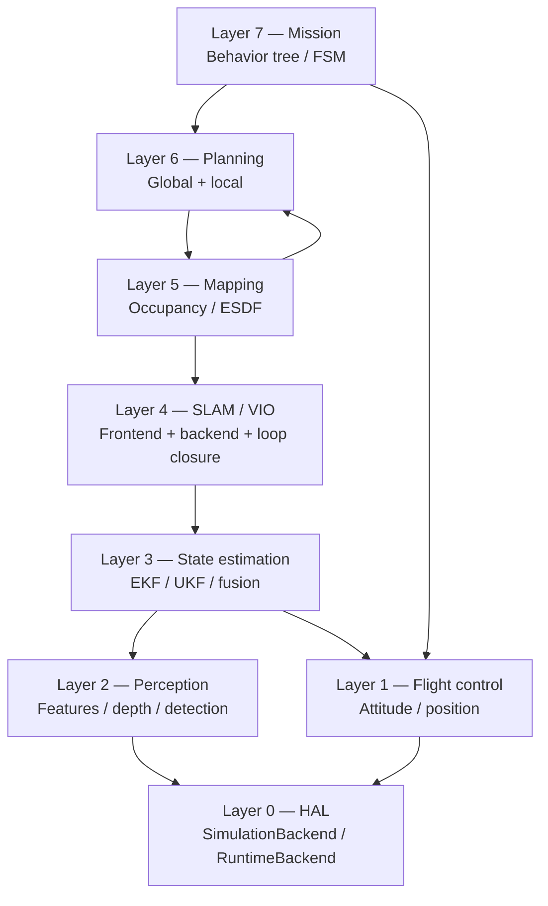
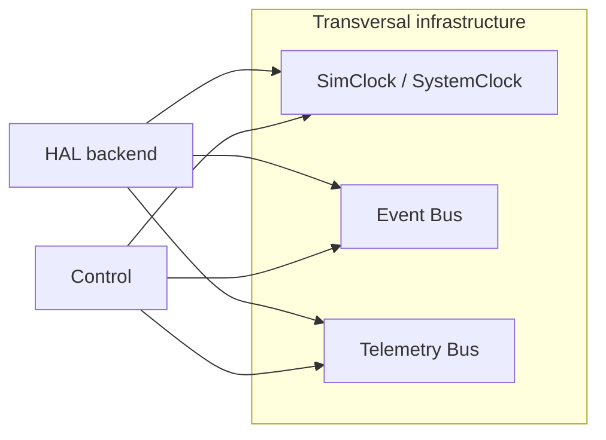
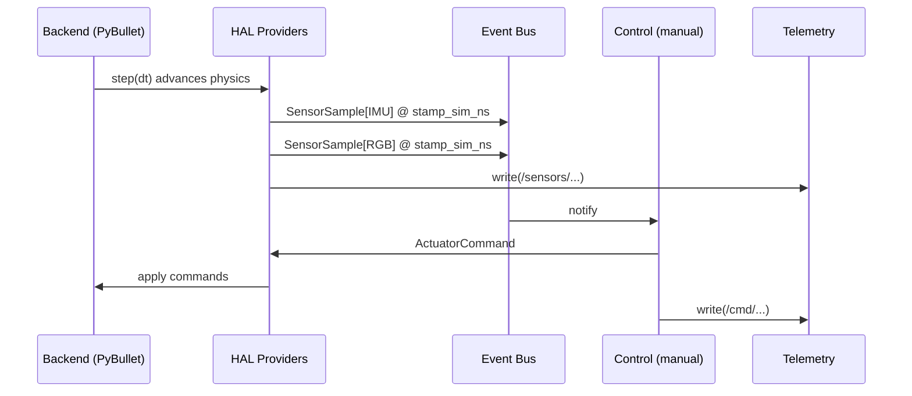
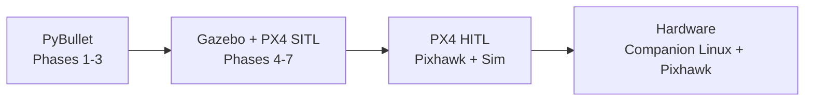

# Project Ghost — System Architecture

- **Status:** living, Phase 0 (foundations)
- **Last updated:** 2026-06-03
- **Audience:** maintainers and integrators of the project over 1–5 years

This document is the single source of truth for the architecture. Any change that contradicts this text requires a formal ADR in `docs/adr/`.

---

## 1. Vision

Build a drone autonomy system that evolves from simulation to real hardware, whose ultimate goal is navigation in unknown environments **without GPS**, using only vision and IMU.

This is not a prototype or a demo. It is designed to live five years, support multiple simulators, and eventually run on real hardware with minimal changes to the higher layers.

## 2. Guiding principles

Each principle is binding. Breaking them requires an ADR.

1. **Sim-first, hardware-ready.** The same code that flies in simulation must fly on hardware by swapping a single backend.
2. **HAL before features.** No estimation, control, planning, or mission work begins until the HAL is frozen and validated.
3. **Absolute determinism in simulation.** Same seed + same scenario + same code = same trajectory, bit for bit.
4. **Obsessive telemetry.** Every message that crosses the bus is persisted to disk with a versioned schema.
5. **Explicit math, no black boxes.** EKF/UKF, BA, MPC are implemented in a readable and testable way. Closed models are forbidden.
6. **Modularity by contracts, not services.** In-process pub/sub, typed dataclasses, no microservices.
7. **Near-zero cost.** The stack runs on a modest laptop. Any heavy dependency must justify itself.
8. **Every decision pays its future cost.** A cheap decision today that costs a lot to maintain tomorrow is rejected.

## 3. System layers

The system is organized in **eight layers** ordered from lower to higher abstraction. Each layer only knows the one immediately below it via typed interfaces.

Notes:

- **Layer 0 (HAL)** abstracts sensors and actuators. It is the only layer that knows simulators or hardware.
- **Layer 1 (Control)** depends directly on the HAL to close fast loops without traversing cognitive layers.
- Layers 2–6 are the perception–cognition chain culminating in plans.
- **Layer 7 (Mission)** orchestrates the rest via events and goals.

In **Phase 1**, only Layer 0, a minimal version of Layer 1 (manual passthrough), and the transversal infrastructure (clock, telemetry, events) exist. The rest is introduced in later phases.

## 4. Transversal infrastructure

Three services cross all layers:

- **Clock:** single source of time. In sim, integer-nanosecond deterministic. On hardware, the system monotonic clock.
- **Event Bus:** in-process pub/sub for discrete semantic events (armed, takeoff, sensor_fault, collision, mission_*).
- **Telemetry Bus:** captures everything published and distributes it to sinks (MCAP file, Rerun, console).

## 5. Data flow

A typical control cycle in Phase 1:

Rules:

- Every published sample carries `stamp_sim_ns`, `stamp_wall_ns`, and a per-sensor monotonic `seq`.
- The backend does not write to the telemetry bus directly: providers do, to keep a single capture point.
- Control never calls physics: it only publishes commands to the `ActuatorSink`.

## 6. Modules and responsibilities

| Package (`src/project_ghost/`) | Responsibility | Phase introduced |
|---|---|---|
| `core/` | Base types, errors, time utilities, RandomSource, configuration | Phase 1 |
| `hal/` | HAL Protocols, messages, and conformance tests | Phase 1 |
| `state/` | Canonical `VehicleState`, frame conventions, transforms | Phase 1 |
| `events/` | Event bus, event schemas, severities, correlation | Phase 1 |
| `telemetry/` | Telemetry bus, sinks (MCAP, Rerun, console), per-run manifest | Phase 1 |
| `simulation/` | Simulation backends; in Phase 1 only PyBullet | Phase 1 |
| `sensors/` | Backend-agnostic providers (processing, optional sync) | Phase 1 minimal |
| `actuators/` | Backend-agnostic sinks, safety envelope, mixers | Phase 1 minimal |
| `perception/` | Features, depth, detection | Phase 3+ |
| `estimation/` | EKF/UKF, IMU preintegration | Phase 3 |
| `slam/` | Frontend, backend, loop closure | Phase 4 |
| `mapping/` | Occupancy, ESDF, frontiers | Phase 5 |
| `planning/` | Global and local | Phase 5–6 |
| `control/` | Attitude/velocity/position cascade, MPC | Phase 2+ |
| `mission/` | Behavior trees, FSM, goals | Phase 7 |

Any package after Phase 1 is introduced only when needed, with its own ADR if it modifies frozen contracts.

## 7. Permitted and forbidden dependencies

One of the project's most important decisions. Validation is automated in CI (`import-linter` or `deptry`).

| Package | Permitted | Forbidden |
|---|---|---|
| `core/` | stdlib, `numpy`, `typing` | everything else |
| `hal/` | stdlib, `numpy`, `core` | OpenCV, Torch, PyBullet, Gazebo, ROS, MAVSDK |
| `state/` | stdlib, `numpy`, `scipy.spatial.transform`, `core` | sensors, backends |
| `events/` | stdlib, `core` | disk I/O, backends |
| `telemetry/` | stdlib, `mcap`, `mcap-protobuf-support`, `rerun-sdk`, `core` | simulation backends |
| `simulation/pybullet/` | `pybullet`, `numpy`, `hal`, `state`, `core` | Torch, OpenCV (except for camera-buffer conversion), ROS |
| `simulation/gazebo_px4/` *(Phase 4+)* | `mavsdk`, `gz` bindings, `hal`, `state`, `core` | PyBullet |
| Cognitive layers (`perception/`, `estimation/`, etc.) | their specific deps + `hal`, `state`, `core` | concrete backends, other parallel cognitive layers |

Global rules:

- `hal/` **never imports anything from `simulation/`**. If it needs to know about backend capabilities, it does so via the `Capabilities` interface.
- No cognitive layer imports another cognitive layer at the same level. Communication is via the bus.
- Any ML model used must have **open weights** and a permissive license. Ultralytics (AGPL) is forbidden.

## 8. Frozen technical conventions

These conventions are the **most expensive to revert** and are fixed now. Changing them requires an ADR.

| Aspect | Decision |
|---|---|
| World frame | ENU (East-North-Up), z=0 at ground |
| Body frame | FLU (Forward-Left-Up) |
| Quaternion | Hamilton, `[w, x, y, z]`, compatible with `scipy.spatial.transform.Rotation` |
| Units | Strict SI. No feet, no knots. Angles in radians except in config/UI |
| Precision | `float64` for state and covariances; `float32` only in image/depth buffers |
| Time | Integer nanoseconds in all timestamps. Floats forbidden for time |
| Randomness | Hierarchical injected `RandomSource`. Global `random` or `np.random` forbidden |
| Project layout | `src/`-layout with `src/project_ghost/...` |
| Schema versioning | Every message dataclass carries `schema_version: int` |

Conversion to/from external conventions (PX4 NED/FRD, JPL quaternion, etc.) happens **in the boundary adapter**, never scattered across the code.

## 9. Growth strategy

The project is built in **orthogonal phases**. Each phase adds a layer without rewriting the previous ones.

| Phase | Adds | Active layers | Exit criterion |
|---|---|---|---|
| **0 — Foundations** | Docs and contracts | — | Architecture, ADRs, and specs approved |
| **1 — Sim + telemetry + manual** | HAL, PyBullet, Rerun, replay | 0 | `make demo` flies manually and replays identically |
| **2 — Stabilization** | Cascade control | 0, 1 | Hover ±5 cm over 60 s with IMU noise |
| **3 — State estimation** | 15-DoF EKF + VO | 0–3 | ATE < 5% on the `corridor` scenario |
| **4 — SLAM** | BA backend, loop closure | 0–4 | Drift < 1% after loop closure on `warehouse` |
| **5 — Planning** | A*, local MPC, ESDF | 0–6 | 0 collisions on `forest`, 95% success over 50 runs |
| **6 — Autonomous navigation** | Replanning + recovery | 0–6 | Mission in a new scenario, 90% success |
| **7 — End-to-end mission** | Behavior tree, exploration | 0–7 | Explore, find target, return, autonomous |

Each phase runs:

1. Read of current specs.
2. Detailed design (ADRs if contracts are affected).
3. Implementation + tests.
4. Acceptance metrics measured on the regression bench.
5. Updated documentation.

## 10. Hardware migration strategy

This is the acid test of the design. If migration hurts, the architecture failed.

**Supported backends.** Project Ghost officially supports **three backends** through its lifetime:

Other simulators (Isaac Sim, AirSim, Webots) are **possible future community backends**, not architectural commitments. They are welcome but not maintained by the core. The HAL contract is what makes such future additions cheap.

The two key substitutions:

1. **`SimulationBackend` → `SimulationBackend` (Gazebo+PX4 SITL):** the HAL contract does not change. The concrete backend changes. Layers 1–7 do not notice.
2. **`SimulationBackend` → `RuntimeBackend` (hardware):** the time paradigm is replaced (sim → wall) and the MAVLink adapter is introduced. The rest of the system keeps consuming the same Protocols.

Mandatory changes when moving to hardware:

- Randomness: `RandomSource` stops being deterministic (the real world cannot be frozen). Runs are marked as non-deterministic in the manifest.
- Time: `SystemClock` replaces `SimClock`. Periodic schedulers are tied to the OS monotonic clock.
- Safety: the `SafetyEnvelope` stops being preventive and becomes load-bearing, redundant with a hardware kill switch.
- Camera: calibration is a repo artifact, not generated by the simulator.

Risk mitigations:

- Before real hardware, **HITL is mandatory** with the same physical Pixhawk that will fly.
- Initial flights are **indoor, tethered, or in a netted cage**, with telemetry always on.
- Software geofence + RTL are configured before each flight.
- Regulatory framing (Mexico, AFAC): experimental flights under supervision, documented weight.

## 11. What this system is **not**

Explicitly out of scope:

- A replacement autopilot for PX4 / ArduPilot. Project Ghost lives **on top of** an autopilot on real hardware.
- An LLM agent framework. There is no agent orchestration in the autonomy system.
- A commercial product. It is open, reproducible research.
- An outdoor drone in extreme weather for Phases 1–7. Focus: indoor / controlled outdoor.

## 12. Glossary

- **HAL:** Hardware Abstraction Layer. Sensor/actuator contract.
- **SITL:** Software In The Loop. Firmware running on a PC with a connected sim.
- **HITL:** Hardware In The Loop. Firmware running on the physical autopilot with a connected sim.
- **MCAP:** Open binary log format, indexed, multi-channel, schema-aware.
- **ATE / RPE:** Absolute / Relative Trajectory Error. Standard SLAM/odometry metrics.
- **ESDF:** Euclidean Signed Distance Field. Differentiable distance map for planning.
- **ENU / FLU / NED / FRD:** Frame conventions. ENU/FLU is the pair used here.
- **VIO:** Visual-Inertial Odometry.

## 13. Cross-references

- ADRs: `docs/adr/`
- Detailed specs: `docs/specs/`
- Adversarial review: `docs/reviews/architecture_red_team_review.md`
- Phase 1 plan: `docs/roadmaps/phase1.md`
