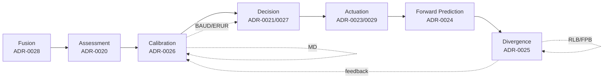

# Project Ghost

!!! quote ""
    **Autonomy under uncertainty.** The system must know when it knows,
    know when it does not know, and alter its behaviour accordingly.

A research-grade autonomy platform for drones built around a single
core idea — and the only open-source robotics codebase that ships a
**formal property set you can verify in one shell command**.

---

## The headline claim

```bash
$ ghost verify-properties --mcap path/to/run.mcap
BAUD-v1: HOLDS  (M=4, K=2, 6/10 cycles evaluated)
ERUR-v1: HOLDS  (M=4, K=2, 4/10 cycles evaluated)
MD-v1:   HOLDS  (10/10 cycles evaluated)
RLB-v1:  HOLDS  (W=32, 0/10 cycles evaluated)
FPB-v1:  HOLDS  (fire_fraction=0.60, 6/10 cycles evaluated)
```

Five properties, five citable claims, exit code `0` iff every
property holds. Each verifier is a pure function over the MCAP — no
replay, no simulation, no trust in the producer.

## Try it without installing anything

[:material-play-circle: Open the live dashboard](https://project-ghost.streamlit.app/){ .md-button .md-button--primary }
[:material-package-variant: Install from PyPI](https://pypi.org/project/project-ghost/){ .md-button }

The hosted dashboard runs the same reference closed-loop smoke and
shows the five property veredictos inline. Same code that
`pip install project-ghost` ships locally.

## The five properties

<div class="grid cards" markdown>

-   :material-shield-alert:{ .lg .middle } **[BAUD-v1](properties/baud.md)**

    Bounded Action Under Drift

    ---

    When prediction error signals drift, the agent emits no
    non-conservative actuator command.

-   :material-restart:{ .lg .middle } **[ERUR-v1](properties/erur.md)**

    Eventual Reactivation Under Recovery

    ---

    When drift is absent and belief is KNOWN, the agent reactivates
    PROCEED.

-   :material-arrow-down-bold:{ .lg .middle } **[MD-v1](properties/md.md)**

    Monotonic Degradation

    ---

    The calibration policy never invents confidence —
    `adjusted >= raw` in the lattice.

-   :material-timer-sand:{ .lg .middle } **[RLB-v1](properties/rlb.md)**

    Recovery Latency Bound

    ---

    Dirty-run length is bounded by `peak + W - 1` where W is the
    calibration history window.

-   :material-chart-line:{ .lg .middle } **[FPB-v1](properties/fpb.md)**

    False Positive Bound observer

    ---

    Empirical BAUD fire rate exposed and bounded for regression
    gating.

</div>

[See the full overview →](properties/index.md)

## Contributions

The underlying ingredients (Bayesian filters, calibration, FDI,
runtime supervisors) are well-established. Project Ghost makes five
concrete, citable contributions in **how they are combined, stated,
and verified**:

- **PV-1 — Reproducibility primitive.**
  `ghost verify-properties --mcap <log>` reduces "is this run safe?"
  to one shell command returning a byte-exact verdict with exit code
  `0` iff every property holds. Verifier is a pure function over
  content-addressed MCAP — no replay, no simulation, no trust in the
  producer.
- **PV-2 — Formal partition theorem.**
  BAUD-v1 + ERUR-v1 partition the space of per-cycle conditional
  behaviour. Stated in TLA+ as `INV_PARTITION`, **mechanically
  verified by TLC** over the full reachable state space of the
  abstract model ([ADR-0036](adr/0036-tla-plus-mechanical-verification-of-baud-erur.md)).
  Promoted from "observed on one trace" to "proved on the model".
- **PV-3 — Structural recovery latency bound.**
  `L ≤ peak + W − 1` for sliding-window calibration histories with
  `MahalanobisDowngradePolicy(M, K)`. Drift-then-recovery smoke fires
  at the bound exactly (38 = 7 + 32 − 1), proving the bound is tight
  ([ADR-0034](adr/0034-recovery-latency-bound-property-v1.md)).
- **PV-4 — Safe-reason set encoding pattern.**
  `S_BAUD-v1 = {"attitude_hold_hold", "kill_zero_throttle"}` — a
  closed taxonomy of strings classifying which non-PROCEED actuator
  commands count as conservative, replacing fragile `command is None`
  checks with an extensible, externally-auditable allowlist
  ([ADR-0031](adr/0031-bounded-action-under-drift-property-v1.md)).
- **PV-5 — End-to-end safety citation pattern.**
  Content-addressed MCAP + ADR + pure-function verifier + Hypothesis
  property test + CI gate + tagged release + OIDC-signed PyPI wheel
  — assembled as one coherent reproducibility unit. The headline
  claim is operationally re-runnable from `pip install project-ghost==0.2.0`.

For each, the binding ADR is the formal statement, the verifier is
the executable test, the inline witness in `SmokeSummary.*_report`
is the self-evidence, and CI is the continuous guarantee.

Theoretically novel? No — this is an engineering and citation
contribution, not a new theorem. **Operationally novel? Yes** —
this is the pattern getting actually built and shipped, in a form
that lets third parties verify their own runs against the captured
MCAP without trusting the producer.

## Architecture in one diagram



## Get started

- :material-rocket: **[Quick start](#try-it-without-installing-anything)** — the live dashboard or `pip install project-ghost`
- :material-book-open: **[Architecture](architecture.md)** — system-level overview
- :material-shield-check: **[Properties overview](properties/index.md)** — the five formal claims
- :material-file-document: **[ADRs](adr/README.md)** — 36 architectural decisions
- :material-format-list-bulleted: **[Specs](specs/README.md)** — frozen component contracts

## Status

- **36 ADRs accepted** (ADR-0000 .. ADR-0035) including the property
  set ADR-0031..0035
- **1653 tests passing**, ruff + mypy strict clean
- **Self-enforcing CI**: every push verifies the property set against
  the reference smoke MCAP
- **PyPI-released** via [OIDC trusted publishing](https://docs.pypi.org/trusted-publishers/)
  on tag push — no API tokens stored anywhere

## License

[Apache License 2.0](https://github.com/JFHelvetius/ghost/blob/main/LICENSE).
No additional clauses.
