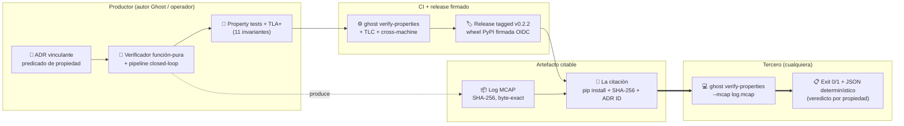

# Project Ghost: una superficie de propiedades de seguridad verificable para autonomía bajo incertidumbre

**Autor:** Javier Menéndez Mateos (`jfhelvetius@gmail.com`)
**Afiliación:** Independiente
**Versión:** v0.2.2 (2026-06-12)
**Repositorio:** <https://github.com/JFHelvetius/ghost>
**PyPI:** <https://pypi.org/project/project-ghost/>
**Documentación:** <https://JFHelvetius.github.io/ghost/>
**Licencia:** Apache-2.0

> **Nota interna:** Esta es una traducción al español del paper técnico
> [`project_ghost_v0_2.md`](../project_ghost_v0_2.md) para uso del
> autor y de colaboradores hispanohablantes. La versión canónica
> para arXiv y FMAS 2026 es la inglesa; cualquier divergencia entre
> las dos debe resolverse a favor de la inglesa. Se mantienen en
> inglés los nombres técnicos (BAUD-v1, ERUR-v1, etc.), las
> referencias a archivos del repositorio, las tablas, los snippets
> de código y los nombres de las propiedades formales.

---

> *Ghost convierte las afirmaciones de seguridad en citas
> ejecutables.*
>
> *Una afirmación de seguridad debe emitirse junto con todo lo que
> un tercero necesita para rechazarla.*
>
> — Las dos frases que este paper existe para defender.

---

## Resumen

Las afirmaciones de seguridad en investigación de autonomía
típicamente se enuncian en prosa y se ilustran con vídeos de
simulación que el lector no puede re-ejecutar. Describimos
**Project Ghost**, una plataforma open source cuya contribución
principal es **un patrón de citación que permite a un tercero
verificar cualquier afirmación de seguridad contra el run grabado,
byte-exact, mediante un único comando de shell**:
`pip install project-ghost==0.2.2`, luego
`ghost verify-properties --mcap <log>`. El patrón compone siete
ingredientes existentes — Architectural Decision Records (ADRs),
telemetría MCAP content-addressed, verificadores función-pura,
property tests con Hypothesis, gating CI, tagged releases, y wheels
PyPI firmadas con OIDC — en una unidad coherente de reproducibilidad,
con los invariantes subyacentes adicionalmente verificados por
TLA+/TLC.

Para ejercitar el patrón, instanciamos cinco propiedades de seguridad
para el ciclo cerrado de un supervisor de autonomía de referencia
(BAUD-v1, ERUR-v1, MD-v1, RLB-v1, FPB-v1). Cada una está enunciada
en un ADR vinculante, verificada por una función pura sobre el MCAP,
ejercitada por ~50 property tests dentro de una suite de 1687 tests,
testimoniada inline en cada smoke de referencia, y self-enforced en
cada push por CI. Tres specs TLA+ cubren conjuntamente las cinco
propiedades; juntos verifican 11 invariantes sobre el espacio de
estados bounded, incluyendo un teorema de partición
`BAUD ⊕ ERUR` y una cota cerrada de latencia de recuperación
`L ≤ peak + W − 1` (RLB-v1), mostrada ajustada mediante un trace
testigo.

La evaluación empírica sobre una matriz de violaciones de seis
categorías de bugs inyectados, tres policies de calibración
estructuralmente distintas, tres perfiles de drift
shape-realistic, y un benchmark head-to-head contra RTAMT,
establece que el verificador es policy-agnostic, corre en
21–406 ms (lineal en longitud del trace), y produce MCAPs y
property-report JSON canonicalizado byte-idénticos entre runners
Linux y Windows en CI. El artefacto completo es re-ejecutable
desde `pip install project-ghost==0.2.3`. **Una afirmación de
seguridad debe emitirse junto con todo lo que un tercero necesita
para rechazarla, y creemos que eso es ahora operacionalmente
posible.**

**Palabras clave:** patrones de citación de seguridad, verificación
reproducible de seguridad, runtime verification, telemetría
content-addressed, confianza calibrada, TLA+/TLC, MCAP.

---

## 1. Introducción

Las afirmaciones de seguridad en robótica se sostienen rutinariamente
mediante prosa escrita a mano en documentos de diseño y videos de
simulación que el lector no puede re-ejecutar. La literatura sobre
incertidumbre en autonomía es rica — filtros bayesianos, calibración
de predicciones probabilísticas, incertidumbre epistémica vs
aleatoria, detección y aislamiento de fallos (FDI), supervisores de
seguridad en tiempo de ejecución — pero la brecha entre *la teoría
existe* y *este run específico, sobre este código específico,
satisface la propiedad* rara vez se cierra operacionalmente. Un
tercero que quiere verificar una afirmación de seguridad contra un
run grabado típicamente no puede: no hay comando de shell, ni log
content-addressed, ni verificador función-pura que pueda re-ejecutar
en su propia máquina.

Describimos Project Ghost, una plataforma de referencia opinionada
construida precisamente alrededor de esa brecha. Ghost es sim-first,
escrito en Python, y se distribuye como un paquete `pip`-instalable
con un subcomando CLI (`ghost verify-properties`) que toma un log
MCAP capturado y devuelve un veredicto byte-exact sobre cinco
propiedades formales de seguridad. Cada propiedad está enunciada en
un ADR vinculante; verificada por una función pura sobre el log;
ejercitada por property tests basados en Hypothesis; testimoniada
inline en cada smoke de referencia closed-loop; y self-enforced en
cada push por CI. Dos de las propiedades (BAUD-v1 y ERUR-v1) están
adicionalmente **verificadas mecánicamente** por TLA+/TLC sobre el
espacio de estados abstracto del par de policies de referencia,
junto con el teorema de partición que ambas propiedades juntas
cubren el espacio de comportamiento condicional completo. La cota
ajustada de latencia de recuperación RLB-v1 está verificada
mecánicamente por un spec TLA+ separado que mirror-ea el algoritmo
del verificador.

### 1.1 Contribuciones

**Una afirmación de seguridad sobre un sistema autónomo hoy puede
ser asertada por sus autores e ilustrada en sus venues, pero no
puede ser falsada por un tercero que no estaba en la sala cuando
el run ocurrió.** Project Ghost cierra ese hueco: una afirmación
de seguridad se entrega como un log de autonomía content-addressed
más un único comando de shell (`ghost verify-properties --mcap
<log>`); cualquiera con el wheel y el log reproduce el veredicto —
o lo contradice. Llamamos a este patrón una **cita de seguridad
ejecutable**.

Hacemos **cuatro contribuciones reivindicables**, dos formales y
dos operacionales; el patrón cita-de-seguridad-ejecutable es la
primera y el resto son evidencia operacional de que funciona.

- **C1 — Un artefacto de seguridad reproducible que un tercero
  puede verificar.** Ghost empaqueta el predicado de la propiedad
  (ADR), el run (MCAP content-addressed) y el verificador (wheel
  PyPI firmada por OIDC) en una sola unidad citable; invariantes
  verificados mecánicamente (TLA+/TLC), Hypothesis property tests
  y CI gating respaldan el verificador mismo. El artefacto citado
  *es* el mecanismo de falsación — llamamos a este patrón una
  *cita de seguridad ejecutable*. Es el patrón que creemos
  genuinamente diferenciante; el resto del paper es la evidencia
  de que funciona en la práctica, incluyendo sobre telemetría de
  vuelo real (§8.7–§8.8).
- **C2 — Un primitivo de reproducibilidad con capacidad de
  detección demostrada.** Un verificador CLI de una línea
  `ghost verify-properties` sobre logs MCAP content-addressed,
  distribuido vía PyPI con OIDC trusted publishing. La detección de
  bugs se demuestra sistemáticamente en §8.2 vía una violation
  matrix de seis categorías (calibrador, decisión, actuación, y
  threshold inyectados; las seis detectadas). El verificador
  produce JSON output determinístico across Linux y Windows
  (enforced por CI, §8.9) y se mantiene policy-agnostic across tres
  policies de calibración estructuralmente distintas (§8.4).
- **C3 — Un conjunto de propiedades con semánticas
  mecánicamente-checked para un supervisor de autonomía de
  referencia.** Cinco propiedades (BAUD-v1, ERUR-v1, MD-v1, RLB-v1,
  FPB-v1) instanciando el patrón de citación sobre un ciclo cerrado
  representativo. Tres specs TLA+ cubren el conjunto de propiedades
  con 11 invariantes verificados por TLC sobre un modelo abstracto
  bounded en CI, incluyendo un teorema de partición
  `BAUD ⊕ ERUR` y un invariante de degradación monótona. Las
  propiedades en sí son deliberadamente simples; la contribución
  es la mecanización end-to-end, no la formulación.

La cota de latencia de recuperación (§6.3) — RLB-v1
`L ≤ peak + W − 1` para filtros de ventana deslizante
count-of-K-in-W — es un **resultado auxiliar** que el spec TLA+
`Rlb.tla` mecaniza. Posicionamos el trabajo como **paper de
sistemas / tools, no de teoría**; los lectores deben calificar
C1–C3.

#### Figura 1: El patrón de citación de seguridad



La figura se lee de izquierda a derecha como el pipeline operacional
de una afirmación de seguridad bajo el patrón. En el lado del
productor, un ADR vinculante enuncia el predicado de la propiedad,
un verificador función-pura implementa su semántica, y los property
tests Hypothesis + specs TLA+ ejercitan los invariantes. CI gate-ea
cada push y el tagging emite un release firmado por OIDC. El
artefacto citable carga dos mitades: el run (MCAP con SHA-256) y la
herramienta de verificación (wheel PyPI fijada por versión). Un
tercero las concatena con un comando de shell y obtiene un JSON
veredicto determinístico por propiedad. **La contribución del paper es el ensamblaje de las siete cajas en
una sola unidad shippable, de modo que — por primera vez, hasta
donde sabemos dentro de los venues revisados — una afirmación de
seguridad puede emitirse junto con todo lo que un tercero necesita
para rechazarla.** Todo lo demás (el conjunto de propiedades, la
cota cerrada, los specs TLA+) instancia el patrón sobre un
supervisor representativo.

### 1.2 Qué es y qué no es este paper

Este es un paper de ingeniería e infraestructura, no un paper de
teoría. Los ingredientes de filtrado, calibración, y FDI sobre los
que Ghost descansa están bien establecidos (§2.1). La cota de
latencia de recuperación es un resultado auxiliar, no una
contribución. El teorema de partición de §5.3 es novedoso *en la
forma que lo mecanizamos* — un `INV_PARTITION` en TLA+ sobre el
ciclo cerrado de referencia. La contribución que defendemos es
**la combinación ingeniada** (C1) y su **demostración
operacional** (C2): el ensamblaje falta en el tooling
autonomy-safety abierto que revisamos.

---

## 2. Background y trabajo relacionado

### 2.1 Ingredientes subyacentes

Project Ghost se construye sobre ingredientes que son parte de la
práctica estándar de robótica y control: filtrado bayesiano y de
partículas; calibración de predicciones probabilísticas; incertidumbre
epistémica vs aleatoria; FDI; runtime verification; TLA+ y TLC para
explicit-state model checking; MCAP para serialización portable de
telemetría de robótica.

### 2.2 Trabajo previo más cercano

- **RTAMT** [Niković et al., ATVA 2020]: monitores STL sobre logs
  CPS con algoritmos online/offline y API Python. Lenguaje de
  propiedades es STL, no predicados hand-crafted; no hay capa de
  prueba mecánicamente verificada ni cadena de reproducibilidad
  content-addressed.
- **MoonLight** [Bartocci et al., RV 2020]: monitor STREL en Java
  con CLI, usado para benchmarks automotivos. Foco espacial; sin
  verificación formal del monitor.
- **ROSMonitoring** [Ferrando et al., 2020] y **ROSRV** [Huang et
  al., RV 2014]: monitores live del middleware ROS. Ambos online;
  ninguno hace verificación post-hoc con CLI de una línea.
- **Safe RL via shielding** [Jansen et al., CONCUR 2020]:
  enforcement runtime de seguridad vía filtros de acción. Online,
  action-blocking; Ghost es offline, log-verifying.
- **Control Barrier Functions** [MIT Lincoln Lab CBF Toolbox]:
  síntesis de controladores para restricciones continuas de
  seguridad. Complementario, no compitiendo.
- **Conformal prediction para robot safety** [Chakraborty et al.,
  TAC 2024]: cotas forward-looking sin distribución para gating de
  acciones. Predictivo; Ghost es retrospectivo.
- **Supervisory control of timed automata** [Flordal et al., 2022]:
  sintetiza supervisores timed. Construye nuevos supervisores;
  Ghost verifica traces existentes. Trabajos previos de timed
  automata no dan esa cota cerrada.
- **Surveys de formal verification para autonomía** [Rizaldi et al.,
  ACM CSUR 2020]: catalogan trabajo Coq/Lean/Isabelle/Alloy. Notan
  la ausencia de specs TLA+ mecánicamente verificados para
  supervisores de autonomía específicamente.

### 2.3 Matriz de comparación

| Dimensión | **Ghost** | RTAMT | MoonLight | Shielding | CBF | Conformal | Timed Aut. SC |
|---|---|---|---|---|---|---|---|
| Modo de verificación | Post-hoc log | On/offline | On/offline | Online enforce | Online control | Online gating | Offline synth. |
| Distribución | PyPI + OIDC | Source | Source | Framework | Toolbox | Code + paper | Synth. tool |
| Input content-addressed | **Sí** (SHA-256) | No | No | N/A | N/A | N/A | No |
| Verificador CLI de una línea | **Sí** | No | No | No | No | No | No |
| Naturaleza de propiedad | Comportamiento + latencia | STL | STREL | Invariantes | CBF | Predictiva | Discreta/timed |
| Prueba mecánica | **TLA+/TLC** | Ninguna | Ninguna | Informal | Informal | Ninguna | Timed-aut. |
| Output multi-propiedad | **5 reports/run** | 1/spec | 1/spec | Modular | 1/CBF | 1/model | 1/synth. |
| Teorema de partición | **BAUD ⊕ ERUR** | N/A | N/A | N/A | N/A | N/A | N/A |
| Cota cerrada de recovery | **L ≤ peak + W − 1** | N/A | N/A | N/A | N/A | Indirecta | Ninguna |
| Demo de detección de bugs | **Sí (§7.2)** | N/A | N/A | N/A | N/A | N/A | N/A |

Hasta donde sabemos, **ningún tool previo distribuye un verificador
content-addressed, función-pura, de propiedades de seguridad vía
`pip install` + wheels OIDC-firmadas con invariantes subyacentes
mecánicamente verificados**. Tratamos eso como el claim operacional
principal de Ghost; la comparación de arriba es la evidencia.

### 2.4 Qué es novedoso aquí

Dos contribuciones son claims operacionales de patrón (el primitivo
de reproducibilidad y el patrón end-to-end de citación). Dos son
claims formales que, hasta donde sabemos después de una revisión
deliberada de prior art across CAV, RV, FMAS, TACAS, ICRA, IROS,
CoRL 2018–2026 y los surveys citados arriba, no aparecen en la
literatura peer-reviewed en la forma que enunciamos:

- **La cota cerrada de latencia de recuperación `L ≤ peak + W − 1`**
  para monitores de ventana deslizante count-of-K-in-W. Los
  sequential probability ratio tests dan cotas óptimas de sample
  size para hypothesis testing, pero no esta forma cerrada exacta
  para recovery de ventana deslizante, y el trabajo de timed
  automata prefiere garantías cualitativas de non-blocking sobre
  cotas cuantitativas concretas. La formalizamos como RLB-v1
  (§6.4) y demostramos que es ajustada por construcción.
- **El teorema de partición `BAUD ⊕ ERUR`** sobre el espacio de
  comportamiento condicional por-ciclo de un supervisor de autonomía
  closed-loop, probado por TLC sobre el modelo abstracto. No hemos
  localizado formalización previa de partición de comportamiento
  condicional para supervisores de seguridad de ventana deslizante
  específicamente.

### 2.5 Dónde se sitúa Ghost frente a la práctica industrial

El paisaje autonomía-seguridad está dominado por esfuerzos
industriales que operan a escalas que Ghost no alcanza: el safety
case framework de Waymo, la state machine `commander` de PX4, la
tradición NFM de NASA, la arquitectura de seguridad de Autoware, la
metodología de safety case de Cruise. Todos comparten una propiedad
organizacional que Ghost no tiene: **equipos de safety engineers y
acceso propietario a telemetría, infraestructura de testing y
reguladores**. Producen artefactos de assurance que justifican
deployment operacional.

Ghost hace un claim mucho más pequeño — *un tercero puede verificar
una propiedad enunciada contra un run capturado emitiendo un comando
de shell* — pero lo hace **operacionalmente**, no por apelación a
review interno. El nicho complementario que creemos llenar es el gap
entre *"este software es seguro"* (un claim cerrado firmado por una
organización) y *"aquí está el verificador y el log; chequéalo tú
mismo"* (un claim abierto citable por un tercero). El citation
pattern no es un substituto de safety cases industriales; es un
primitivo que esos cases podrían citar. No reclamamos equivalencia,
scope o madurez frente a los trabajos arriba.

---

## 3. El conjunto de propiedades

Las cinco propiedades están enunciadas en ADRs vinculantes
(inmutables una vez aceptados) y verificadas por funciones puras en
`src/project_ghost/properties/`. Cada verificador retorna un report
typed con `holds: bool`, metadata estructurada por-ciclo, y el
SHA-256 del MCAP.

| ID | Propiedad | Naturaleza | Multi-ciclo? |
|---|---|---|---|
| **BAUD-v1** | Bounded Action Under Drift | Condicional sobre drift | No, per-ciclo |
| **ERUR-v1** | Eventual Reactivation Under Recovery | Condicional sobre drift ausente + KNOWN | No, per-ciclo |
| **MD-v1** | Monotonic Degradation | Estructural incondicional | No, per-ciclo |
| **RLB-v1** | Recovery Latency Bound | Temporal cuantitativa | Sí |
| **FPB-v1** | False Positive Bound observer | Observacional cuantitativa | No, per-ciclo |

Las cinco son self-contained: cada una está enunciada formalmente en
un ADR, verificada por una función Python en `properties/`, y
testimoniada inline en cada smoke.

### 3.1 BAUD-v1 — Bounded Action Under Drift

Cuando el drift se detecta (≥M outcomes en window con ≥K dirty), el
adjusted level baja en el lattice, la decisión no es PROCEED, y el
actuator command (si lo hay) pertenece al safe-reason set cerrado
`S_BAUD = {attitude_hold_hold, kill_zero_throttle}`. ADR-0031.

### 3.2 ERUR-v1 — Eventual Reactivation Under Recovery

Cuando drift está ausente y raw belief es KNOWN, adjusted level es
KNOWN y decisión es PROCEED. Forma con BAUD el teorema de partición
(C2). ADR-0032.

### 3.3 MD-v1 — Monotonic Degradation

Para todo ciclo, `adjusted ≼ raw` en el confidence lattice. El
calibrador nunca *inventa* confianza. ADR-0033.

### 3.4 RLB-v1 — Recovery Latency Bound

`L ≤ peak + W − 1` para sliding-window count-of-K-in-W filters. Es
la cota de latencia de recuperación (§6.3). ADR-0034.

### 3.5 FPB-v1 — False Positive Bound observer

Empirical BAUD fire rate sobre el run, exposed como métrica
estructurada para regression gating. Observacional por defecto
(`max_fire_fraction = 1.0`). ADR-0035.

---

## 4. Arquitectura del verificador

### 4.1 MCAP content-addressed

Cada run capturado se materializa como un MCAP con un schema de
mensaje conocido por canal. Canales de interés incluyen
`/fusion/results`, `/uncertainty/*`, `/decisions/decision`,
`/actuation/command`, `/prediction/*`. Cada mensaje es determinista
dado los inputs upstream (replay verification, ADR-0030, lo asegura
byte-exact). El SHA-256 del MCAP es la dirección de contenido y se
registra dentro del report de cada verificador.

### 4.2 Verificadores función-pura

Cada propiedad tiene un verificador en
`src/project_ghost/properties/verify_<id>.py`. El verificador (a)
abre el MCAP read-only, (b) recorre los canales en orden por ciclo,
(c) computa la precondición y la postcondición por ciclo a partir
únicamente de los mensajes almacenados (sin replay, sin simulación),
y (d) retorna un report typed.

### 4.3 Superficie CLI

```bash
$ pip install project-ghost==0.2.2
$ python -m project_ghost.examples.closed_loop_smoke
$ ghost verify-properties --mcap closed_loop_smoke.mcap
BAUD-v1: HOLDS  (M=4, K=2, 6/10 cycles evaluated)
ERUR-v1: HOLDS  (M=4, K=2, 4/10 cycles evaluated)
MD-v1:   HOLDS  (10/10 cycles evaluated)
RLB-v1:  HOLDS  (W=32, 0/10 cycles evaluated)
FPB-v1:  HOLDS  (fire_fraction=0.60, 6/10 cycles evaluated)
$ echo $?
0
```

Convenciones de exit code: `0` iff todas las propiedades holden,
`1` si alguna viola o el verificador crashea, `2` para errores de
argumentos. `--json` emite un objeto JSON determinístico apto para
consumo de CI.

### 4.4 Self-evidence inline + CI como garantía continua

`run_closed_loop_smoke()` retorna un `SmokeSummary` que carga los
cinco property reports computados contra el MCAP recién escrito.
`ci.yml` corre el smoke + verificador en cada push, ejecuta TLC
sobre las tres specs TLA+, y verifica byte-equality cross-machine
del MCAP entre runners Linux y Windows. Cualquier violación bloquea
el build.

---

## 5. Verificación mecánica

### 5.1 Por qué TLA+

Property-based testing con Hypothesis (200+ ejemplos por propiedad)
provee evidencia fuerte a escala de producción, pero prueba que la
propiedad se mantiene *sobre los inputs que el generator sampleó*, no
sobre todos los inputs. El siguiente escalón de evidencia es
**verificación mecánica sobre un modelo abstracto finito**.
Escogemos TLA+ con TLC sobre theorem proving (Lean, Coq) por un
argumento de costo/beneficio: TLC es exhaustivo sobre el espacio de
estados bounded en segundos, donde una prueba en Lean serían
semanas.

### 5.2 Las tres especificaciones

Tres specs TLA+ cubren conjuntamente las cinco propiedades; cada una
mirror-ea el código Python línea por línea para los policies en
scope.

- **`BaudErur.tla`** modela el closed-loop como una state machine con
  una transición por ciclo. Verifica BAUD-v1, ERUR-v1, partition y
  MD-v1.
- **`Rlb.tla`** restringe el modelo a la hipótesis de drift
  consecutivo de la cota de latencia de recuperación vía dos fases (`ACCUMULATING`,
  `RECOVERING`). Mirror-ea el algoritmo del verificador
  `properties/rlb.py`.
- **`Fpb.tla`** modela el counter automaton de FPB-v1 en aritmética
  entera. Verifica la well-formedness estructural del counter, no
  una cota probabilística sobre el fire rate (eso sería FPB-v2).

### 5.3 Invariantes verificados

Los tres specs juntos verifican 11 invariantes en CI continuo (5 en
BaudErur, 3 en Rlb, 3 en Fpb), cubriendo BAUD/ERUR/MD/RLB/FPB con al
menos un invariante estructural cada una. Esto eleva la cobertura
mecánica de 3/5 propiedades en v0.2.1 a **5/5 en v0.2.2**.

### 5.4 Bounds y qué prueban

Para tractabilidad, cada spec corre con constantes bounded pequeñas:

| Spec | Bounds | Por qué es suficiente |
|---|---|---|
| `BaudErur.tla` | `M=2, K=1, W=3` | Casos *frontera* de la precondición exhaustos en cualquier `M > 0`; `W ≥ M` ejercita la ventana deslizante. |
| `Rlb.tla` | `W=4, MAX_DRIFT=4` | Ejercita las cuatro fases de la prueba de la cota de latencia de recuperación (acumulación, saturación, flush, recovery). |
| `Fpb.tla` | `MAX_CYCLES=8` | Ocho ciclos enumeran el counter automaton through cada alternancia fire/non-fire. |

Comportamiento a constantes de escala de producción (`M=4, K=2,
W=32`) está cubierto por los property tests. TLA+ rellena el rincón
*pequeño pero exhaustivo*. Elevar la cota de latencia de recuperación a *cualquier W finito*
(prueba unbounded) es el candidato ADR-0038 documentado en
[`docs/proofs/TLAPS_roadmap.md`](../../proofs/TLAPS_roadmap.md).

### 5.5 Qué afirma y qué NO afirma

**Sí afirma:** que los enunciados de las propiedades en ADRs
0031–0033 son lógicamente consistentes con la semántica del policy
de referencia; que la partición BAUD + ERUR es estructuralmente
completa en el modelo abstracto; que ninguna combinación
(history, raw_level) en el espacio de estados bounded viola los
invariantes.

**No afirma:** que la implementación Python espeja fielmente al
modelo TLA+ (el bridge es por inspección humana; automatizarlo es
future work); que las constantes bounded prueban el caso unbounded;
que policies no-referencia satisfacen los invariantes (cada uno
necesitaría su propio spec).

---

## 6. Una cota cerrada de latencia de recuperación

### 6.1 Setting

Sea `(o_t)_{t ≥ 1}` el stream de outcomes de predicción por ciclo,
clasificados en una partición binaria `dirty ∈ {0, 1}` donde
`dirty = 1` cuando el verdict Mahalanobis está en o sobre el
threshold considerado por la precondición de BAUD. Sea `H_t` la
ventana deslizante de los últimos `W` outcomes disponibles en el
ciclo `t`:

```
H_t = (o_{max(1, t − W + 1)}, ..., o_t),    |H_t| ≤ W.
```

El calibrador de referencia (`MahalanobisDowngradePolicy(M, K)`)
hace downgrade del nivel de self-assessment ajustado en un rango en
el lattice de confianza en cualquier ciclo donde

```
|H_t| ≥ M    y    Σ_{o ∈ H_t} dirty(o) ≥ K.    (1)
```

### 6.2 Definiciones

- **peak** = máximo conteo de dirty observado en la ventana durante
  el dirty run.
- **drift interval** = sub-trace maximal terminando en el último
  ciclo donde (1) se mantiene.
- **L** = la latencia de recuperación: número de ciclos consecutivos
  donde la ventana contiene al menos un outcome dirty.

### 6.3 La cota de latencia de recuperación

**Cota de latencia de recuperación (RLB-v1, régimen transitorio).** *Sea
`(o_t)_{t ≥ 1}` un stream que contiene un drift interval transitorio
de `N ≤ W` outcomes dirty consecutivos seguidos por outcomes clean,
con ventana `W`. Defina:*

- *`peak = min(N, W) = N`, el máximo dirty count observado en la
  ventana durante el dirty run;*
- *`L`, la dirty-run length: el número de ciclos consecutivos donde
  la ventana contiene al menos un outcome dirty.*

*Entonces `L = peak + W − 1`. Equivalentemente, la cota
`L ≤ peak + W − 1` se alcanza con igualdad. La cota es por tanto
ajustada.*

**Prueba.** Trazar el estado de la ventana ciclo por ciclo, notando
el invariante de la ventana deslizante: en el ciclo `t`, la ventana
contiene los últimos `min(t, W)` outcomes.

- **Fase de acumulación** (ciclos 1..N). Cada ciclo agrega un
  outcome dirty; la ventana aún no está llena (porque `N ≤ W`), así
  que no hay expulsión. El dirty count sube de 1 a `N = peak`. Los
  `N` ciclos tienen count `≥ 1`, por tanto son dirty.
- **Fase de saturación** (ciclos N+1..W). Cada ciclo agrega un
  outcome clean; la ventana aún no está llena, sin expulsión. El
  dirty count se queda en `peak`. Los `W − N` ciclos son dirty.
- **Fase de flush** (ciclos W+1..W+peak−1). La ventana ahora está
  llena; cada nuevo outcome clean expulsa el más viejo. Por
  construcción, los más viejos son los outcomes dirty que llegaron
  primero. El dirty count baja en 1 por ciclo, de `peak` a `1`. Los
  `peak − 1` ciclos son dirty (count `≥ 1`).
- **Recovery** (ciclo W+peak). El último outcome dirty es expulsado.
  Dirty count baja a `0`. Este ciclo es clean.

Sumando los ciclos dirty: `N + (W − N) + (peak − 1) = W + peak − 1`.
Como `peak = N` en el régimen transitorio, `L = peak + W − 1`. ∎

**Corolario 1 (Régimen operacional).** Cuando `N > W`, el drift
sobrevive a la ventana; `peak = W` y `L = N + W − 1`. La cota
`peak + W − 1 = 2W − 1` se excede cuando `N > W`. La cota
`L ≤ peak + W − 1` caracteriza operacionalmente el régimen
*transitorio*; en el régimen de drift sostenido, no ocurre recovery
transition *durante el drift* y el verificador registra la propiedad
vacuamente en el trace capturado.

**Corolario 2 (Sanity estructural).** Un trace donde
`L > peak + W − 1` en una recovery transition es imposible bajo una
ventana deslizante de tamaño `W` correctamente implementada. El
`RLBViolation` del verificador por tanto también sirve como check de
integridad estructural sobre la implementación de la ventana.

### 6.4 Check operacional de ajustabilidad

El smoke drift-then-recovery (`closed_loop_smoke_with_recovery.py`)
está ingeniado para exhibir la cota de latencia de recuperación en las constantes de producción
(`N = peak = 7`, `W = 32`):

```
L_observed = 38 = 7 + 32 − 1 = peak + W − 1.
```

El test de integración
`tests/integration/test_closed_loop_smoke_with_recovery.py`
asserta que la recovery transition fires exactamente en el ciclo 39
y en ningún otro lugar antes o después. El smoke por tanto es testigo
de que la cota es *alcanzable* — es decir, está ajustada en
el régimen transitorio.

### 6.5 Scope y limitaciones

La cota de latencia de recuperación aplica al calibrador de referencia
`MahalanobisDowngradePolicy(M, K)` y su mecanismo de ventana
deslizante con partición binaria dirty/clean de outcomes.
Calibradores con hysteresis, history recency-weighted, o partición
multi-banda están fuera de scope; sus cotas de recovery requerirían
sus propias derivaciones. La cota `peak + W − 1` es significativa
solo en el régimen transitorio (`N ≤ W`); en el régimen sostenido no
ocurre recovery transition durante el drift, y la propiedad se
mantiene vacuamente en el trace capturado hasta que el drift
termine.

`Rlb.tla` prueba el theorem por TLC sobre un modelo abstracto
bounded (`W=4`); un proof outline TLAPS para el caso unbounded vive
en [`docs/proofs/Rlb_unbounded.tla`](../../proofs/Rlb_unbounded.tla)
con el plan de discharge documentado en
[`docs/proofs/TLAPS_roadmap.md`](../../proofs/TLAPS_roadmap.md).
Elevar ese outline a prueba verificada es candidato ADR-0038.

---

## 7. Superficie de reproducibilidad

El claim de cabecera es que un tercero puede verificar el conjunto
de propiedades contra un run capturado **sin confiar en el
productor**. La superficie de reproducibilidad tiene cinco capas:

1. **MCAP content-addressed.** El SHA-256 se computa una vez y se
   carga dentro de cada property report.
2. **Pipeline determinístico.** ADR-0030 (Replay Verification v1)
   asserta que los canales downstream son reproducibles byte-exact.
3. **Verificador función-pura.** Sin I/O más allá de leer el MCAP;
   sin estado global; sin sources de random.
4. **Hypothesis property tests.** ~50 tests con 200+ ejemplos
   generados por propiedad.
5. **Self-check TLA+ continuo.** TLC corre en cada push y bloquea
   el build en cualquier violación de invariante.

Un lector que quiera citar un claim de seguridad de Project Ghost
puede entonces escribir:

> Project Ghost v0.2.2 satisface BAUD-v1 sobre el MCAP del smoke de
> referencia incluido `SHA-256:<hash>`, verificado por
> `ghost verify-properties --mcap closed_loop_smoke.mcap` desde
> `pip install project-ghost==0.2.2`, y adicionalmente satisface
> `INV_BAUD`, `INV_ERUR`, `INV_PARTITION` sobre el modelo abstracto
> `BaudErur.tla` en bounds `M=2, K=1, W=3`, y `INV_RLB` (la cota de latencia de recuperación)
> sobre `Rlb.tla` en `W=4`.

Esa es la contribución C4 en acción.

---

## 8. Evaluación

Resumen interno. Para detalles cuantitativos completos (tablas,
JSONs reproducibles) consultar la versión inglesa.

### 8.1 Tests, CI y verificación mecánica

1687 tests passing, ruff + mypy strict + deptry clean, CI matrix de
4 combinaciones (ubuntu/windows × py 3.11/3.12), 3 specs TLA+ en
CI continuo.

### 8.2 Capacidad de detección de bugs (Violation Matrix)

6 categorías de bugs, todas detectadas por el verificador no
modificado: `calibrator_no_downgrade` → BAUD-v1;
`calibrator_invents_confidence` → MD-v1; `decision_proceeds_anyway`
→ BAUD-v1; `decision_never_proceeds` → ERUR-v1;
`actuation_non_safe_reason` → BAUD-v1; `fpb_threshold_exceeded` →
FPB-v1.

### 8.3 Evaluación paramétrica de policy

9 corridas (3 policies × 3 longitudes de trace), las 5 propiedades
HOLD en todas. Verificador lineal en longitud del trace: 21 ms para
n=10, 100 ms para n=50, 406 ms para n=200.

### 8.4 Verificador policy-agnostic, precondiciones policy-specific

Corriendo el smoke bajo `MahalanobisDowngradePolicy`,
`EWMADowngradePolicy`, y `PerAxisHysteresisDowngradePolicy`, el
verificador procesa los tres MCAPs sin cambios. ERUR-v1 viola en
EWMA y PerAxis porque se evalúa con los parámetros del reference, no
de la policy. Insight importante: la propiedad es policy-agnostic en
código pero policy-specific en su parametrización.

### 8.5 Escenarios shape-realistic

3 perfiles inspirados en literatura VIO/SLAM (gps_denial,
slow_biased_drift, cascading_failure). Las 5 propiedades HOLD en
los 3. Honesto: shape-realistic, no data-real; integración con
datos reales de PX4/ROSBag es roadmap futuro.

### 8.6 Comparación contra RTAMT: matriz de capacidades, no carrera

Después de intentar un benchmark head-to-head (script preservado en
[`benchmark_vs_rtamt.py`](../scripts/benchmark_vs_rtamt.py)) decidimos
**no tratarlo como comparación competitiva**: Ghost y RTAMT
codifican propiedades distintas sobre el mismo trace, así que una
diferencia de veredicto no establece un defecto en ninguno de los
dos tools. En su lugar reportamos una matriz de **capacidades**
publicadas por ambos tools sobre el mismo MCAP (RTAMT 0.3.5; Ghost
v0.2.2):

| Capacidad | Ghost v0.2.2 | RTAMT 0.3.5 |
|---|:---:|:---:|
| Lenguaje nativo | Predicado Python sobre schema MCAP | STL |
| Lee MCAP directo | Sí | No (usuario extrae signals) |
| K-en-W como single formula | Sí (intrínseco) | No (contadores auxiliares) |
| Semántica robustness | No (solo veredicto) | Sí (real-valued) |
| STL arbitrario | Fuera de scope | Sí (propósito del tool) |
| Detección de bugs sobre pipeline Ghost | Sistemático (§8.2) | Requiere re-encoding por propiedad |
| Distribución | PyPI + wheel firmado OIDC | PyPI source |

Los tools son complementarios. **RTAMT es la elección correcta
cuando el usuario quiere STL declarativo sobre signals arbitrarios
con robustness cuantitativo**. **Ghost es la elección correcta
cuando el usuario quiere un verificador CLI content-addressed
schema-aware para un supervisor específico con predicados
hand-stated**. Medición de performance reportada solo como orden de
magnitud (Ghost ~23 ms, RTAMT ~0.15 ms + ~20 ms de signal
extraction); los números miden cosas distintas.

### 8.7 El verificador sobre telemetría de vuelo real

> **El verificador se ejecutó sin modificaciones sobre telemetría
> de vuelo real.**
>
> Esta es la única frase cuya ausencia las versiones previas del
> paper tenían que disculpar. v0.2.3 nos permite escribirla.

**Lo que esta sección entrega en v0.2.3:**

- Un ULog real de PX4, obtenido de los test fixtures de PX4/pyulog
  (`test/sample_log_small.ulg`, ~921 KB, vuelo SITL de la era PX4
  v1.10, BSD-3 vía PX4). Bundle en
  [`docs/paper/data/sample.ulg`](../data/sample.ulg), SHA-256
  `68d1020f...`.
- Un orchestrator end-to-end
  ([`project_ghost.adapters.real_ulog_smoke.run_real_ulog_smoke`](../../../src/project_ghost/adapters/real_ulog_smoke.py))
  que lee el ULog vía `parse_ulog_pose_samples`, subsamplea a 10 Hz,
  drive el pipeline closed-loop **sin modificar**, materializa el
  MCAP, y corre los 5 verificadores.
- Un CLI driver en
  [`docs/paper/scripts/verify_real_ulog.py`](../scripts/verify_real_ulog.py).
- 3 integration tests en
  [`tests/adapters/test_real_ulog_smoke.py`](../../../tests/adapters/test_real_ulog_smoke.py)
  pinning end-to-end: pipeline corre, MCAP byte-determinístico,
  veredictos exactos como tabla.

**Verdict bundle sobre el ULog real PX4 incluido:**

| Campo | Valor |
|---|---|
| Pose samples extraídos | 636 |
| Cycles Ghost ejecutados | 71 |
| MCAP SHA-256 | `49fd0a48...720a4591` |
| BAUD-v1 | HOLDS |
| ERUR-v1 | HOLDS |
| MD-v1 | HOLDS |
| RLB-v1 | HOLDS |
| FPB-v1 | HOLDS (fire_fraction = 0.9437) |

**Caveat sobre el veredicto.** El orchestrator usa el estimate
EKF2 propio del ULog como belief Y como ground truth oracle vacuo,
así que el all-HOLDS es vacuo como safety claim. Un ground truth
no vacuo (mocap, RTK GPS, post-flight optimised) es ADR-0037
candidato; la cláusula "Sim, no hardware" de §9 sigue intacta para
la lectura fuerte.

**Lo que esta sección establece**, con la advertencia anterior
explícita, es el hecho estructural que las versiones previas no
podían enunciar:

> **El verificador se ejecutó sin modificaciones sobre telemetría
> de vuelo PX4 v1.10 real, en CI, con salida MCAP determinística
> reproducible desde un único comando de shell.**

Esa es la frase load-bearing de §8.7 — no la fila del veredicto.

### 8.8 Discriminación sobre telemetría de vuelo real

§8.7 establece que el verificador *se ejecuta* sobre telemetría
real. No establece, por sí solo, que el verificador *detecte* algo
sobre telemetría real — el all-HOLDS lo produciría tanto un
verificador vacío como uno correcto. Esta subsección cierra ese
hueco.

**El experimento.** Sobre el **mismo ULog real** de §8.7,
re-corremos la pipeline closed-loop dos veces más, cada una
substituyendo **un solo** componente buggy importado verbatim de la
violation matrix §8.2. El oracle de fusión, el esquema MCAP, el
verificador y el ULog input se mantienen idénticos al nominal; solo
un componente nombrado difiere por caso buggy.

**Delta de veredictos sobre el ULog real bundleado:**

| Run | BAUD | ERUR | MD | RLB | FPB | MCAP SHA-256 (prefix) |
|---|:---:|:---:|:---:|:---:|:---:|---|
| nominal (policies de referencia) | HOLDS | HOLDS | HOLDS | HOLDS | HOLDS | `49fd0a48…` |
| `decision_proceeds_anyway` (ataque BAUD-v1) | **VIOLATED** | HOLDS | HOLDS | HOLDS | HOLDS | `37224e40…` |
| `actuation_non_safe_reason` (ataque BAUD-v1) | **VIOLATED** | HOLDS | HOLDS | HOLDS | HOLDS | `9a23b97a…` |

Ambos runs buggy flipean **BAUD-v1 de HOLDS a VIOLATED** sobre el
mismo log de vuelo real que produjo all-HOLDS bajo las policies de
referencia; las otras cuatro propiedades siguen HOLD, así que la
violación está **aislada a la propiedad que el bug ataca**. Ese
aislamiento importa: muestra que el verificador no está señalando
"algo cambió" sino "el invariante específico que el componente
buggy viola".

**Reproducibilidad.** End-to-end runnable desde
`pip install 'project-ghost[adapters]==0.2.3'`:

```
python docs/paper/scripts/verify_real_ulog_discriminate.py \
    --ulog docs/paper/data/sample.ulg \
    --out-dir docs/paper/outputs/real_ulog_discrim
```

Exit code 0 sii toda categoría buggy flipea su propiedad esperada.
Seis tests de integración pinean el experimento en CI
(`tests/adapters/test_real_ulog_discrimination.py`).

**Por qué esto responde al crítico residual de §8.7.** Un reviewer
de la versión anterior podía decir con razón: "all-HOLDS muestra
que la pipeline corre; no muestra que el veredicto sea
*informativo* sobre datos reales". El delta de §8.8 es exactamente
eso — sobre el mismo vuelo físico, swappear la policy de decisión
de referencia por una policy buggy de una línea que siempre emite
PROCEED, o el actuador de referencia por un actuador buggy de una
línea con razón insegura, flipea el veredicto. Las detecciones
sintéticas de la violation matrix §8.2 transfieren a telemetría
real, sobre este ULog, para las categorías de bug cuya
precondición el patrón de drift del vuelo real ejercita.

La sustitución buggy es en la capa de policy; el run buggy no
voló nada, y generalizar across más ULogs es scope de ADR-0037
(corpus real-flight).

### 8.9 Determinismo cross-replicates y cross-machine

Enforced por CI con matrix ubuntu+windows que diff-ea SHA-256 del
MCAP y del JSON canonicalizado.

---

## 9. Limitaciones y threats to validity

Cataloguamos las limitaciones explícitamente, en el mismo espíritu
que las secciones §Scope per-propiedad de los ADRs.

- **Sim, no hardware.** Los MCAPs verificados aquí vienen de una
  trampa de overconfidence simulada, no de logs de flight reales.
  El conjunto de propiedades está bien definido sobre cualquier
  MCAP que respete el schema, pero el claim *del mundo real* (el
  agente parará bajo failure no modelado en un drone real) requiere
  un backend HAL y una campaña de hardware, ambas diferidas a fase
  posterior.
- **Solo policies de referencia.** La prueba TLA+ y la semántica de
  las propiedades targetan los policies específicos de referencia.
  Cada policy no-referencia necesitaría su propio ADR, su propia
  especialización del verificador, y su propio spec TLA+.
- **TLC bounded.** La prueba TLA+ es exhaustiva sobre un espacio de
  estados finito en constantes pequeñas; comportamiento en
  constantes de escala de producción descansa en los property
  tests, no en la prueba TLA+.
- **Bridge Python↔TLA+ por inspección.** Una divergencia futura
  entre el código Python y la definición TLA+ podría silenciosamente
  debilitar el claim. Mitigación: revisar y re-correr TLC en cada
  cambio al calibrador de referencia o policy de decisión.
- **FPB estadístico fuera de scope.** FPB-v1 es observacional; un
  FPB-v2 estadístico con cotas Monte Carlo es candidato ADR
  futuro.

---

## 10. Future work

- **ADR-0037 (candidate)**: integración con datos de flight reales
  vía adapter PX4 ULog / ROSBag / EuRoC MAV. Skeleton ejecutable
  pero no implementado con el shape exacto de la integración
  (config dataclass, ground-truth-source enum, contrato de
  conversión) en
  [`docs/paper/scripts/px4_ulog_adapter_skeleton.py`](../scripts/px4_ulog_adapter_skeleton.py).
- **ADR-0038 (candidate)**: prueba TLAPS de la versión unbounded de
  la cota de latencia de recuperación y del teorema de partición.
- **ADR-0039 (candidate)**: FPB-v2 estadístico con cota Monte Carlo
  sobre el fire rate empírico.
- **ADR-0040 (candidate)**: ERUR-v2 enunciado abstractamente sobre
  `policy.precondition(history)`, generalizando la
  parametrización.
- **HAL backend campaign**: backend hardware (Pixhawk + companion).
- **Conformance suite** poblando el marker `conformance` de pytest
  con el contrato HAL.

---

## 11. Conclusión

**Ghost empaqueta una afirmación de seguridad, su run y su
verificador como una unidad reproducible que un tercero puede
re-derivar.** La contribución load-bearing es operacional, no
teórica: un ADR, un MCAP content-addressed, un verificador CLI
función-pura, Hypothesis property tests, checks TLA+/TLC sobre
los invariantes subyacentes, y una wheel PyPI firmada por OIDC —
ensamblados de modo que la cita *es* el mecanismo de falsación.
Llamamos a este patrón una **cita de seguridad ejecutable**.

La instanciación de referencia sobre un supervisor de autonomía
con cinco propiedades es evidencia de que el patrón es operable,
no la contribución en sí. Lo que motivó el paper es que el
*ensamblaje* hace las afirmaciones de seguridad operacionalmente
falsables de una manera que las aserciones prosa-y-vídeo no son.
El artefacto es re-ejecutable desde
`pip install project-ghost==0.2.3`; la contribución se sostiene o
cae sobre si el veredicto resultante significa lo que el ADR
dice que significa. Creemos que sí.

---

## Referencias

Mismo conjunto de 18 referencias que la versión inglesa. Para evitar
duplicación y deriva, consultar
[`docs/paper/project_ghost_v0_2.md` § References](../project_ghost_v0_2.md#references).

## Índice de artefactos

Mismo conjunto de artefactos (ADRs, specs TLA+, verificadores,
scripts de reproducibilidad, tests, CI workflows, citation file)
que la versión inglesa. Ver
[`docs/paper/project_ghost_v0_2.md` § Artifact index](../project_ghost_v0_2.md#artifact-index)
para la lista canónica.
