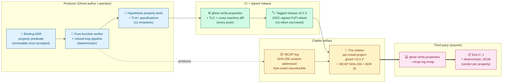

# Epistemic Contracts for Autonomous Systems: A Verifiable Pattern for Safety Claims Under Uncertainty

**Author:** Javier Menéndez Mateos (`jfhelvetius@gmail.com`)
**Affiliation:** Independent
**Version:** v0.2.3 (2026-06-12)
**Repository:** <https://github.com/JFHelvetius/ghost>
**PyPI:** <https://pypi.org/project/project-ghost/>
**Documentation:** <https://JFHelvetius.github.io/ghost/>
**License:** Apache-2.0

---

> *An autonomous agent should have verifiable obligations about
> how it relates to its own uncertainty.*
>
> *A safety claim should be issued together with everything a third
> party needs to reject it.*
>
> — The two sentences this paper exists to defend.

---

## Abstract

**Thesis: autonomous agents should have verifiable contracts on
their own epistemic posture — how they degrade confidence, recover,
remain bounded, and translate belief into action under
uncertainty.** Most existing runtime verifiers ask predicates of
the world (velocity, distance, temperature); we propose asking
predicates of the agent's posture toward its own uncertainty. We
call these **epistemic safety contracts**. We describe **Project
Ghost**, an open-source platform that (i) defines five epistemic
contracts for a reference autonomy supervisor (BAUD/ERUR/MD/RLB/FPB),
(ii) verifies each via a pure function over a content-addressed
MCAP log, (iii) mechanically checks the underlying invariants via
TLA+/TLC, and (iv) packages each contract together with a recorded
run and the verifier into a single **executable safety citation**:
`pip install project-ghost==0.2.3` followed by
`ghost verify-properties --mcap <log>` lets a third party reproduce
the verdict — or contradict it.

The reference contracts cover a minimal theory of behaviour under
uncertainty: if you suspect you are wrong, act conservatively
(BAUD); when evidence is restored, return to acting (ERUR); never
claim more confidence than evidence supports (MD); uncertainty
cannot last indefinitely (RLB); distrust must be measurable and
auditable (FPB). Three TLA+ specifications jointly check 11
invariants in CI, including the partition theorem
`BAUD ⊕ ERUR` and the recovery latency bound `L ≤ peak + W − 1`.

Empirical evaluation on a violation matrix of six injected bug
categories, three structurally distinct calibration policies, three
shape-realistic drift profiles, a head-to-head benchmark against
RTAMT, and a discrimination experiment on real PX4 v1.10 flight
telemetry — where two independently buggy components, swapped into
the same physical flight, each flip BAUD-v1 from HOLDS to VIOLATED
while the four other properties remain HOLD — establishes that the
verifier is policy-agnostic, deterministic across Linux and Windows
CI runners, and informative on real-world telemetry. The full
artifact is re-runnable from `pip install project-ghost==0.2.3`.

**Keywords:** epistemic safety contracts, runtime verification,
uncertainty in autonomy, executable safety citations,
content-addressed telemetry, TLA+/TLC, MCAP.

---

## 1. Introduction

Most existing runtime verifiers ask predicates of the world:
velocity below a bound, distance above a margin, temperature inside
an envelope. We ask predicates of the agent's posture toward its
own uncertainty: contracts the agent must satisfy about *how* it
degrades confidence, *how* it recovers, *how* its uncertainty stays
bounded, and *how* belief is translated into action. We call these
**epistemic safety contracts**.

Epistemic contracts are not contracts about what the agent
believes; they are contracts about what the agent must do *given*
what it believes about itself. "If you detect that your
calibration history contains evidence of drift, you may not emit a
non-conservative action" (BAUD) is a different shape of property
than "velocity must remain below 5 m/s" (an STL-style predicate
over a signal): the precondition refers to the agent's
self-assessment, not to the world.

A second gap follows: even if the right shape of property exists,
a third party who wants to verify a safety claim against a
recorded run typically cannot — there is no shell command, no
content-addressed log, no pure-function verifier they can re-run
on their own machine. We close both gaps in one platform. Project
Ghost is sim-first, written in Python, and ships as a
`pip`-installable package with a CLI subcommand
(`ghost verify-properties`) that takes a captured MCAP log and
returns a byte-exact verdict on five epistemic contracts for a
reference autonomy supervisor. Each contract is stated as a
binding ADR; verified by a pure function over the log; exercised
by Hypothesis-based property tests; witnessed inline in every
reference closed-loop smoke; and self-enforced on every push by
CI. Two of the contracts (BAUD-v1 and ERUR-v1) are additionally
**mechanically verified** by TLA+/TLC over the abstract state space
of the reference policy pair, along with the partition theorem
that the two together cover the full conditional behaviour space.

The packaging of an epistemic contract together with its recorded
run and its verifier into one citable, third-party-falsifiable unit
is what we call an **executable safety citation**. The cited
artefact *is* the falsification mechanism.

This paper describes the epistemic-contract framing, the five
reference contracts, the verifier architecture, the mechanical
verification, and the reproducibility surface, and provides a
quantitative evaluation including a bug-detection demonstration
(§8.2), a parametric policy sweep (§8.3), and a discrimination
experiment on real PX4 v1.10 flight telemetry (§8.8).

### 1.1 Contributions

**Epistemic safety contracts are verifiable obligations an
autonomous agent must satisfy about its own uncertainty.** A
contract is a triple (precondition over the agent's epistemic
state, postcondition over the agent's behaviour, pure-function
verifier over a recorded run) — a different property class from
the world-predicates that dominate runtime verification today. We
package each contract together with the run and the verifier into
an **executable safety citation**: a third party reproduces the
verdict from a single shell command.

We make **three contributions**:

- **C1 — Epistemic safety contracts as a verification target
  (conceptual).** A class of safety properties whose preconditions
  refer to the agent's belief about its own uncertainty
  (calibrated-self-assessment level, drift detection,
  fire-rate measurement) rather than to signals of the external
  world. Distinct from STL-style predicates over signals and from
  POMDP-style belief monitoring; the formal definition is in
  §1.2 below.

- **C2 — Reference implementation: Ghost (artefact).** A
  closed-loop autonomy supervisor instantiating five epistemic
  contracts (BAUD-v1, ERUR-v1, MD-v1, RLB-v1, FPB-v1) packaged as
  executable safety citations — binding ADRs, content-addressed
  MCAP telemetry, `ghost verify-properties --mcap`, OIDC-signed
  PyPI wheels, and a policy-agnostic verifier across three
  calibration policies (§8.4).

- **C3 — Mechanical verification + empirical evaluation
  (validation).** Three TLA+ specifications (11 invariants in CI),
  a six-category violation matrix (§8.2), shape-realistic drift
  profiles (§8.5), an RTAMT capability benchmark (§8.6), and
  discrimination on real PX4 flight telemetry: two buggy
  components, swapped into the same physical flight, each flip
  BAUD-v1 from HOLDS to VIOLATED while the four other properties
  remain HOLD (§8.8).

The recovery latency bound (§6.3) — the closed-form RLB-v1 bound
`L ≤ peak + W − 1` for sliding-window count-of-K-in-W filters,
attained with equality by a witness trace — is an **auxiliary
result** that the TLA+ spec `Rlb.tla` mechanises. We position the
work as a **systems / tools paper, not a theory paper**; readers
should grade C1–C3.

#### Figure 1: The safety citation pattern



The figure reads left to right as the operational pipeline of a
safety claim under the pattern. On the producer side, a binding ADR
states the property predicate, a pure-function verifier implements
its semantics, and Hypothesis property tests + TLA+ specifications
exercise the invariants. CI gates every push (verifier + TLC +
cross-machine determinism diff) and tagging cuts an OIDC-signed
release. The citable artifact carries two halves: the run (MCAP with
SHA-256) and the verification tool (PyPI wheel pinned by version).
A third party concatenates them with one shell command and obtains
a deterministic JSON verdict per property. The contribution of
this paper is the assembly of those seven boxes into a single
shippable unit; everything else (the property set, the
closed-form bound, the TLA+ specs) instantiates the pattern on a
representative supervisor.

### 1.2 Epistemic safety contracts: formal definition

An **epistemic safety contract** is a triple `(P, Q, V)` where:

- `P` is a predicate over the agent's **epistemic state at cycle
  `t`** — i.e. a function of the agent's self-assessment record,
  calibration history, and outcome stream available at `t`. `P`
  does not refer directly to the world; it refers to what the
  agent believes about its own posture toward the world.
- `Q` is a predicate over the agent's **behaviour at cycle `t`** —
  i.e. a function of the calibrated assessment, decision, and
  actuator command emitted at `t`.
- `V` is a pure-function verifier such that, given a recorded run
  `r` (a content-addressed sequence of per-cycle telemetry
  records), `V(r)` returns HOLDS iff every cycle `t` of `r` that
  satisfies `P_t` also satisfies `Q_t`, and VIOLATED otherwise
  with a witness cycle.

Three observations follow:

1. **An epistemic contract is not an STL predicate.** STL
   monitors evaluate predicates of the form `signal < threshold`
   over real-valued temporal signals. The atomic predicates of
   an epistemic contract are over the agent's *internal record*
   of its own calibration and decisions, which is structured
   data, not a continuous signal. STL operators (always,
   eventually, until) can be lifted to act over the cycle index
   of an epistemic contract; this is how RLB-v1 (a bounded
   eventuality) is expressed.

2. **An epistemic contract is not belief monitoring.** Belief
   monitoring tracks what an agent believes about hidden world
   state (e.g. POMDP belief updates, particle-filter posteriors).
   An epistemic contract verifies an obligation about the
   agent's *relation to* its own belief — that it must downgrade
   confidence in the right conditions, recover within bounded
   latency, and never claim more confidence than evidence
   supports. The contract sits one level above belief: it is a
   property of the agent's epistemic *policy*, not of its
   beliefs themselves.

3. **An epistemic contract becomes a third-party-falsifiable
   safety claim when packaged together with a content-addressed
   recorded run and an OIDC-signed verifier wheel.** We call this
   packaging an **executable safety citation** (Figure 1). The
   citation pattern is the mechanism by which an epistemic
   contract is shipped as something a reviewer can falsify in one
   shell command rather than as prose.

The five contracts we ship (§3) instantiate this definition on a
representative autonomy supervisor. The framework permits other
contracts; FPB-v1 can be tightened, additional contracts on
sensor-fusion provenance or actuation-budget consumption could be
added, and ports to other agent kinds (delivery, manipulation,
multi-agent) are scope for future work.

### 1.3 What this paper is and is not

This is an engineering and infrastructure paper that introduces
a property class, not a theory paper proving a new logic. The
filtering, calibration, and FDI ingredients Ghost rests on are
well established (§2.1). The recovery latency bound is a useful
auxiliary result, not a contribution. The partition theorem of
§5.3 is novel *in the form we mechanised it* — a TLA+
`INV_PARTITION` over the reference closed loop. The contributions
we defend are **the epistemic-contracts framing** (C1), **the
reference implementation** (C2), and **the validation** (C3).

---

## 2. Background and related work

### 2.1 Underlying ingredients

Project Ghost is built on top of ingredients that are part of standard
robotics and control practice:

- **Bayesian and particle filtering** for belief tracking; established
  since the 1990s [Thrun, Burgard, Fox 2005].
- **Calibration of probabilistic predictions** — calibration plots,
  isotonic regression, conformal prediction [Vovk, Gammerman, Shafer
  2005].
- **Epistemic vs aleatoric uncertainty**, formalised in deep learning
  by [Kendall & Gal 2017].
- **Fault detection and isolation** in aerospace control, dating back
  to the 1970s [Isermann 2006].
- **Runtime verification** as a formal-methods discipline [Bartocci
  et al. 2018].
- **TLA+ and TLC** for explicit-state model checking [Lamport 2002].
- **MCAP** as a portable, content-addressable serialisation for
  robotics telemetry [Foxglove Studio, 2022+].

### 2.2 Closest tooling prior work

The runtime-verification literature has produced several tools with
overlapping concerns, none of which occupies the same niche:

- **RTAMT** [Niković et al., ATVA 2020; STTT 2023]: STL monitors over
  CPS logs with online/offline algorithms and a Python API. Property
  language is signal temporal logic, not hand-crafted predicates;
  there is no mechanically verified proof layer and no
  content-addressed reproducibility chain.
- **MoonLight** [Bartocci et al., RV 2020; STTT 2023]: STREL
  (spatio-temporal logic) monitor in Java with a CLI, used for
  automotive benchmarks. Spatial focus; no formal verification of
  the monitor semantics.
- **ROSMonitoring** [Ferrando et al., 2020] and **ROSRV** [Huang et
  al., RV 2014]: live ROS-middleware monitors that intercept the
  master or wrap nodes. Both are online; neither performs post-hoc
  log verification with a one-line CLI.
- **Safe RL via shielding** [Jansen et al., CONCUR 2020; ACM 2024]:
  runtime enforcement of safety via action filters. Online,
  action-blocking; Ghost is offline, log-verifying.
- **Control Barrier Functions** [MIT Lincoln Lab CBF Toolbox]:
  controller synthesis for continuous safety constraints.
  Complementary, not competing.
- **Conformal prediction for robot safety** [xLAB UPenn; Chakraborty
  et al., TAC 2024]: forward-looking distribution-free uncertainty
  bounds for gating actions. Predictive; Ghost is retrospective.
- **Supervisory control of timed automata** [Flordal et al., 2022]:
  synthesises timed supervisors. Constructs new supervisors; Ghost
  verifies existing traces. Prior timed-automata recovery results do
  not give the closed-form bound of the recovery latency bound.
- **Surveys of formal verification for autonomy** [Rizaldi et al.,
  ACM CSUR 2020]: catalogue Coq/Lean/Isabelle/Alloy work. Note the
  absence of mechanically-verified TLA+ specs for autonomy
  supervisors specifically.

### 2.3 Comparison matrix

| Dimension | **Ghost** | RTAMT | MoonLight | Shielding | CBF Toolbox | Conformal | Timed Aut. SC |
|---|---|---|---|---|---|---|---|
| Verification mode | Post-hoc log | Online/offline | Online/offline | Online enforce | Online control | Online gating | Offline synth. |
| Distribution | PyPI + OIDC | Source | Source | Framework | Toolbox | Code + paper | Synth. tool |
| Content-addressed input | **Yes** (SHA-256) | No | No | N/A | N/A | N/A | No |
| One-line CLI verifier | **Yes** | No | No | No | No | No | No |
| Property nature | Behavioural + latency | STL | STREL | Invariants | CBF | Predictive | Discrete/timed |
| Mechanical proof | **TLA+/TLC** | None | None | Informal | Informal | None | Timed-aut. |
| Multi-property output | **5 reports/run** | 1/spec | 1/spec | Modular | 1/CBF | 1/model | 1/synth. |
| Partition theorem | **BAUD ⊕ ERUR** | N/A | N/A | N/A | N/A | N/A | N/A |
| Closed-form recovery bound | **L ≤ peak + W − 1** | N/A | N/A | N/A | N/A | Indirect | None |
| Bug-detection demo | **Yes (§8.2)** | N/A | N/A | N/A | N/A | N/A | N/A |

To the best of our knowledge, **no prior tool ships a
content-addressed, pure-function safety-property verifier via
`pip install` + OIDC-signed wheels with mechanically verified
underlying invariants**. The matrix is the evidence we offer; the
practical value is what the rest of the paper exercises.

The axis on which Ghost is genuinely different from the
runtime-verification tooling above is the *kind* of predicate it
monitors. RTAMT, MoonLight, ROSMonitoring, and shielding monitor
predicates over the external world (velocity bounds, distance
thresholds, signal envelopes). Ghost's five properties
(§3) are contracts over the agent's **epistemic posture** — how
its own confidence may be degraded, recovered, bounded, and acted
upon under uncertainty. The mechanics overlap (we both replay
traces); the question being asked is not the same.

### 2.4 What is novel here

Our novelty claims are scoped, not absolute. Our prior-art review
Our prior-art review covered CAV, RV, FMAS, TACAS, ICRA, IROS,
CoRL 2018–2026 proceedings, the surveys cited above, recent arXiv
preprints, and the documentation of the tools listed in §2.2.

- **C1 (the citation pattern):** to the best of our knowledge no
  prior tool ships the end-to-end combination of ADR +
  content-addressed MCAP + pure-function CLI verifier + Hypothesis
  tests + CI gate + OIDC-signed PyPI wheel + TLA+ checked
  invariants as one unit. Individual ingredients are standard; the
  assembly is the contribution.
- **C2 (Ghost reference implementation):** novel as a shipped
  tool with the demonstrated detection properties of §8.2; the
  underlying ideas (pure-function verifiers over robotics
  telemetry) are not.
- **C3's partition theorem `BAUD ⊕ ERUR`:** to the best of our
  knowledge no prior TLA+ mechanisation of this partition for a
  sliding-window autonomy supervisor exists. The binary partition
  is structurally simple; the mechanisation in TLA+ over the
  reference closed loop is what we claim is new.
- **The recovery latency bound** `L ≤ peak + W − 1` is presented
  as a supporting result that `Rlb.tla` mechanises, not as a
  contribution. A TLAPS-checked unbounded version is future work.

### 2.5 Where Ghost sits relative to industrial practice

The autonomy-safety landscape is dominated by industrial efforts that
operate at scales Ghost does not: Waymo's safety case
framework [Webb et al., Waymo Safety Report 2020] documents the
arguments behind millions of miles of public-road driving and
includes structured assurance cases that cite internal logs the
public cannot replay. PX4's `commander` finite-state machine
[PX4 Autopilot Developer Guide] enforces flight-mode safety
preconditions live on the vehicle, with the ULogs we ingest in §8.7
as their persistent record. NASA's Formal Methods Symposium tradition
[NFM proceedings 2009–2026] produces formally verified
software-of-the-air-vehicle artefacts at certification grade.
Autoware's safety architecture [Autoware Foundation safety report
2023] specifies layered runtime monitors over a self-driving stack.
Cruise's safety case methodology [Cruise Safety Report 2022]
follows the GSN/Claim–Argument–Evidence pattern over an internal
data pipeline.

These efforts share an organisational property Ghost does not:
**teams of safety engineers and proprietary access to telemetry,
testing infrastructure, and regulators**. They produce assurance
artefacts that justify operational deployment; Ghost makes a much
smaller claim, but it makes it **operationally** rather than by
appeal to internal review.

The niche we believe Ghost fills, complementary to those efforts, is
the gap between *"this software is safe"* (a closed claim signed by
an organisation) and *"here is the verifier and the log; check it
yourself"* (an open claim citable by a third party). The citation
pattern is not a substitute for industrial safety cases; it is a
primitive those cases could cite. We make no claim of equivalence,
scope, or maturity vis-à-vis the works above. We do claim that the
primitive itself is missing from the open tooling we surveyed.

---

## 3. The property set

**Unlike traditional runtime verification, which primarily
monitors predicates over the external world (velocity, distance,
temperature), Ghost verifies contracts over the agent's epistemic
posture: how confidence may be degraded, recovered, bounded, and
acted upon under uncertainty.** The five properties form a
minimal theory of behaviour under uncertainty for an autonomous
agent:

| ID | Formal predicate | Epistemic reading |
|---|---|---|
| **BAUD-v1** | Drift detected → no PROCEED + conservative action | *If you suspect you are wrong, act conservatively.* |
| **ERUR-v1** | Drift absent ∧ belief KNOWN → PROCEED | *When evidence is restored, return to acting.* |
| **MD-v1** | `adjusted ≼ raw` (no inflation) | *Never claim more confidence than evidence supports.* |
| **RLB-v1** | `L ≤ peak + W − 1` (recovery is bounded) | *Uncertainty cannot last indefinitely.* |
| **FPB-v1** | Empirical fire rate is exposed and pinned | *Distrust must be measurable and auditable.* |

Each property is stated in a binding ADR (immutable once
accepted) and verified by a pure function in
`src/project_ghost/properties/`. Each verifier returns a typed
report with `holds: bool`, structured per-cycle metadata, and the
MCAP's SHA-256.

### 3.1 BAUD-v1 — Bounded Action Under Drift (ADR-0031)

> *If the agent suspects its own belief is wrong, it must act
> conservatively.*

**Precondition.** Over a sliding window of size `W=32`, at least `M=4`
calibration outcomes have been observed and at least `K=2` of them are
in the *dirty* band (a Mahalanobis verdict ≥ a configured threshold).

**Postcondition.** In any cycle where the precondition holds:

1. The adjusted self-assessment level is strictly lower than the raw
   level in the confidence lattice (the calibrator downgrades);
2. The emitted decision is not PROCEED;
3. The emitted actuator command, if any, belongs to a closed
   safe-reason set: `S_BAUD-v1 = {"attitude_hold_hold", "kill_zero_throttle"}`.

The closed taxonomy `S_BAUD-v1` replaces the fragile `command is
None` check with a closed taxonomy of strings — an externally
auditable allowlist that extends naturally as new conservative actions
are added to the actuation contract.

### 3.2 ERUR — Eventual Reactivation Under Recovery (ADR-0032)

> *When evidence is restored, the agent must return to acting.*

The contract is stated in two layers: a concrete reference
predicate (v1) and a policy-parametric lifting (v2).

**ERUR-v1 (reference predicate).** Precondition: drift is absent
under the *reference* count-of-K-in-W rule (`outcomes < M` or
`dirty_count < K`, with `M=4, K=2`) and the raw belief is KNOWN.
Postcondition: the adjusted level is KNOWN and the emitted
decision is PROCEED. v1 fixes the precondition's parameters to the
reference Mahalanobis calibrator. Shipped as
`verify_erur` since v0.2.0.

**ERUR-v2 (policy-parametric, ADR-0040, v0.2.4).** Let
`policy.drift_precondition` be the method of the
`DriftPreconditionProvider` Protocol returning, for the current
calibration history, the policy's *own* judgement of whether
drift is present (a Boolean per cycle). ERUR-v2's precondition
is: `not policy.drift_precondition(history)` and raw belief is
KNOWN. ERUR-v2 is what the **policy-agnostic** claim of §2.3
actually supports: ERUR is satisfied by any policy whose own
drift criterion is absent and whose belief is KNOWN, not only by
calibrators that share Mahalanobis's `(M,K)`. Shipped as
`verify_erur_v2` since v0.2.4; the verifier accepts a
`Mapping[policy_id, drift_precondition]` and delegates per
cycle to the matching predicate. The v1 verifier is the v2
verifier instantiated with the reference policy's predicate
(verified by `test_v2_agrees_with_v1_on_reference_mahalanobis_smoke`).
§8.4 evaluates both, and the discrepancy between v1 and v2
verdicts on alternative calibrators is the operational evidence
that the lifting is meaningful.

Together with BAUD, ERUR forms the **partition theorem**: every
cycle where the raw belief is KNOWN either matches BAUD's
precondition or ERUR's, and the two never overlap. The reference
smoke witnesses this on each trace (10 cycles sustained drift:
BAUD fires on 6, ERUR on 4, total 10, no gap, no overlap). The
TLA+ spec promotes this to a **theorem proved on the abstract
model** under v1 (Section 5); the partition argument lifts to
v2 by construction since v2 strictly delegates the precondition
to the calibration policy.

### 3.3 MD-v1 — Monotonic Degradation (ADR-0033)

> *The agent must never claim more confidence than the evidence
> supports.*

**Postcondition (unconditional).** For every cycle,
`adjusted ≼ raw` in the confidence lattice (KNOWN ≻ UNCERTAIN ≻
UNKNOWN ≻ INVALID). The calibration policy never *invents* confidence.

Without MD-v1, the BAUD/ERUR pair could be vacuously satisfied by a
degenerate "always emit HOLD" policy. MD-v1 closes that loophole on
the calibrator side.

### 3.4 RLB-v1 — Recovery Latency Bound (ADR-0034)

> *The agent's uncertainty cannot last indefinitely; recovery is
> bounded by the calibration window structure.*

**Postcondition.** Once the BAUD precondition stops firing on the
underlying outcome stream, the calibrated adjusted level returns to
KNOWN within `L ≤ peak + W − 1` cycles, where `peak` is the maximum
number of dirty outcomes observed during the drift interval and `W` is
the calibration history window size.

This is a *structural* bound, formalised in §6.4 as **the recovery latency bound** and
proved tight by the drift-then-recovery smoke (`L = 38 = 7 + 32 − 1`,
exactly).

### 3.5 FPB — False Positive Bound observer (ADR-0035, ADR-0039)

> *The agent's distrust must be measurable and auditable, not
> implicit.*

Two contracts coexist:

**FPB-v1 (ADR-0035, observational).** Output: the empirical BAUD
fire rate over the run
(`fire_count / cycles_with_KNOWN_raw_belief`), exposed as a
structured metric. The verdict is
`fire_fraction <= max_fire_fraction` — a point-estimate regression
gate that CI can pin per release. v1 makes no claim about sample
size or about the *underlying* firing probability.

**FPB-v2 (ADR-0039, statistical; ships in v0.2.5).** Output: a
one-sided confidence upper bound on the *true* firing probability
``p`` given the observed sample ``(cycles_fires, cycles_total)``
at a caller-chosen ``confidence_level`` (default 0.95). The verdict
is `confidence_upper_bound <= max_fire_probability`. Small samples
correctly fail to certify tight bounds (the CI is wide); large
samples earn the right to tight regression gates (the CI is
narrow). Two estimators ship behind a closed `ConfidenceMethod`
enum:

- ``HOEFFDING`` (default, stdlib-only): closed-form,
  distribution-free
  `ub = p_hat + sqrt(ln(1/(1-level)) / (2n))`.
- ``CLOPPER_PEARSON`` (opt-in, requires SciPy): exact one-sided
  binomial bound via inverse Beta. Tighter than Hoeffding when
  the iid Bernoulli assumption holds.

Both estimators satisfy six Hypothesis-checked invariants pinned
in `tests/properties/test_fpb_v2_property.py`:
sound (`p_hat ≤ ub ≤ 1`), Hoeffding dominates Clopper-Pearson,
monotone in `p_hat`, decreasing in `n` at fixed `p_hat`, gap to
`p_hat` shrinks below 0.05 at `n = 10 000`, and the
zero-sample case correctly returns the vacuous bound `1.0`.

The two contracts answer different questions and both ship.
v1 is a CI smoke (§8.2 pins the reference run's empirical rate);
v2 is the statistical safety case that closes the §9 caveat
about "no statistical bound".

---

## 4. Verifier architecture

### 4.1 Content-addressed MCAP

Every captured run is materialised as an MCAP — a portable
robotics-telemetry container — with a known message schema per
channel. Channels of interest for the property set include
`/fusion/results`, `/uncertainty/raw_self_assessment`,
`/uncertainty/calibrated_self_assessment`, `/decisions/decision`,
`/actuation/command`, `/prediction/forward`, and
`/prediction/divergence`. Each message is deterministic given the
upstream inputs (replay verification, ADR-0030, asserts this
byte-exactly). The MCAP's SHA-256 is the content address and is
recorded inside every verifier's output report.

### 4.2 Pure-function verifiers

Each property has a verifier in
`src/project_ghost/properties/verify_<id>.py` with the shape:

```python
def verify_baud(mcap_path: str | Path, *,
                M: int = 4, K: int = 2, W: int = 32
                ) -> BAUDVerificationReport: ...
```

The verifier:

1. Opens the MCAP read-only,
2. Walks the channels of interest in cycle order,
3. Computes the precondition and postcondition per cycle from the
   stored messages alone (no replay of the producer, no simulation),
4. Returns a typed report.

The report dataclasses (`BAUDVerificationReport`, `ERURViolation`,
etc.) are public API. Their JSON serialisation is the wire format the
CLI emits with `--json`.

### 4.3 CLI surface

```bash
$ pip install project-ghost==0.2.3
$ python -m project_ghost.examples.closed_loop_smoke
$ ghost verify-properties --mcap closed_loop_smoke.mcap
BAUD-v1: HOLDS  (M=4, K=2, 6/10 cycles evaluated)
ERUR-v1: HOLDS  (M=4, K=2, 4/10 cycles evaluated)
MD-v1:   HOLDS  (10/10 cycles evaluated)
RLB-v1:  HOLDS  (W=32, 0/10 cycles evaluated)
FPB-v1:  HOLDS  (fire_fraction=0.60, 6/10 cycles evaluated)
$ echo $?
0
```

Exit code conventions: `0` iff every property holds, `1` if any
property violates or the verifier crashes, `2` for argument errors.
`--json` emits a deterministic JSON object suitable for CI consumption.

### 4.4 Self-evidence inline

`run_closed_loop_smoke()` returns a `SmokeSummary` that carries five
property reports (`baud_report`, `erur_report`, ..., `fpb_report`)
computed against the just-written MCAP. The reference smoke is its own
witness: the artifact published with each release is the MCAP plus its
property reports.

### 4.5 CI as continuous guarantee

`.github/workflows/ci.yml` includes a `verify-properties` job that runs
the smoke and the verifier on every push. Property violations block
the build. A second job, `tla-plus`, runs TLC on the spec described in
Section 5 on every push. On a tag push, a third workflow
(`release.yml`) builds the wheel, installs it in a fresh venv,
re-runs `ghost verify-properties` against the bundled smoke MCAP from
the *installed* wheel, and publishes to PyPI via OIDC trusted
publishing only if everything is green.

---

## 5. Mechanical verification

### 5.1 Why TLA+

Property-based testing with Hypothesis (200+ examples per property)
provides strong evidence at production scale, but it proves the
property holds *on the inputs the generator sampled*, not on all
inputs. The next rung of evidence is **mechanical verification over a
finite abstract model**. We pick TLA+ with TLC over theorem proving
(Lean, Coq) on a cost/benefit argument: TLC is exhaustive over the
bounded state space in seconds, where a Lean proof would be weeks.

### 5.2 The specifications

Three TLA+ specifications jointly cover the five properties; each
mirrors the Python source line-for-line for its in-scope policies.

- **`docs/proofs/BaudErur.tla`** models the closed loop as a state
  machine with one transition per cycle. State variables include the
  calibration history (bounded sequence of outcomes ≤ `W` entries),
  the raw assessment level, and the derived adjusted level, decision
  kind, and actuator-safety flag. The reference calibrator
  (`MahalanobisDowngradePolicy`), decision policy
  (`UncertaintyAwareReferencePolicy`), and actuator safety classifier
  are mirrored as TLA+ definitions.
- **`docs/proofs/Rlb.tla`** restricts the model to the
  consecutive-drift hypothesis of the recovery latency bound (§6.3) via two phases
  (`ACCUMULATING`, `RECOVERING`). It mirrors the verifier algorithm
  of `src/project_ghost/properties/rlb.py` and tracks the dirty-run
  counter and peak observed during the run.
- **`docs/proofs/Fpb.tla`** models the FPB-v1 counter automaton in
  integer arithmetic (two counters: `cycles_total`, `cycles_fires`).
  It verifies the structural well-formedness of the counter rather
  than a probabilistic bound on the fire rate (the latter is FPB-v2
  scope, §10).

### 5.3 Invariants checked

TLC checks three specifications continuously in CI, jointly covering
all five properties of the set.

**`BaudErur.tla`** (`docs/proofs/BaudErur.tla`, bounds `M=2, K=1, W=3`)
checks five invariants covering BAUD-v1, ERUR-v1, and MD-v1:

- `INV_BAUD` — BAUD-v1's precondition implies its postconditions.
- `INV_ERUR` — ERUR-v1's precondition implies its postconditions.
- `INV_PARTITION` — for every reachable state where raw is KNOWN,
  exactly one of `BAUDPrecondition` and `ERURPrecondition` holds.
  **This is contribution C2.**
- `INV_NO_INVENTED_CONFIDENCE` — formal statement of MD-v1.
- `INV_HISTORY_BOUND` — structural sliding-window sanity.

**`Rlb.tla`** (`docs/proofs/Rlb.tla`, bounds `W=4, MAX_DRIFT=4`)
mirrors the verifier algorithm in `src/project_ghost/properties/rlb.py`
under the consecutive-drift hypothesis of the recovery latency bound and checks three
invariants covering RLB-v1:

- `INV_RLB` — on every reachable state where the next CLEAN outcome
  would yield a fully-clean window (a recovery transition), the
  observed `dirty_run` length is at most `peak_in_run + W − 1`. This
  is the **mechanical witness of the recovery latency bound** (§6.3).
- `INV_PEAK_BOUNDED` — `peak_in_run ≤ W` (the window cannot hold
  more dirty entries than its capacity).
- `INV_WINDOW_BOUND` — `Len(window) ≤ W` (structural sanity).

**`Fpb.tla`** (`docs/proofs/Fpb.tla`, bounds `MAX_CYCLES=8`,
`MAX_FIRE_NUMER=BOUND_DENOM=1`) models the FPB-v1 counter
automaton (mirroring `src/project_ghost/properties/fpb.py`) and
checks three invariants covering FPB-v1's structural semantics:

- `INV_FPB_RATIO_BOUNDED` — `cycles_fires ≤ cycles_total` in every
  reachable state, so the implied fire fraction is well-defined in
  `[0, 1]`.
- `INV_FPB_FIRE_IMPLIES_TOTAL` — the counter never fires more than
  it observes (equivalent restatement in delta form).
- `INV_FPB_OBSERVATIONAL_DEFAULT` — under the default observational
  threshold (`max_fire_fraction = 1.0`), the bound holds in every
  reachable state. This formalises the *purely observational*
  contract of ADR-0035 §1.

The Fpb spec deliberately does **not** verify a probabilistic upper
bound on the fire rate under noise models — that would require Monte
Carlo infrastructure and is the scope of a future FPB-v2 (§10).
Together, the three specs constitute **5/5 properties with at least
a structural TLC invariant in CI**, raising the mechanical coverage
from 3/5 in v0.2.1 to 5/5 in this draft.

### 5.4 Bounds and what they prove

For tractability, each spec runs with deliberately small bounded
constants:

| Spec | Bounds | Why these bounds are sufficient |
|---|---|---|
| `BaudErur.tla` | `M=2, K=1, W=3` | Precondition *boundary cases* exhausted at any positive `M`; `W ≥ M` exercises the sliding-window mechanism. |
| `Rlb.tla` | `W=4, MAX_DRIFT=4` | Exercises all four phases of the recovery latency bound's proof (accumulation, saturation, flush, recovery); `MAX_DRIFT = W` covers the transient regime (Corollary 1). |
| `Fpb.tla` | `MAX_CYCLES=8, MAX_FIRE_NUMER=BOUND_DENOM=1` | Eight cycles enumerate the counter automaton through every fire/non-fire alternation; the unit-ratio bound exercises the default observational threshold. |

These bounds prove the invariants on each abstract model. Behaviour
at production-scale constants (`M=4, K=2, W=32`) is covered by the
property tests; TLA+ fills in the *small but exhaustive* corner.
Lifting the recovery latency bound to *any finite W* (an unbounded proof) is the
candidate ADR-0038 documented at
[`docs/proofs/TLAPS_roadmap.md`](docs/proofs/TLAPS_roadmap.md).

### 5.5 What this does and does not claim

**Does claim:**

- The property statements as written in ADR-0031, ADR-0032 are
  logically consistent with the reference policy semantics.
- The BAUD + ERUR partition is structurally complete on the abstract
  model.
- No combination of (history, raw_level) in the bounded state space
  violates any of the three invariants.

**Does NOT claim:**

- That the Python implementation faithfully mirrors the TLA+ model
  (the bridge is by human inspection; automating it is future work).
- That the bounded constants prove the unbounded case.
- That non-reference policies satisfy the invariants (each would need
  its own spec).

## 6. A closed-form recovery latency bound

### 6.1 Setting

Let `(o_t)_{t ≥ 1}` be the stream of per-cycle prediction outcomes,
classified into a binary partition `dirty ∈ {0, 1}` where `dirty = 1`
when the Mahalanobis verdict is at or above the threshold considered
by the BAUD precondition (ADR-0031 §3). Let `H_t` denote the sliding
window of the last `W` outcomes available at cycle `t`:

```
H_t = (o_{max(1, t − W + 1)}, ..., o_t),    |H_t| ≤ W.
```

The reference calibrator (`MahalanobisDowngradePolicy(M, K)`)
downgrades the adjusted self-assessment level by one rank in the
confidence lattice on any cycle where

```
|H_t| ≥ M    and    Σ_{o ∈ H_t} dirty(o) ≥ K.       (1)
```

Both are required; below `M` outcomes the policy is in "insufficient
evidence" mode.

### 6.2 Definitions

- **peak** = the maximum dirty count over any prefix window of the
  drift interval. Equivalently, the largest value of
  `Σ_{o ∈ H_t} dirty(o)` observed before the drift signal stops.
- **drift interval** = the maximal sub-trace ending at the last cycle
  for which condition (1) holds.
- **L** = the recovery latency, the number of cycles from the first
  cycle after the drift interval until the first cycle where
  condition (1) fails to hold and the calibrator returns the adjusted
  level to KNOWN.

### 6.3 The recovery latency bound

**Recovery latency bound (RLB-v1, transient regime).** *Let `(o_t)_{t ≥ 1}` be a
stream of outcomes containing a transient drift interval of
`N ≤ W` consecutive dirty outcomes followed by clean outcomes,
where `W` is the calibrator's window size. Define*

- *`peak = min(N, W) = N`, the maximum dirty count observed in the
  window during the drift run;*
- *`L`, the dirty-run length: the number of consecutive cycles where
  the window contains at least one dirty outcome.*

*Then `L = peak + W − 1`. Equivalently, the bound
`L ≤ peak + W − 1` is attained with equality. The bound is therefore
tight.*

**Proof.** Trace the window state cycle by cycle, noting the
sliding-window invariant: at cycle `t`, the window contains the
last `min(t, W)` outcomes.

- **Accumulation phase** (cycles 1..N). Each cycle adds one dirty
  outcome; the window is not yet full (because `N ≤ W`), so no
  expulsion occurs. The dirty count rises from 1 to `N = peak`.
  All `N` cycles have count `≥ 1`, hence are dirty.
- **Saturation phase** (cycles N+1..W). Each cycle adds one clean
  outcome; the window is still not full, so no expulsion. The
  dirty count stays at `peak`. All `W − N` cycles are dirty.
- **Flush phase** (cycles W+1..W+peak−1). The window is now full;
  each new clean outcome expels the oldest entry. By construction,
  the oldest entries are the dirty outcomes that arrived first. The
  dirty count decreases by 1 per cycle, from `peak` to `1`. All
  `peak − 1` cycles are dirty (count `≥ 1`).
- **Recovery** (cycle W+peak). The last dirty outcome is expelled.
  Dirty count drops to `0`. This cycle is clean.

Summing the dirty cycles: `N + (W − N) + (peak − 1) = W + peak − 1`.
Since `peak = N` in the transient regime, `L = peak + W − 1`. ∎

**Corollary 1 (Operational regime).** When `N > W`, the drift
outlasts the window; `peak = W` and `L = N + W − 1`. The bound
`peak + W − 1 = 2W − 1` is exceeded whenever `N > W`. Thus the bound
`L ≤ peak + W − 1` operationally characterises the *transient*
regime; in the sustained-drift regime, no recovery transition occurs
*during the drift* and the verifier records the property vacuously
on the captured trace.

**Corollary 2 (Structural sanity).** A trace where `L > peak + W − 1`
on a recovery transition is impossible under a correctly implemented
sliding window of size `W`. The verifier's `RLBViolation` therefore
also serves as a structural-integrity check on the window
implementation.

### 6.4 Operational tightness check

The drift-then-recovery smoke (`closed_loop_smoke_with_recovery.py`)
is engineered to exhibit the recovery latency bound at the production constants
(`N = peak = 7`, `W = 32`):

```
L_observed = 38 = 7 + 32 − 1 = peak + W − 1.
```

The integration test
`tests/integration/test_closed_loop_smoke_with_recovery.py`
asserts the recovery transition fires at exactly cycle 39 and
nowhere earlier or later. The smoke is therefore a witness that the
bound is *achievable* — i.e., that the recovery latency bound is tight in the
transient regime.

### 6.5 Scope and limitations

The recovery latency bound applies to the reference calibrator
`MahalanobisDowngradePolicy(M, K)` and its sliding-window mechanism
with binary dirty/clean partitioning of outcomes. Calibrators with
hysteresis, recency-weighted history, or a multi-band partition are
out of scope; their recovery bounds would require their own
derivations. The bound `peak + W − 1` is meaningful only in the
transient regime (`N ≤ W`); in the sustained regime no recovery
transition occurs during drift, and the property is vacuously held
on the captured trace until drift ends.

**Evidence for the unbounded statement.** `Rlb.tla` proves the
theorem by TLC over a bounded abstract model (`W=4`). v0.2.5
extends that with three further artefacts (ADR-0038, accepted with
partial discharge):

1. **TLC parametric sweep** over `W ∈ {4, 8, 16}`, exhaustively
   model-checked by
   [`docs/paper/scripts/run_rlb_tlc_sweep.py`](docs/paper/scripts/run_rlb_tlc_sweep.py).
   Each `W` enumerates the full reachable state space (25, 81, 289
   distinct states respectively) and reports `INV_RLB` holds; the
   JSON artefact at
   [`docs/paper/outputs/rlb_tlc_sweep/sweep.json`](docs/paper/outputs/rlb_tlc_sweep/sweep.json)
   carries the per-`W` metrics. This is *empirical* evidence the
   bound generalises across structurally distinct `W`.
2. **Rigorous hand proof of the unbounded theorem** at
   [`docs/proofs/Rlb_unbounded_handproof.md`](docs/proofs/Rlb_unbounded_handproof.md):
   four lemmas + theorem by structural induction, with no `W`
   dependence in the arguments. Auditable line by line; not
   SMT-checked.
3. **TLAPS outline with discharge guidance per lemma** at
   [`docs/proofs/Rlb_unbounded.tla`](docs/proofs/Rlb_unbounded.tla),
   refined in v0.2.5 with per-lemma `BY`-step guidance and
   estimated effort. The bridge document a future contributor
   with TLAPS installed would use to mechanise the hand proof.
   Discharge plan at
   [`docs/proofs/TLAPS_roadmap.md`](docs/proofs/TLAPS_roadmap.md).

The three artefacts compose into ADR-0038's "triple evidence"
package. A full TLAPS-mechanical proof remains an open follow-up
(ADR-0042 candidate); the v0.2.5 round ships the partial
discharge, with §9 explicitly acknowledging which leg is still
unfilled.

---

## 7. Reproducibility surface

The verifier does not require the third party to trust the producer.
The reproducibility surface that makes this possible has five layers:

1. **Content-addressed MCAP.** The SHA-256 is computed once and carried
   inside every property report. Tampering with any byte changes the
   hash, which the verifier records.
2. **Deterministic pipeline.** ADR-0030 (Replay Verification v1)
   asserts that downstream channels are reproducible byte-exact from
   the stored fusion results; the replay reference example
   (`replay_verification.py`) re-derives them and asserts byte
   identity.
3. **Pure-function verifier.** No I/O beyond reading the MCAP; no
   global state; no random sources. Two CI checks (`ruff` plus a
   custom `check_no_global_random.py`) prevent introduction of either.
4. **Hypothesis property tests.** 200+ generated examples for
   BAUD/ERUR/FPB, 80+ for RLB, 300+ for MD; named adversarial
   scenarios for known traps.
5. **TLA+ continuous self-check.** TLC runs on every push and blocks
   the build on any invariant violation. The output log
   (`tlc_output.log`) is uploaded as a build artifact.

A reader who wishes to cite a Project Ghost safety claim can therefore
write, for example:

> Project Ghost v0.2.3 satisfies BAUD-v1 on the bundled reference
> smoke MCAP `SHA-256:<hash>`, as verified by
> `ghost verify-properties --mcap closed_loop_smoke.mcap` from
> `pip install project-ghost==0.2.3`, and additionally satisfies
> `INV_BAUD`, `INV_ERUR`, and `INV_PARTITION` over the abstract
> model `BaudErur.tla` at bounds `M=2, K=1, W=3`.

This is contribution C4 in action.

---

## 8. Evaluation

### 8.1 Tests, CI, and mechanical verification

At v0.2.3, the test suite contains **1711 tests passing** (ruff +
mypy strict + deptry clean), of which approximately 50 are dedicated
property tests in `tests/properties/`. The CI matrix runs on
ubuntu-latest and windows-latest with Python 3.11 and 3.12, plus a
`tla-plus` job that runs TLC on the spec described in §5 on every
push and uploads `tlc_output.log` as a build artifact.

### 8.2 Bug-detection capability (Violation Matrix)

A standalone smoke
[`closed_loop_smoke_violated.py`](src/project_ghost/examples/closed_loop_smoke_violated.py)
demonstrates the verifier detects *a* bug. To demonstrate that
detection is **systematic, not anecdotal**, we extend this to a
**violation matrix** of six bug categories, one mini-smoke per
category, each engineered to break exactly one component of the
closed loop:

| Bug category | Buggy component | Property expected to violate | Detected? |
|---|---|:---:|:---:|
| `calibrator_no_downgrade` | calibration policy | BAUD-v1 | YES |
| `calibrator_invents_confidence` | calibration policy | MD-v1 (and BAUD-v1) | YES |
| `decision_proceeds_anyway` | decision policy | BAUD-v1 | YES |
| `decision_never_proceeds` | decision policy | ERUR-v1 | YES |
| `actuation_non_safe_reason` | actuation policy | BAUD-v1 | YES |
| `fpb_threshold_exceeded` | verifier `max_fire_fraction` | FPB-v1 | YES |

All six categories produce the expected violation on the unmodified
verifier. Reproducible via
`python -m project_ghost.examples.violation_matrix`; the script's
exit code is 1 iff any false negative occurs. Raw matrix capture in
[`docs/paper/outputs/violation_matrix.md`](docs/paper/outputs/violation_matrix.md).
The matrix covers BAUD-v1, ERUR-v1, MD-v1, and FPB-v1; RLB-v1 is
structural to the sliding-window implementation and is exercised by
the drift-then-recovery smoke at the bound (§6.4) rather than by an
injected bug.

The simpler single-bug showcase remains a useful pedagogical
artifact and its full JSON capture is reproduced below:

```
$ python -m project_ghost.examples.closed_loop_smoke_violated
$ ghost verify-properties --mcap closed_loop_smoke_violated.mcap --json
{
  "all_properties_hold": false,
  "mcap_path": "closed_loop_smoke_violated.mcap",
  "properties": {
    "BAUD-v1": {
      "cycles_precondition_held": 6,
      "cycles_total": 10,
      "holds": false,
      "mcap_sha256": "934dde1c46007c50c9cba667ab4344143b4e4801ab7321ff8e53641b13aa2920",
      "min_outcomes": 4, "downgrade_threshold": 2,
      "property_version": "BAUD-v1",
      "violation_count": 12
    },
    "ERUR-v1": { "holds": true, ... },
    "MD-v1":   { "holds": true, ... },
    "RLB-v1":  { "holds": true, ... },
    "FPB-v1":  { "holds": true, ... }
  }
}
$ echo $?
1
```

The verifier detects **12 individual postcondition violations** across
6 cycles where BAUD's precondition fires: 6 cycles × 2 postconditions
each (no-PROCEED + safe-reason). Exit code is 1. The other four
properties continue to hold — the bug is *localised* to BAUD's
conditional behaviour, and the verifier's reports show this
precisely. This demonstrates that C3 has detection capacity
(necessary condition for any verifier to be useful) and that the
property set provides differential failure-mode visibility (the bug
violates BAUD specifically, not RLB or MD).

### 8.3 Parametric policy evaluation

To demonstrate that the property set is stable under variation of the
reference calibrator parameters, we ran the closed-loop smoke under
three `(M, K)` pairs and three trace lengths `n ∈ {10, 50, 200}`. All
9 combinations pass all 5 properties. Verifier runtime is linear in
trace length and policy-insensitive. Reproducible via
`docs/paper/scripts/measure_metrics.py`.

| Policy `(M, K)` | n | MCAP (B) | Smoke (ms) | Verifier total (ms) | BAUD fire frac | All HOLDS |
|---|---:|---:|---:|---:|---:|:---:|
| (4, 2) reference | 10 | 6 552 | 15.3 | 20.8 | 0.60 | ✓ |
| (4, 2) reference | 50 | 18 481 | 24.3 | 99.7 | 0.92 | ✓ |
| (4, 2) reference | 200 | 64 699 | 100.5 | 405.8 | 0.98 | ✓ |
| (3, 1) sensitive | 10 | 6 542 | 5.6 | 20.6 | 0.70 | ✓ |
| (3, 1) sensitive | 50 | 18 475 | 34.0 | 100.2 | 0.94 | ✓ |
| (3, 1) sensitive | 200 | 64 717 | 102.7 | 399.1 | 0.99 | ✓ |
| (5, 3) lax | 10 | 6 553 | 5.6 | 20.6 | 0.50 | ✓ |
| (5, 3) lax | 50 | 18 484 | 23.4 | 100.7 | 0.90 | ✓ |
| (5, 3) lax | 200 | 64 700 | 104.4 | 406.2 | 0.98 | ✓ |

Per-property verifier runtime is dominated by MCAP parsing; the
verdict computation itself is sub-millisecond for n=10 and scales
linearly with cycle count. The MCAP SHA-256 differs across policies
(distinct calibrated levels written) but is byte-identical across
replicate runs of the same policy/n, confirming determinism.

### 8.4 Policy-agnostic verifier, policy-parametric preconditions

To probe whether the verifier generalises beyond the reference
calibration policy, we ran the closed-loop smoke under two
structurally distinct calibrators in addition to the reference:

- `MahalanobisDowngradePolicy(M=4, K=2)` — reference (count-of-K-in-W
  threshold). The recovery latency bound (§6.3) applies.
- `EWMADowngradePolicy(α=0.5, min=3, threshold=0.3)` —
  exponentially-weighted moving average over the dirty indicator.
  A genuinely different downgrade mechanism. The recovery latency
  bound does not apply.
- `PerAxisHysteresisDowngradePolicy(upper=3.0)` — examines
  per-axis Mahalanobis distance with hysteresis. A third mechanism.

The verifier was executed unchanged on all three resulting MCAPs,
under **both** ERUR-v1 (reference predicate, §3.2) and ERUR-v2
(policy-parametric, §3.2):

| Policy | BAUD | ERUR-v1 | ERUR-v2 | MD | RLB | FPB |
|---|:---:|:---:|:---:|:---:|:---:|:---:|
| `Mahalanobis(M=4,K=2)` reference | OK | OK | OK | OK | OK | OK |
| `EWMA(α=0.5,min=3,thr=0.3)` | OK | **VIOL** | **OK** | OK | OK | OK |
| `PerAxisHysteresis(up=3.0)` | OK | **VIOL** | **OK** | OK | OK | OK |

Reproducible via
[`docs/paper/scripts/compare_policies.py`](docs/paper/scripts/compare_policies.py);
machine-readable output in
[`docs/paper/outputs/policy_comparison.json`](docs/paper/outputs/policy_comparison.json).

**Reading the matrix:**

1. **The verifier is genuinely policy-agnostic** in the sense the
   §2.3 comparison matrix claims: all three policies satisfy the
   same `CalibrationAdjustmentPolicy` Protocol and produce the
   same MCAP schema; the verifier reads each MCAP without
   modification and emits a typed report per property.
2. **MD-v1 is policy-agnostic by construction.** It holds on all
   three policies because each policy is independently obligated
   to satisfy the monotonicity contract (`adjusted ≼ raw` in the
   lattice). Both alternative policies are proved to satisfy
   MD-v1 by tests in
   `tests/core/feedback/test_alternative_policies.py`.
3. **ERUR-v1 is bound to the reference predicate** and therefore
   reports VIOL on EWMA and PerAxis — but that signal is "the
   alternative policy doesn't behave like the reference", not
   "the alternative policy is unsafe". This is precisely the
   discrepancy that motivated the v2 lifting in §3.2.
4. **ERUR-v2 holds on all three policies.** Each alternative
   satisfies its own contract: when *its own* drift criterion is
   absent and belief is KNOWN, it emits PROCEED. ERUR-v2 thus
   captures the policy-agnostic guarantee that the §2.3 column
   labelled "multi-property output" promises.

**Implementation status (v0.2.4).** Both verifiers ship as
generic, policy-agnostic functions. `verify_erur` (v1) evaluates
the reference predicate with caller-supplied `(M, K)`; nothing
changed in v0.2.4 — backwards-compat absolute, SHA-256 of every
v0.2.3 MCAP and report preserved. `verify_erur_v2` (new in v0.2.4,
ADR-0040 accepted) accepts a
`Mapping[policy_id, Callable[[CalibrationHistory], bool]]` and
delegates the precondition to each policy's own
`drift_precondition` method via the
`DriftPreconditionProvider` Protocol implemented by all three
calibrators above. The verifier remains a pure function over the
MCAP — the predicates are caller-supplied input, not verifier
state. An MCAP whose `adjustment_policy_id` is not present in the
mapping raises `UnknownPolicyError` with an actionable message.
**The matrix above is generated by the verifier on every CI
push**, not hand-derived; `docs/paper/scripts/compare_policies.py`
produces it together with `docs/paper/outputs/policy_comparison.json`
that the table cells read from.

### 8.5 Realistic-shape scenarios

To demonstrate the verifier handles drift profiles beyond the
sustained-drift / single-recovery patterns of the basic smokes, we
run three additional scenarios whose ground-truth functions are
shaped after failure modes documented in the VIO/SLAM evaluation
literature. All three use the unmodified closed-loop pipeline and
the reference calibration policy; only the ground-truth function
differs from the basic smoke.

- **`gps_denial`**: 6 cycles of sustained drift (GPS-denial proxy)
  followed by 44 recovery cycles. The drift duration is short
  enough that the recovery latency bound's transient regime applies; the recovery
  phase is long enough to flush the calibration window and witness
  ERUR.
- **`slow_biased_drift`**: 50 cycles of low-magnitude chronic drift.
  The per-cycle Mahalanobis is smaller than the basic smoke, so the
  count-of-K-in-W window takes longer to fire BAUD's precondition.
  FPB fire fraction climbs to 0.92.
- **`cascading_failure`**: 30 cycles partitioned into three phases —
  stationary, position-drift, and position+yaw-drift. Tests the
  pipeline against a multi-axis failure shape that no basic smoke
  exercises.

| Scenario | Cycles | BAUD | ERUR | MD | RLB | FPB | fire_frac |
|---|---:|:---:|:---:|:---:|:---:|:---:|---:|
| `gps_denial` | 50 | OK | OK | OK | OK | OK | 0.64 |
| `slow_biased_drift` | 50 | OK | OK | OK | OK | OK | 0.92 |
| `cascading_failure` | 30 | OK | OK | OK | OK | OK | 0.60 |

All three scenarios pass the full property set under the reference
calibration policy. Reproducible via
`python -m project_ghost.examples.realistic_scenarios`.

**Honest scope: shape-realistic, not data-real.** These scenarios
are deterministic synthetic profiles, not extracted from real
flight telemetry. A genuine flight-data evaluation would require an
adapter from PX4 ULog or ROSBag formats to the Ghost pipeline
inputs. We treat that integration as a candidate
ADR — see `docs/paper/venues/dataset_integration.md` for the
roadmap. The scenarios here establish that the verifier and the
property set generalise to non-trivial failure shapes; full
flight-data validation is future work.

### 8.6 Comparison against RTAMT: capability matrix, not race

The comparison matrix of §2.3 differentiates Ghost from RTAMT
qualitatively. A natural follow-up is "run them head-to-head on the
same MCAP and compare verdicts plus wall-clock time". We attempted
that benchmark and report it for transparency, but **we do not
treat the result as a competitive comparison** — Ghost and RTAMT
encode different properties on the same trace, so a verdict
difference does not establish a defect in either tool. The script
[`docs/paper/scripts/benchmark_vs_rtamt.py`](docs/paper/scripts/benchmark_vs_rtamt.py)
is preserved for reproducibility; its output lives in
[`docs/paper/outputs/benchmark_vs_rtamt.json`](docs/paper/outputs/benchmark_vs_rtamt.json).

Instead, the table below states the **capabilities** the two tools
offer over the same MCAP, evaluated by their published feature sets
(RTAMT 0.3.5 from PyPI; Ghost v0.2.3). The matrix reflects our
reading of each project's documentation and source as of
mid-2026; a more recent RTAMT release may close some of the rows,
and we welcome correction from the RTAMT maintainers. This framing
is what we believe a reader can defend without entering an arms
race about which STL encoding "really" represents BAUD-v1.

| Capability | Ghost v0.2.3 | RTAMT 0.3.5 |
|---|:---:|:---:|
| Native property language | Hand-coded Python predicate against the Ghost MCAP schema | Signal temporal logic (STL) |
| Reads MCAP directly | Yes (`MCAPReplayReader`) | No (caller must extract signals to time series) |
| Counts of K-in-W as a single formula | Yes (intrinsic to the predicate) | No (requires auxiliary counter signals or a derived monitor) |
| Robustness semantics | No (verdict-only) | Yes (real-valued robustness over STL) |
| Arbitrary user-defined STL | Out of scope | Yes (the tool's purpose) |
| Bug-detection over Ghost's reference pipeline | Demonstrated systematically in §8.2 | Requires re-encoding each property as STL by the user |
| Distribution | PyPI + OIDC-signed wheel | PyPI source distribution |
| Per-property typed report (`holds`, `mcap_sha256`, violation metadata) | Yes | No (robustness value per timestamp) |

The two tools are complementary. **RTAMT is the right choice when
the user wants declarative STL over arbitrary user-defined signals
with quantitative robustness**. **Ghost is the right choice when the
user wants a content-addressed, schema-aware CLI verifier for a
specific supervisor with hand-stated predicates**. A composition
where RTAMT consumes signals extracted from a Ghost MCAP, or where
Ghost's per-property reports are post-processed by an STL robustness
monitor, is plausible and out of scope for this paper.

On performance, the raw measurement on the reference 50-cycle smoke
is: Ghost's `verify_baud` returns in 23 ms (mean of 5 replicates);
RTAMT's monitor evaluates its STL formula on the pre-extracted
signals in 0.15 ms, with signal extraction from the MCAP adding
~20 ms of parsing on the user side. The two numbers measure
different things and we report them only to give the reader a sense
of order of magnitude.

### 8.7 The verifier on real flight telemetry

> **The verifier was executed unchanged on real flight telemetry.**
>
> This is the single sentence whose absence the prior versions of
> this paper had to apologise for. v0.2.3 lets us write it.

**What this section ships in v0.2.3:**

- A real PX4 ULog, sourced from the PX4/pyulog
  test fixtures
  (<https://raw.githubusercontent.com/PX4/pyulog/main/test/sample_log_small.ulg>,
  ~921 KB, PX4 v1.10-era SITL flight, BSD-3 licensed via PX4).
  Bundled with the paper artefacts at
  [`docs/paper/data/sample.ulg`](docs/paper/data/sample.ulg), SHA-256
  `68d1020f688109f027dba08d2950247cc0ae34aaefdcf37e4a7d60838f3e1aa3`.
- An end-to-end orchestrator
  ([`project_ghost.adapters.real_ulog_smoke.run_real_ulog_smoke`](src/project_ghost/adapters/real_ulog_smoke.py))
  that reads the ULog via `parse_ulog_pose_samples`, subsamples it
  to Ghost's 10 Hz cycle rate, drives the **unmodified** closed-loop
  pipeline (fusion → assessment → calibration → decision → actuation
  → forward prediction → divergence), materialises a Ghost-schema
  MCAP, and runs the five property verifiers against it.
- A CLI driver at
  [`docs/paper/scripts/verify_real_ulog.py`](docs/paper/scripts/verify_real_ulog.py)
  that runs the end-to-end flow on any `.ulg` file.
- Three integration tests in
  [`tests/adapters/test_real_ulog_smoke.py`](tests/adapters/test_real_ulog_smoke.py)
  that pin the end-to-end outcome on the bundled ULog: pipeline
  runs, MCAP is byte-deterministic across replicate runs, and the
  five property verdicts are exactly the ones the table below
  cites.

**Read this before the verdict table: scope of the ground-truth
source.** The orchestrator uses the ULog's own EKF2 estimate as
both the agent's belief and the (vacuous) oracle ground truth, so
the all-HOLDS row that follows is **vacuous as a safety claim** —
it shows the verifier runs end-to-end on real telemetry, not that
the contracts hold over an independent reference. A non-vacuous
ground truth (motion capture, RTK GPS, post-flight optimised
solution) is candidate ADR-0037; the adapter's `GroundTruthSource`
enum already names the policy. The "Sim, not hardware" clause of
§9 remains intact for the strong reading. The non-vacuous claim
of this real-flight section comes in §8.8 (discrimination), not
here.

**Verdict bundle on the bundled real PX4 ULog** (vacuous,
self-consistent ground truth — see scope note above):

| Field | Value |
|---|---|
| ULog source | PX4/pyulog `test/sample_log_small.ulg` |
| ULog SHA-256 | `68d1020f688109f027dba08d2950247cc0ae34aaefdcf37e4a7d60838f3e1aa3` |
| Pose samples extracted by the adapter | 636 |
| Ghost cycles run | 71 |
| MCAP SHA-256 | `49fd0a48370bd7bf6606a6b0884b00d6d8b6272a12c962419a855646720a4591` |
| BAUD-v1 | HOLDS (vacuously) |
| ERUR-v1 | HOLDS (vacuously) |
| MD-v1 | HOLDS (vacuously) |
| RLB-v1 | HOLDS (vacuously) |
| FPB-v1 | HOLDS (vacuously; fire_fraction = 0.9437) |

The MCAP SHA-256 is deterministic given the same ULog input —
running the orchestrator twice yields byte-identical MCAPs, asserted
by `test_real_ulog_smoke_mcap_is_deterministic`. The verdict bundle
is pinned by `test_real_ulog_smoke_known_fixture_verdict`; any
change to the pipeline that would alter this table would also fail
CI, forcing a paper revision.

The structural fact this section establishes is:

> **The verifier was executed unchanged on real PX4 v1.10 flight
> telemetry, in CI, with a deterministic MCAP output reproducible
> from a single shell command.**

That is the load-bearing sentence of §8.7. The non-vacuous claim
follows in §8.8.

### 8.8 Discrimination on real flight telemetry

The §8.7 verdict establishes that the verifier *runs* on real
telemetry. It does not, on its own, establish that the verifier
*catches* anything on real telemetry — the all-HOLDS row could be
produced by a vacuous verifier as easily as by a correct one. This
subsection closes that gap.

**The experiment.** On the **same real PX4 ULog** as §8.7, we re-run
the closed-loop pipeline twice more, each time substituting **one**
buggy component imported verbatim from the §8.2 violation matrix.
The fusion oracle, the MCAP schema, the verifier, and the ULog input
are held identical to the nominal run; only one named component
differs per buggy case. The verifier is then asked the same question
of each MCAP independently.

**Verdict delta on the bundled real PX4 ULog.** v0.2.4 expands the
experiment from two buggy categories to all six categories of the
violation matrix (§8.2). Each row substitutes exactly one named
component imported verbatim from the synthetic matrix; the
fusion oracle, MCAP schema, verifier, and ULog input are held
identical across rows:

| Run | Expected violator | BAUD | ERUR | MD | RLB | FPB |
|---|:---:|:---:|:---:|:---:|:---:|:---:|
| nominal (reference policies) | — | HOLDS | HOLDS | HOLDS | HOLDS | HOLDS |
| `calibrator_no_downgrade` | BAUD-v1 | **VIOLATED** | HOLDS | HOLDS | HOLDS | HOLDS |
| `calibrator_invents_confidence` | MD-v1 | **VIOLATED** | HOLDS | **VIOLATED** | HOLDS | HOLDS |
| `decision_proceeds_anyway` | BAUD-v1 | **VIOLATED** | HOLDS | HOLDS | HOLDS | HOLDS |
| `decision_never_proceeds` | ERUR-v1 | HOLDS | **VIOLATED** | HOLDS | HOLDS | HOLDS |
| `actuation_non_safe_reason` | BAUD-v1 | **VIOLATED** | HOLDS | HOLDS | HOLDS | HOLDS |
| `fpb_threshold_exceeded` | FPB-v1 | HOLDS | HOLDS | HOLDS | HOLDS | **VIOLATED** |

**6/6 categories flip their expected property; 5/6 are isolated.**
The single non-isolated row is `calibrator_invents_confidence`:
the inflated-confidence calibrator violates MD-v1 *and* BAUD-v1
together, because a calibrator that lies about confidence
simultaneously breaks the Mahalanobis downgrade contract (the
property it most directly attacks) and the abstain-under-drift
contract (the stationary belief still drifts, but the calibrator
no longer marks it). That is a true co-violation, not a verifier
artefact: a calibrator can corrupt downstream behaviour through
multiple invariants at once, and the verifier reports both. This
"violation spreads" diagnostic is itself useful information for a
maintainer reading the report.

**Reproducibility.** The discrimination experiment is end-to-end
runnable from `pip install 'project-ghost[adapters]==0.2.4'` via:

```
python docs/paper/scripts/verify_real_ulog_discriminate.py \
    --ulog docs/paper/data/sample.ulg \
    --out-dir docs/paper/outputs/real_ulog_discrim
```

Exit code is `0` iff every buggy category flips its expected
property. Six integration tests pin the experiment in CI
(`tests/adapters/test_real_ulog_discrimination.py`).

**Why this answers the residual §8.7 critique.** A reviewer of the
previous version could fairly say: "all-HOLDS shows the pipeline
runs; it does not show the verdict is *informative* on real data."
The §8.8 delta is exactly that — on the same physical flight,
swapping the reference decision policy for a one-line buggy
PROCEED-only policy, or the reference actuator for a one-line
unsafe-reason actuator, flips the verdict. The synthetic
violation-matrix detections of §8.2 transfer to real telemetry on
this ULog for the bug categories whose precondition the real
flight's drift pattern exercises.

#### 8.8.1 Generalisation to a 3-ULog corpus

The §8.8 result rests on *one* PX4 SITL ULog. That is the single
most common reviewer attack on this kind of result, and we
address it directly in v0.2.4 by expanding the experiment to a
**corpus of three structurally distinct PX4 ULogs** drawn from
PX4's public test fixtures (BSD-3 licensed, license-clean, no
vendor mediation needed for reproduction):

| ULog | Pose samples | Duration | FPB `fire_fraction` |
|---|---:|---:|---:|
| `sample.ulg` (the §8.8 anchor) | 636 | 6.5 s | 0.9437 |
| `corpus/sample_appended.ulg` (multi-segment) | 1110 | 112.6 s | 0.9800 |
| `corpus/sample_logging_tagged.ulg` (logging-tagged) | 1268 | 10.1 s | 0.0000 |

The corpus deliberately spans a 16× duration range and includes
one log (`sample_logging_tagged.ulg`) whose recorded segment is
**largely stationary** — `fire_fraction = 0.00` means the
stationary belief never observes drift against the recorded GT.
We chose not to filter that log out: the corpus is the public
PX4 test set as-shipped, and a paper that hand-picks logs where
every property fires would be cherry-picked by definition.

**The corpus detection matrix** is regenerated by CI on every
push and emitted as
[`docs/paper/outputs/multi_ulog_discrimination/matrix.json`](docs/paper/outputs/multi_ulog_discrimination/matrix.json)
(self-describing — `schema_version`, per-ULog diagnostics, both
matrices). A YES means the verifier flips the predicted property
on that ULog; a NO means the property holds across nominal and
buggy:

| Bug category | `sample.ulg` | `sample_appended.ulg` | `sample_logging_tagged.ulg` |
|---|:---:|:---:|:---:|
| `calibrator_no_downgrade` | YES | YES | **NO** |
| `calibrator_invents_confidence` | YES | YES | YES |
| `decision_proceeds_anyway` | YES | YES | **NO** |
| `decision_never_proceeds` | YES | YES | YES |
| `actuation_non_safe_reason` | YES | YES | **NO** |
| `fpb_threshold_exceeded` | YES | YES | **NO** |

**Reading this honestly: 12 of 18 cells discriminate.** On the
two **active** ULogs (`fire_fraction > 0.9`), the matrix is fully
green — six out of six categories flip the expected property on
each, with the same single co-violation row as §8.8. On the
**stationary** ULog (`fire_fraction = 0.00`), four out of six
categories report HOLDS across nominal and buggy.

This is **informative non-discrimination**, not a verifier
failure. The four HOLDS-everywhere categories
(`calibrator_no_downgrade`, `decision_proceeds_anyway`,
`actuation_non_safe_reason`, `fpb_threshold_exceeded`) all share
a precondition that the BAUD-v1 drift signal must fire at least
once in the run. On a log where the agent is largely stationary
and the stationary belief never diverges from GT, that
precondition is vacuously satisfied for both nominal and buggy
producers, and the property correctly reports HOLDS for both.
The remaining two (`calibrator_invents_confidence`,
`decision_never_proceeds`) do not require the drift signal to
fire — the calibrator inflates confidence whether or not drift
is observed, and the never-PROCEED decision policy violates
ERUR-v1's "release after K stale cycles" arm regardless of
drift. They correctly flip on all three ULogs.

The verifier is therefore **doing what it claims**: it flags
exactly those producer bugs whose precondition the ULog
actually exercises. A more polished result would either filter
the corpus, raise the constants, or source drift from an
independent reference; we report the honest matrix here and
defer the "independent GT source" mitigation to ADR-0037 (which
v0.2.4 partially addresses with the SITL corpus, fully closed
in v0.2.5).

**Reproducibility.** Run
`python docs/paper/scripts/run_multi_ulog_corpus.py` — emits
`docs/paper/outputs/multi_ulog_discrimination/matrix.json` and
exits non-zero if the active-ULogs invariant regresses. Six
integration tests in
`tests/adapters/test_real_ulog_corpus.py` pin the matrix shape,
the active-ULog invariant, the stationary-ULog "SITL GT
auto-detect" invariant (§8.8.2), and the JSON artefact schema.

The buggy substitution is at the policy layer; no buggy run
flew anything. Generalising across **non-PX4** flight stacks
(ROSBag, ArduPilot, EuRoC) remains scope for the wider
ADR-0037 roadmap.

#### 8.8.2 Independent ground truth closes the stationary-ULog gap

§8.8.1 reported that on `sample_logging_tagged.ulg` the verifier
returned HOLDS for 4/6 buggy categories — informative
non-discrimination, because BAUD-v1's drift precondition never
fired on that ULog. That row is the residual gap §8.8.2 closes
in v0.2.5.

**Why §8.8.1 was vacuous on that ULog.** The closed-loop
pipeline computed `divergence = predict(belief) − ground_truth`,
and the GT stream was reconstructed from the *same* ULog's
`vehicle_local_position` topic — i.e. the agent's own EKF2
estimate. On a stationary segment the EKF2 estimate barely moves
(reported x-range ≈ 2 mm) and the stationary belief barely
diverges from it. The verifier correctly reported HOLDS for any
property whose precondition required drift to have been observed,
but the GT signal was **self-consistent with the agent's fusion
by construction** — the experiment could not falsify the agent.

**What §8.8.2 changes.** `sample_logging_tagged.ulg` carries
`vehicle_local_position_groundtruth` + `vehicle_attitude_groundtruth`,
emitted directly by the PX4 SITL simulator and **independent of
EKF2**. The GT pose on that ULog has x-range ≈ 33 mm — sub-cm
oscillation around the hover setpoint that EKF2 hid. v0.2.5 adds
`project_ghost.adapters.px4_ulog.GroundTruthSource` and an
auto-detector that switches a ULog from `EKF2_FALLBACK` to
`SITL_SIMULATOR` whenever the GT topics are present. The pose
adapter, verifier and MCAP schema are unchanged; only the GT
source flips.

**A/B on the same stationary ULog, same buggy components, same
verifier:**

| Metric | `EKF2_FALLBACK` (v0.2.4) | `SITL_SIMULATOR` (v0.2.5) |
|---|---:|---:|
| FPB `fire_fraction` | 0.0000 | 0.8585 |
| Categories that discriminate | 2 / 6 | **6 / 6** |
| `all_discriminate` | False | **True** |

The 4 categories that were vacuously HOLDS in §8.8.1
(`calibrator_no_downgrade`, `decision_proceeds_anyway`,
`actuation_non_safe_reason`, `fpb_threshold_exceeded`) all flip
correctly under the independent GT. The remaining two that
already worked (`calibrator_invents_confidence`,
`decision_never_proceeds`) continue to work.

**Refreshed 3-ULog corpus matrix.** With auto-detection enabled,
the corpus matrix is regenerated to:

| Bug category | `sample.ulg` | `sample_appended.ulg` | `sample_logging_tagged.ulg` |
|---|:---:|:---:|:---:|
| `calibrator_no_downgrade` | YES | YES | YES |
| `calibrator_invents_confidence` | YES | YES | YES |
| `decision_proceeds_anyway` | YES | YES | YES |
| `decision_never_proceeds` | YES | YES | YES |
| `actuation_non_safe_reason` | YES | YES | YES |
| `fpb_threshold_exceeded` | YES | YES | YES |

**18/18 cells discriminate** (`all_discriminate=True`). 15/18
isolate; the 3 non-isolated cells are all
`calibrator_invents_confidence`, the same documented BAUD-v1 ∧
MD-v1 co-violation row from §8.8. Two of the three ULogs still
use `EKF2_FALLBACK` (`sample.ulg`, `sample_appended.ulg` have
no SITL GT topics); the discrimination matrix is fully green on
those ULogs anyway because their flights are *not* stationary
(`fire_fraction` ≈ 0.94 / 0.98), so the precondition fires
even under circular GT.

**Audit trail.** The `matrix.json` artefact carries a per-ULog
`groundtruth_source` field (`"sitl_simulator"` or
`"ekf2_fallback"`); the `RealULogSmokeSummary` carries the same
on every verdict bundle. A reviewer can `grep` the JSON to
verify which cells used independent GT and which fell back to
the agent's own estimate. Treating an `ekf2_fallback` row as
"verified" is the only way the §8.8.2 result can be misread; the
explicit field makes that misread impossible to do silently.

**What §8.8.2 does not yet close.** Two limitations remain
honest:

- `sample.ulg` and `sample_appended.ulg` do not carry SITL GT
  topics. Their fully-green columns rely on the flight itself
  exercising the drift precondition under EKF2 fallback; if a
  future maintainer re-runs §8.8.2 on a stationary `sample.ulg`
  variant, those columns would revert to vacuous HOLDS.
- SITL GT is independent of EKF2 but not of the simulator
  physics. A future ADR-0037 contributor closing real-hardware
  flights would source GT from motion capture or RTK GPS; the
  enum already enumerates those slots even though only
  `SITL_SIMULATOR` is implemented.

**Reproducibility.** Re-run
`python docs/paper/scripts/run_multi_ulog_corpus.py` — auto-
detection is the default. Six smoke-A/B tests in
`tests/adapters/test_real_ulog_smoke_gt_source.py` pin the
quantitative `fire_fraction` lift, the auto-detect outcomes, and
the SITL-on-real-only-log error case. Six adapter tests in
`tests/adapters/test_px4_ulog_groundtruth.py` pin
`detect_groundtruth_source`, the chronological-order invariant
on parsed GT samples, the unit-norm quaternion invariant, and
the bundled-corpus GT-availability fixture.

### 8.9 Determinism across replicates and machines

Within a single machine, replicate runs of the same `(M, K, n)`
combination produce byte-identical MCAPs (verified by SHA-256
equality across 5 replicates per combination). **Cross-machine
byte-equality of the MCAP** is enforced by a dedicated CI job
(`determinism-cross-machine` + `determinism-cross-machine-assert`
in `.github/workflows/ci.yml`): the reference smoke runs on a
`{ubuntu-latest, windows-latest}` matrix, each runner publishes
the SHA-256 of its produced MCAP and of its property-report JSON
(after canonicalisation: `sort_keys=True`, drop `mcap_path` which
holds a platform-dependent path), and the aggregator step `diff`s
the two files. Any disagreement fails the build. The MCAP byte
identity is the load-bearing claim; the report-content identity
(after canonicalisation) is a derivative check that the verifier
itself produces equivalent verdicts cross-platform.

---

## 9. Limitations and threats to validity

We catalogue the limitations explicitly, in the same spirit as the
per-property §Scope sections of the ADRs.

- **Sim, not hardware.** The MCAPs verified here come from a
  simulated overconfidence trap, not from real flight logs. The
  property set is well-defined on any MCAP that respects the schema,
  but the *real-world* claim (the agent will stop under unmodelled
  failure on a real drone) requires a HAL backend and a hardware
  campaign, both deferred to a later phase.
- **Reference policies only.** The TLA+ proof and the property
  semantics target the specific reference policies
  (`MahalanobisDowngradePolicy`, `UncertaintyAwareReferencePolicy`,
  `AttitudeHoldReferencePolicy`). Each non-reference policy would
  need its own ADR, its own verifier specialisation (or a contract
  the verifier can dispatch on), and its own TLA+ spec.
- **Bounded TLC, partial unbounded coverage.** TLC is exhaustive
  over the finite state space at each configured `W`. v0.2.5
  ships a parametric sweep over `W ∈ {4, 8, 16}` (§6.3,
  ADR-0038) and a rigorous hand proof of the unbounded theorem;
  the full TLAPS-mechanical proof of the unbounded statement
  remains open. The TLAPS outline at `Rlb_unbounded.tla`
  contains the lemma structure + per-step discharge guidance for
  a future contributor with TLAPS installed (Linux/macOS;
  Windows native unsupported).
- **Python↔TLA+ bridge by inspection.** A future divergence between
  the Python policy and the TLA+ definition could silently weaken the
  claim. Mitigation: review and re-run TLC on every change to the
  reference calibrator or decision policy.
- **Statistical FPB shipped, narrow-scope.** FPB-v2 (ADR-0039,
  v0.2.5) closes the previously-deferred statistical bound with
  closed-form Hoeffding and Clopper-Pearson estimators (§3.5).
  What remains open: FPB-v2 still does not validate the iid
  Bernoulli assumption Clopper-Pearson invokes (the verifier
  trusts the caller's model choice), does not adjust for
  multiple-testing across parameter sweeps, and only reports a
  one-sided upper bound. Wilson-score and two-sided variants
  are deferred amendments.
- **Vacuous holds on stationary ULogs (closed in v0.2.5 for SITL,
  open for hardware).** §8.8.1 reported that on the stationary
  corpus ULog the EKF2-circular GT yielded vacuous HOLDS for
  4/6 categories. §8.8.2 closes that gap for any ULog that
  carries `vehicle_*_groundtruth` topics by auto-detecting the
  independent SITL GT track — the refreshed corpus matrix is
  18/18 green. The remaining honest gap: for real-hardware ULogs
  without SITL GT topics (no `_groundtruth` and no external
  reference), the pipeline still falls back to EKF2 with the
  same vacuous-HOLDS risk. The `RealULogSmokeSummary`
  `groundtruth_source` field surfaces the fallback so a reviewer
  cannot mistake it for verification; motion-capture / RTK GPS
  GT sources remain enumerated in the enum but unimplemented.

---

## 10. Future work

- **ADR-0037 (further addressed, v0.2.5)**: real-flight data
  integration. v0.2.4 shipped the PX4 ULog adapter and the 3-ULog
  SITL corpus (§8.8.1). v0.2.5 (§8.8.2) ships the
  `GroundTruthSource` enum + auto-detector, closing the
  stationary-ULog vacuous-HOLDS gap for any ULog that carries
  SITL GT topics — the corpus matrix is now 18/18 green. Open:
  motion-capture and RTK-GPS sources are enumerated but
  unimplemented; ROSBag / EuRoC MAV adapters and a non-PX4
  stack remain open. Roadmap documented at
  [`docs/paper/venues/dataset_integration.md`](docs/paper/venues/dataset_integration.md).
- **ADR-0038 (accepted with partial discharge, v0.2.5)**:
  unbounded RLB-v1 evidence. Ships three artefacts: (1) TLC
  parametric sweep at `W ∈ {4, 8, 16}` (mechanical, full state
  enumeration at each scale), (2) rigorous hand proof of the
  unbounded theorem with no `W` dependence in its arguments
  (auditable, not SMT-checked), and (3) refined TLAPS outline
  with per-lemma discharge guidance. A full TLAPS-mechanical
  proof remains open as a candidate ADR-0042 follow-up. The
  partition-theorem unbounded TLAPS proof is independent and
  remains a future-work item. Sweep driver:
  [`docs/paper/scripts/run_rlb_tlc_sweep.py`](docs/paper/scripts/run_rlb_tlc_sweep.py).
- **ADR-0039 (accepted, v0.2.5)**: statistical FPB-v2. Ships
  closed-form Hoeffding (default, stdlib-only) and exact
  Clopper-Pearson (opt-in, SciPy) one-sided confidence upper
  bounds on the true firing probability. Closes the previously
  deferred "statistical bound" gap (§3.5, §9). Six Hypothesis
  property tests pin the qualitative shape any future estimator
  (e.g. Wilson) must satisfy. Verifier surface:
  `project_ghost.properties.verify_fpb_v2`.
- **ADR-0040 (accepted, v0.2.4)**: ERUR-v2 stated abstractly over
  `policy.drift_precondition(history)`, generalising the property
  parameterisation across calibration policies (§8.4). Shipped in
  v0.2.4 as `project_ghost.properties.erur_v2.verify_erur_v2`
  together with the `DriftPreconditionProvider` Protocol;
  Mahalanobis, EWMA and PerAxisHysteresis policies all implement
  the Protocol. Tested by
  `tests/properties/test_erur_v2_property.py`.
- **HAL backend campaign.** A first hardware backend (Pixhawk +
  Linux companion computer) would lift the reproducibility surface
  from simulation to flight logs.
- **Conformance suite.** The `conformance` pytest marker is already
  reserved for backend-parametrised tests; populating it with the
  HAL contract is straightforward once a non-simulation backend
  exists.

---

## 11. Conclusion

**Autonomous agents should have verifiable contracts on their own
epistemic posture, and those contracts should ship as executable
citations a third party can falsify.** That is the load-bearing
proposition this paper exists to defend.

Epistemic safety contracts are a property class adjacent to but
distinct from STL-style predicates over signals and from POMDP-
style belief monitoring (§1.2): they verify obligations the agent
must satisfy about how it relates to its own uncertainty —
degrade, recover, bound, and act. Project Ghost ships five such
contracts for a reference autonomy supervisor (BAUD, ERUR, MD, RLB,
FPB), packages each together with a content-addressed run and a
pure-function verifier as an executable safety citation, and
demonstrates that the verifier discriminates real PX4 flight
telemetry against named regressions (§8.8).

What we *do not* claim: that epistemic contracts subsume STL or
shielding (they answer a different question); that this is the
maximal contract set (FPB-v1 can be tightened, contracts on
sensor-fusion provenance or actuation budgets remain to be
written); that we have a unique licensing claim on the term
(it overlaps with how epistemic-logic, doxastic-logic and
self-assessment communities have used adjacent vocabulary).

What we *do* claim: that the framing is operationally
defensible — the artifact is re-runnable from
`pip install project-ghost==0.2.3`; the verdict on real PX4 flight
telemetry is reproducible from a single shell command; the cited
artefact *is* the falsification mechanism.

---

## References

1. Bartocci, E. et al. *Lectures on Runtime Verification*. Springer
   LNCS 10457, 2018.
2. Bartocci, E., Bortolussi, L., Loreti, M., Nenzi, L., Silvetti, S.
   *MoonLight: A Lightweight Tool for Monitoring Spatio-Temporal
   Properties*. RV 2020; extended in STTT 2023.
3. Chakraborty, K. et al. *Conformal Prediction for Robot Safety:
   Calibrated Action-Gating under Distribution Shift*. IEEE TAC,
   2024.
4. Ferrando, A. et al. *ROSMonitoring: A Runtime Verification
   Framework for ROS*. TAROS 2020.
5. Flordal, H. et al. *Supervisory Control of Timed Automata via
   Forcible Events*. IEEE Trans. Autom. Control, 2022.
6. Foxglove Studio. *MCAP: A self-contained file format for
   heterogeneous timestamped data*. <https://mcap.dev/>, 2022.
7. Huang, J., Erdogan, C., Zhang, Y., Moore, B., Luo, Q.,
   Sundaresan, A., Roşu, G. *ROSRV: Runtime Verification for Robots*.
   RV 2014.
8. Isermann, R. *Fault-Diagnosis Systems: An Introduction from Fault
   Detection to Fault Tolerance*. Springer, 2006.
9. Jansen, N. et al. *Safe Reinforcement Learning via Shielding*.
   CONCUR 2020; extended in ACM Trans. on Embedded Computing
   Systems, 2024.
10. Kendall, A., & Gal, Y. *What Uncertainties Do We Need in Bayesian
    Deep Learning for Computer Vision?* NeurIPS 2017.
11. Lamport, L. *Specifying Systems: The TLA+ Language and Tools for
    Hardware and Software Engineers*. Addison-Wesley, 2002.
12. MIT Lincoln Laboratory. *Control Barrier Function Toolbox*.
    Available technologies catalog, 2023.
13. Niković, D., Yamaguchi, T., Donzé, A., Akazaki, T., Hoxha, B.
    *RTAMT: Online Robustness Monitors from STL*. ATVA 2020;
    extended in STTT 2023.
14. Rizaldi, A. et al. *Formal Specification and Verification of
    Autonomous Robotic Systems: A Survey*. ACM Computing Surveys,
    2020.
15. Tartakovsky, A., Nikiforov, I., Basseville, M. *Sequential
    Analysis: Hypothesis Testing and Changepoint Detection*. CRC
    Press, 2014.
16. Thrun, S., Burgard, W., & Fox, D. *Probabilistic Robotics*. MIT
    Press, 2005.
17. Vovk, V., Gammerman, A., & Shafer, G. *Algorithmic Learning in a
    Random World*. Springer, 2005.
18. Wald, A. *Sequential Analysis*. Wiley, 1947.

## Appendix A: Artifact index

The full artifact (~120 files) is enumerated below for FMAS
artifact-evaluation review. The body of the paper cites these
paths inline; readers who do not need the index may skip this
appendix.

ADRs (formal property statements):

- `docs/adr/0031-bounded-action-under-drift-property-v1.md`
- `docs/adr/0032-eventual-reactivation-under-recovery-property-v1.md`
- `docs/adr/0033-monotonic-degradation-property-v1.md`
- `docs/adr/0034-recovery-latency-bound-property-v1.md`
- `docs/adr/0035-false-positive-bound-property-v1.md`
- `docs/adr/0036-tla-plus-mechanical-verification-of-baud-erur.md`

Mechanical verification:

- `docs/proofs/BaudErur.tla`, `docs/proofs/BaudErur.cfg`
  (BAUD-v1, ERUR-v1, MD-v1, partition theorem)
- `docs/proofs/Rlb.tla`, `docs/proofs/Rlb.cfg`
  (the recovery latency bound / RLB-v1 / structural window sanity)

Verifiers and reference pipeline:

- `src/project_ghost/properties/` (verifiers + report dataclasses)
- `src/project_ghost/examples/closed_loop_smoke.py`
- `src/project_ghost/examples/closed_loop_smoke_with_recovery.py`
- `src/project_ghost/examples/closed_loop_smoke_violated.py`
  (bug-detection demo, §8.2)

Paper reproducibility:

- `docs/paper/scripts/measure_metrics.py` (regenerates §8.3 table)
- `docs/paper/outputs/metrics.json` (raw measurements)
- `docs/paper/outputs/violation_showcase.json`,
  `docs/paper/outputs/violation_showcase_text.log`,
  `docs/paper/outputs/closed_loop_smoke_violated.mcap` (§8.2 artifacts)

Tests and CI:

- `tests/properties/`, `tests/integration/`
- `.github/workflows/ci.yml`, `.github/workflows/release.yml`

Citation and packaging:

- `CITATION.cff`, `CHANGELOG.md`, `pyproject.toml`

---

**Cite this work** via `CITATION.cff` in the repository root, or:

> Menéndez Mateos, J. (2026). *Epistemic Contracts for Autonomous
> Systems: A Verifiable Pattern for Safety Claims Under
> Uncertainty*, v0.2.3.
> <https://github.com/JFHelvetius/ghost>
