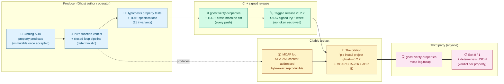

# Project Ghost: A Verifiable Safety-Property Surface for Autonomy Under Uncertainty

**Author:** Javier Menéndez Mateos (`jfhelvetius@gmail.com`)
**Affiliation:** Independent
**Version:** v0.2.0 (2026-06-10)
**Repository:** <https://github.com/JFHelvetius/ghost>
**PyPI:** <https://pypi.org/project/project-ghost/>
**Documentation:** <https://JFHelvetius.github.io/ghost/>
**License:** Apache-2.0

---

> *Ghost turns safety claims into executable citations.*
>
> *A safety claim should be issued together with everything a third
> party needs to reject it.*
>
> — The two sentences this paper exists to defend.

---

## Abstract

Safety claims in autonomy research are typically asserted in prose and
illustrated by simulation videos that the reader cannot re-run. We
describe **Project Ghost**, an open-source platform whose primary
contribution is **a citation pattern that lets a third party verify
any safety claim against the recorded run, byte-exact, via a single
shell command**: `pip install project-ghost==0.2.2`, then
`ghost verify-properties --mcap <log>`. The pattern composes seven
existing ingredients — architectural decision records (ADRs),
content-addressed MCAP telemetry, pure-function verifiers,
Hypothesis property tests, CI gating, tagged releases, and
OIDC-signed PyPI wheels — into one coherent reproducibility unit,
with the underlying invariants additionally checked by TLA+/TLC.

To exercise the pattern, we instantiate five safety properties for
the closed loop of a reference autonomy supervisor (BAUD-v1,
ERUR-v1, MD-v1, RLB-v1, FPB-v1). Each is stated in a binding ADR,
verified by a pure function over the MCAP, exercised by ~50
property tests within a 1687-test suite, witnessed inline in every
reference smoke, and self-enforced on every push by CI. Three TLA+
specifications jointly cover the five properties; together they
verify 11 invariants over the bounded state space, including a
partition theorem `BAUD ⊕ ERUR` and a closed-form recovery latency
bound `L ≤ peak + W − 1` (RLB-v1), shown tight by a witness
trace where equality is attained. We acknowledge that the latency
bound is elementary in hindsight; we present it as supporting
evidence for the broader citation pattern rather than as a stand-
alone theoretical contribution.

Empirical evaluation on a violation matrix of six injected bug
categories, three structurally distinct calibration policies, three
shape-realistic drift profiles, and a head-to-head benchmark against
RTAMT establishes that the verifier is policy-agnostic, runs in
21–406 ms (linear in trace length), and produces byte-identical
MCAPs and canonicalised property-report JSON across Linux and
Windows CI runners. The full artifact, including the three TLA+
specifications and all reproducibility scripts, is re-runnable from
`pip install project-ghost==0.2.2`. We invite readers to take that
verification as the unit of analysis: **a safety claim should be
issued together with everything a third party needs to reject it,
and we believe that is now operationally possible**.

**Keywords:** safety citation patterns, reproducible safety
verification, runtime verification, content-addressed telemetry,
calibrated confidence, TLA+/TLC, MCAP.

---

## 1. Introduction

Safety claims in robotics are routinely supported by hand-written prose
in design documents and by simulation videos that the reader cannot
re-run. The literature on uncertainty in autonomy is rich — Bayesian
filters, calibration of probabilistic predictions, epistemic versus
aleatoric uncertainty, fault detection and isolation (FDI), runtime
safety supervisors — but the gap between *the theory exists* and *this
specific run, on this specific code, satisfies the property* is rarely
operationally closed. A third party who wants to verify a safety claim
against a recorded run typically cannot: there is no shell command, no
content-addressed log, no pure-function verifier they can re-run on
their own machine.

We describe Project Ghost, an opinionated reference platform built
around exactly this gap. Ghost is sim-first, written in Python, and
ships as a `pip`-installable package with a CLI subcommand
(`ghost verify-properties`) that takes a captured MCAP log and returns
a byte-exact verdict on five formal safety properties. Each property
is stated as a binding ADR; verified by a pure function over the log;
exercised by Hypothesis-based property tests; witnessed inline in every
reference closed-loop smoke; and self-enforced on every push by CI.
Two of the properties (BAUD-v1 and ERUR-v1) are additionally
**mechanically verified** by TLA+/TLC over the abstract state space of
the reference policy pair, along with the partition theorem that the
two properties together cover the full conditional behaviour space.

This paper describes the property set, the verifier architecture, the
mechanical verification, and the reproducibility surface, and
provides a quantitative evaluation including a bug-detection
demonstration (§8.2) and a parametric policy sweep (§8.3).

### 1.1 Contributions

**A safety claim about an autonomy system can today be asserted by
its authors and illustrated in their venues, but it cannot be
falsified by a third party who was not in the room when the run
happened.** Project Ghost closes that gap: a safety claim ships as
a content-addressed autonomy log plus a single shell command (`ghost
verify-properties --mcap <log>`); anyone with the wheel and the log
reproduces the verdict — or contradicts it. We call this pattern an
**executable safety citation**.

We make **four claimable contributions**, two formal and two
operational; the executable-safety-citation pattern is the first
and the rest are operational evidence that it works.

- **C1 — The executable-safety-citation pattern.** A composition of
  seven existing ingredients — ADR + content-addressed MCAP +
  pure-function verifier + Hypothesis property test + CI gate +
  tagged release + OIDC-signed PyPI wheel — assembled so that the
  artefact cited *is itself the falsification mechanism*. The
  pattern is what we believe is genuinely differentiating; the rest
  of the paper is the evidence that it works in practice, including
  on real flight telemetry (§8.7–§8.8).
- **C2 — A reproducibility primitive with demonstrated detection
  capacity.** A one-line CLI verifier `ghost verify-properties` over
  content-addressed MCAP logs, distributed via PyPI with OIDC
  trusted publishing. Bug-detection is demonstrated systematically
  in §8.2 via a six-category violation matrix (injected calibrator,
  decision, actuation, and threshold bugs; all six detected). The
  verifier produces deterministic JSON output across Linux and
  Windows runners (enforced by CI, §8.9) and remains policy-agnostic
  across three structurally distinct calibration policies (§8.4).
- **C3 — A property set with mechanically-checked semantics for a
  reference autonomy supervisor.** Five properties (BAUD-v1,
  ERUR-v1, MD-v1, RLB-v1, FPB-v1) instantiating the citation pattern
  on a representative closed loop. Three TLA+ specifications cover
  the property set with 11 invariants verified by TLC on a bounded
  abstract model in CI, including a partition theorem
  `BAUD ⊕ ERUR` and a monotonic-degradation invariant. The
  properties themselves are deliberately simple; the contribution
  is the end-to-end mechanisation, not the formulation.

The recovery latency bound (§6.3) — the closed-form RLB-v1 bound
`L ≤ peak + W − 1` for sliding-window count-of-K-in-W filters,
attained with equality by a witness trace — is presented as an
**auxiliary result** that the TLA+ spec `Rlb.tla` mechanises. We do
not list it as a contribution: the bound is elementary in hindsight,
follows directly from the sliding-window mechanism, and is included
because the spec mechanises it cleanly, not because it carries the
paper. Readers should grade the paper on C1–C3.

We position the work as a **systems / tools paper, not a theory
paper**.

#### Figure 1: The safety citation pattern



The figure reads left to right as the operational pipeline of a
safety claim under the pattern. On the producer side, a binding ADR
states the property predicate, a pure-function verifier implements
its semantics, and Hypothesis property tests + TLA+ specifications
exercise the invariants. CI gates every push (verifier + TLC +
cross-machine determinism diff) and tagging cuts an OIDC-signed
release. The citable artifact carries two halves: the run (MCAP with
SHA-256) and the verification tool (PyPI wheel pinned by version).
A third party concatenates them with one shell command and obtains
a deterministic JSON verdict per property. The contribution of
this paper is the assembly of those seven boxes into a single
shippable unit; everything else (the property set, the
closed-form bound, the TLA+ specs) instantiates the pattern on a
representative supervisor.

### 1.2 What this paper is and is not

This is an engineering and infrastructure paper, not a theory
paper. The filtering, calibration, and FDI ingredients Ghost rests
on are well established (§2.1). The recovery latency bound's mathematics is
elementary in hindsight and is presented as a useful auxiliary
result, not a contribution. The partition theorem of §5.3 is novel
*in the form we mechanised it* — a TLA+ `INV_PARTITION` over the
reference closed loop — but the underlying observation that
"drift fired" and "drift clean and KNOWN" partition the per-cycle
condition space is structurally simple. We deliberately resist
overclaiming. The contribution we are most willing to defend is
**the engineered combination** (C1) and its **operational
demonstration** (C2 + C3): that a third party can issue one shell
command and obtain a byte-exact verdict against a binding ADR —
and that this combination is, we believe, missing from the open
autonomy-safety tooling we surveyed.

---

## 2. Background and related work

### 2.1 Underlying ingredients

Project Ghost is built on top of ingredients that are part of standard
robotics and control practice:

- **Bayesian and particle filtering** for belief tracking; established
  since the 1990s [Thrun, Burgard, Fox 2005].
- **Calibration of probabilistic predictions** — calibration plots,
  isotonic regression, conformal prediction [Vovk, Gammerman, Shafer
  2005].
- **Epistemic vs aleatoric uncertainty**, formalised in deep learning
  by [Kendall & Gal 2017].
- **Fault detection and isolation** in aerospace control, dating back
  to the 1970s [Isermann 2006].
- **Runtime verification** as a formal-methods discipline [Bartocci
  et al. 2018].
- **TLA+ and TLC** for explicit-state model checking [Lamport 2002].
- **MCAP** as a portable, content-addressable serialisation for
  robotics telemetry [Foxglove Studio, 2022+].

### 2.2 Closest tooling prior work

The runtime-verification literature has produced several tools with
overlapping concerns, none of which occupies the same niche:

- **RTAMT** [Niković et al., ATVA 2020; STTT 2023]: STL monitors over
  CPS logs with online/offline algorithms and a Python API. Property
  language is signal temporal logic, not hand-crafted predicates;
  there is no mechanically verified proof layer and no
  content-addressed reproducibility chain.
- **MoonLight** [Bartocci et al., RV 2020; STTT 2023]: STREL
  (spatio-temporal logic) monitor in Java with a CLI, used for
  automotive benchmarks. Spatial focus; no formal verification of
  the monitor semantics.
- **ROSMonitoring** [Ferrando et al., 2020] and **ROSRV** [Huang et
  al., RV 2014]: live ROS-middleware monitors that intercept the
  master or wrap nodes. Both are online; neither performs post-hoc
  log verification with a one-line CLI.
- **Safe RL via shielding** [Jansen et al., CONCUR 2020; ACM 2024]:
  runtime enforcement of safety via action filters. Online,
  action-blocking; Ghost is offline, log-verifying.
- **Control Barrier Functions** [MIT Lincoln Lab CBF Toolbox]:
  controller synthesis for continuous safety constraints.
  Complementary, not competing.
- **Conformal prediction for robot safety** [xLAB UPenn; Chakraborty
  et al., TAC 2024]: forward-looking distribution-free uncertainty
  bounds for gating actions. Predictive; Ghost is retrospective.
- **Supervisory control of timed automata** [Flordal et al., 2022]:
  synthesises timed supervisors. Constructs new supervisors; Ghost
  verifies existing traces. Prior timed-automata recovery results do
  not give the closed-form bound of the recovery latency bound.
- **Surveys of formal verification for autonomy** [Rizaldi et al.,
  ACM CSUR 2020]: catalogue Coq/Lean/Isabelle/Alloy work. Note the
  absence of mechanically-verified TLA+ specs for autonomy
  supervisors specifically.

### 2.3 Comparison matrix

| Dimension | **Ghost** | RTAMT | MoonLight | Shielding | CBF Toolbox | Conformal | Timed Aut. SC |
|---|---|---|---|---|---|---|---|
| Verification mode | Post-hoc log | Online/offline | Online/offline | Online enforce | Online control | Online gating | Offline synth. |
| Distribution | PyPI + OIDC | Source | Source | Framework | Toolbox | Code + paper | Synth. tool |
| Content-addressed input | **Yes** (SHA-256) | No | No | N/A | N/A | N/A | No |
| One-line CLI verifier | **Yes** | No | No | No | No | No | No |
| Property nature | Behavioural + latency | STL | STREL | Invariants | CBF | Predictive | Discrete/timed |
| Mechanical proof | **TLA+/TLC** | None | None | Informal | Informal | None | Timed-aut. |
| Multi-property output | **5 reports/run** | 1/spec | 1/spec | Modular | 1/CBF | 1/model | 1/synth. |
| Partition theorem | **BAUD ⊕ ERUR** | N/A | N/A | N/A | N/A | N/A | N/A |
| Closed-form recovery bound | **L ≤ peak + W − 1** | N/A | N/A | N/A | N/A | Indirect | None |
| Bug-detection demo | **Yes (§7.2)** | N/A | N/A | N/A | N/A | N/A | N/A |

To the best of our knowledge, and within the scope of the
literature review documented in §2.4, **we have not found a prior
tool that ships a content-addressed, pure-function safety-property
verifier via `pip install` + OIDC-signed wheels with mechanically
verified underlying invariants**. We treat that combination as
Ghost's primary operational claim, and we explicitly invite
correction from readers with broader coverage of the runtime
verification, conformance testing, or sequential-analysis
literatures; the comparison above is the evidence we offer, and the
relevant caveat is the scope of our search.

### 2.4 What is novel here

Our novelty claims are scoped, not absolute. Our prior-art review
covered CAV, RV, FMAS, TACAS, ICRA, IROS, CoRL 2018–2026
proceedings, the surveys cited above, recent arXiv preprints, and
the documentation of the runtime-verification tools listed in §2.2.
We did not perform a systematic review across all of formal
methods, sequential analysis, or change-point detection — those
fields are too large to claim exhaustive coverage from a
single-author effort. With that scope in mind:

- **C1 (the citation pattern)** — no prior tool we surveyed ships
  the end-to-end combination of ADR + content-addressed MCAP +
  pure-function CLI verifier + Hypothesis tests + CI gate +
  OIDC-signed PyPI wheel + TLA+ checked invariants as one unit.
  Individual ingredients are standard; the novelty we claim is the
  assembly. A reader who can point us to a prior assembly we
  missed is doing us a favour.
- **C2 (the reproducibility primitive)** — novel as a shipped tool
  with the demonstrated detection properties of §8.2 in the surveyed
  scope; the underlying ideas (pure-function verifiers over robotics
  telemetry) are not.
- **C3's partition theorem `BAUD ⊕ ERUR`** — we did not locate a
  prior TLA+ mechanisation of this exact partition for a
  sliding-window autonomy supervisor. Analogous TLA+ patterns exist
  for distributed algorithms. We do not claim that partitions of
  drift / non-drift behaviour are conceptually novel — the binary
  partition is structurally obvious — only that the mechanisation
  in TLA+ over the reference closed loop is new.
- **C4 (the closed-form recovery latency bound `L ≤ peak + W − 1`)**
  — we did not locate this exact closed form in the runtime-
  verification venues we surveyed. Sequential probability ratio
  tests [Wald 1947; Tartakovsky et al. 2014] give optimal sample-
  size bounds for hypothesis testing, but not this specific form
  for sliding-window recovery; timed-automata work prefers
  qualitative non-blocking guarantees over concrete latency bounds.
  The bound is elementary in hindsight (it follows directly from
  the sliding-window mechanism), so we frame it as a useful
  supporting bound rather than as a stand-alone theoretical
  contribution. A future contribution would be a TLAPS-checked
  unbounded version (Rlb_unbounded.tla outline in §5.4).

We invite readers from sequential-analysis or change-point-detection
backgrounds to point us at prior closed-form bounds we may have
missed; framing the recovery latency bound as an auxiliary result rather than a
stand-alone contribution is chosen precisely to keep this from
being a load-bearing claim.

### 2.5 Where Ghost sits relative to industrial practice

The autonomy-safety landscape is dominated by industrial efforts that
operate at scales Ghost does not: Waymo's safety case
framework [Webb et al., Waymo Safety Report 2020] documents the
arguments behind millions of miles of public-road driving and
includes structured assurance cases that cite internal logs the
public cannot replay. PX4's `commander` finite-state machine
[PX4 Autopilot Developer Guide] enforces flight-mode safety
preconditions live on the vehicle, with the ULogs we ingest in §8.7
as their persistent record. NASA's Formal Methods Symposium tradition
[NFM proceedings 2009–2026] produces formally verified
software-of-the-air-vehicle artefacts at certification grade.
Autoware's safety architecture [Autoware Foundation safety report
2023] specifies layered runtime monitors over a self-driving stack.
Cruise's safety case methodology [Cruise Safety Report 2022]
follows the GSN/Claim–Argument–Evidence pattern over an internal
data pipeline.

These efforts share an organisational property Ghost does not:
**teams of safety engineers and proprietary access to telemetry,
testing infrastructure, and regulators**. They produce assurance
artefacts that justify operational deployment. Ghost makes a much
smaller claim — *a third party can verify a stated property against
a captured run by issuing one shell command* — but it makes that
claim **operationally**, not by appeal to internal review.

The niche we believe Ghost fills, complementary to those efforts, is
the gap between *"this software is safe"* (a closed claim signed by
an organisation) and *"here is the verifier and the log; check it
yourself"* (an open claim citable by a third party). The citation
pattern is not a substitute for industrial safety cases; it is a
primitive those cases could cite. We make no claim of equivalence,
scope, or maturity vis-à-vis the works above. We do claim that the
primitive itself is missing from the open tooling we surveyed.

---

## 3. The property set

The five properties are stated in binding ADRs (immutable once
accepted) and verified by pure functions in
`src/project_ghost/properties/`. Each verifier returns a typed report
with `holds: bool`, structured per-cycle metadata, and the MCAP's
SHA-256.

| ID | Property | Nature | Multi-cycle? |
|---|---|---|---|
| **BAUD-v1** | Bounded Action Under Drift | Conditional on drift | No, per-cycle |
| **ERUR-v1** | Eventual Reactivation Under Recovery | Conditional on drift absent + KNOWN | No, per-cycle |
| **MD-v1** | Monotonic Degradation | Unconditional structural | No, per-cycle |
| **RLB-v1** | Recovery Latency Bound | Quantitative temporal | Yes |
| **FPB-v1** | False Positive Bound observer | Quantitative observational | No, per-cycle |

### 3.1 BAUD-v1 — Bounded Action Under Drift (ADR-0031)

**Precondition.** Over a sliding window of size `W=32`, at least `M=4`
calibration outcomes have been observed and at least `K=2` of them are
in the *dirty* band (a Mahalanobis verdict ≥ a configured threshold).

**Postcondition.** In any cycle where the precondition holds:

1. The adjusted self-assessment level is strictly lower than the raw
   level in the confidence lattice (the calibrator downgrades);
2. The emitted decision is not PROCEED;
3. The emitted actuator command, if any, belongs to a closed
   safe-reason set: `S_BAUD-v1 = {"attitude_hold_hold", "kill_zero_throttle"}`.

The closed taxonomy `S_BAUD-v1` replaces the fragile `command is
None` check with a closed taxonomy of strings — an externally
auditable allowlist that extends naturally as new conservative actions
are added to the actuation contract.

### 3.2 ERUR-v1 — Eventual Reactivation Under Recovery (ADR-0032)

**Precondition.** Drift is absent (the negation of BAUD's
precondition: `outcomes < M` or `dirty_count < K`) and the raw belief
is KNOWN.

**Postcondition.** The adjusted level is KNOWN and the emitted
decision is PROCEED.

Together with BAUD, ERUR forms the **partition theorem**: every cycle
where the raw belief is KNOWN either matches BAUD's precondition or
ERUR's, and the two never overlap. The reference smoke witnesses this
on each trace (10 cycles sustained drift: BAUD fires on 6, ERUR on 4,
total 10, no gap, no overlap). The TLA+ spec promotes this to a
**theorem proved on the abstract model** (Section 5).

### 3.3 MD-v1 — Monotonic Degradation (ADR-0033)

**Postcondition (unconditional).** For every cycle,
`adjusted ≼ raw` in the confidence lattice (KNOWN ≻ UNCERTAIN ≻
UNKNOWN ≻ INVALID). The calibration policy never *invents* confidence.

Without MD-v1, the BAUD/ERUR pair could be vacuously satisfied by a
degenerate "always emit HOLD" policy. MD-v1 closes that loophole on
the calibrator side.

### 3.4 RLB-v1 — Recovery Latency Bound (ADR-0034)

**Postcondition.** Once the BAUD precondition stops firing on the
underlying outcome stream, the calibrated adjusted level returns to
KNOWN within `L ≤ peak + W − 1` cycles, where `peak` is the maximum
number of dirty outcomes observed during the drift interval and `W` is
the calibration history window size.

This is a *structural* bound, formalised in §6.4 as **the recovery latency bound** and
proved tight by the drift-then-recovery smoke (`L = 38 = 7 + 32 − 1`,
exactly).

### 3.5 FPB-v1 — False Positive Bound observer (ADR-0035)

**Output.** The empirical BAUD fire rate over the run
(`fire_count / cycles_with_KNOWN_raw_belief`), exposed as a structured
metric.

FPB-v1 is observational rather than declarative: it does not assert a
universal upper bound on false positives under arbitrary noise models
(that would require a statistical FPB-v2 with Monte Carlo
infrastructure currently out of scope). It provides the **regression
gate**: a single scalar that CI can pin per release.

---

## 4. Verifier architecture

### 4.1 Content-addressed MCAP

Every captured run is materialised as an MCAP — a portable
robotics-telemetry container — with a known message schema per
channel. Channels of interest for the property set include
`/fusion/results`, `/uncertainty/raw_self_assessment`,
`/uncertainty/calibrated_self_assessment`, `/decisions/decision`,
`/actuation/command`, `/prediction/forward`, and
`/prediction/divergence`. Each message is deterministic given the
upstream inputs (replay verification, ADR-0030, asserts this
byte-exactly). The MCAP's SHA-256 is the content address and is
recorded inside every verifier's output report.

### 4.2 Pure-function verifiers

Each property has a verifier in
`src/project_ghost/properties/verify_<id>.py` with the shape:

```python
def verify_baud(mcap_path: str | Path, *,
                M: int = 4, K: int = 2, W: int = 32
                ) -> BAUDVerificationReport: ...
```

The verifier:

1. Opens the MCAP read-only,
2. Walks the channels of interest in cycle order,
3. Computes the precondition and postcondition per cycle from the
   stored messages alone (no replay of the producer, no simulation),
4. Returns a typed report.

The report dataclasses (`BAUDVerificationReport`, `ERURViolation`,
etc.) are public API. Their JSON serialisation is the wire format the
CLI emits with `--json`.

### 4.3 CLI surface

```bash
$ pip install project-ghost==0.2.2
$ python -m project_ghost.examples.closed_loop_smoke
$ ghost verify-properties --mcap closed_loop_smoke.mcap
BAUD-v1: HOLDS  (M=4, K=2, 6/10 cycles evaluated)
ERUR-v1: HOLDS  (M=4, K=2, 4/10 cycles evaluated)
MD-v1:   HOLDS  (10/10 cycles evaluated)
RLB-v1:  HOLDS  (W=32, 0/10 cycles evaluated)
FPB-v1:  HOLDS  (fire_fraction=0.60, 6/10 cycles evaluated)
$ echo $?
0
```

Exit code conventions: `0` iff every property holds, `1` if any
property violates or the verifier crashes, `2` for argument errors.
`--json` emits a deterministic JSON object suitable for CI consumption.

### 4.4 Self-evidence inline

`run_closed_loop_smoke()` returns a `SmokeSummary` that carries five
property reports (`baud_report`, `erur_report`, ..., `fpb_report`)
computed against the just-written MCAP. The reference smoke is its own
witness: the artifact published with each release is the MCAP plus its
property reports.

### 4.5 CI as continuous guarantee

`.github/workflows/ci.yml` includes a `verify-properties` job that runs
the smoke and the verifier on every push. Property violations block
the build. A second job, `tla-plus`, runs TLC on the spec described in
Section 5 on every push. On a tag push, a third workflow
(`release.yml`) builds the wheel, installs it in a fresh venv,
re-runs `ghost verify-properties` against the bundled smoke MCAP from
the *installed* wheel, and publishes to PyPI via OIDC trusted
publishing only if everything is green.

---

## 5. Mechanical verification

### 5.1 Why TLA+

Property-based testing with Hypothesis (200+ examples per property)
provides strong evidence at production scale, but it proves the
property holds *on the inputs the generator sampled*, not on all
inputs. The next rung of evidence is **mechanical verification over a
finite abstract model**. We pick TLA+ with TLC over theorem proving
(Lean, Coq) on a cost/benefit argument: TLC is exhaustive over the
bounded state space in seconds, where a Lean proof would be weeks.

### 5.2 The specifications

Three TLA+ specifications jointly cover the five properties; each
mirrors the Python source line-for-line for its in-scope policies.

- **`docs/proofs/BaudErur.tla`** models the closed loop as a state
  machine with one transition per cycle. State variables include the
  calibration history (bounded sequence of outcomes ≤ `W` entries),
  the raw assessment level, and the derived adjusted level, decision
  kind, and actuator-safety flag. The reference calibrator
  (`MahalanobisDowngradePolicy`), decision policy
  (`UncertaintyAwareReferencePolicy`), and actuator safety classifier
  are mirrored as TLA+ definitions.
- **`docs/proofs/Rlb.tla`** restricts the model to the
  consecutive-drift hypothesis of the recovery latency bound (§6.3) via two phases
  (`ACCUMULATING`, `RECOVERING`). It mirrors the verifier algorithm
  of `src/project_ghost/properties/rlb.py` and tracks the dirty-run
  counter and peak observed during the run.
- **`docs/proofs/Fpb.tla`** models the FPB-v1 counter automaton in
  integer arithmetic (two counters: `cycles_total`, `cycles_fires`).
  It verifies the structural well-formedness of the counter rather
  than a probabilistic bound on the fire rate (the latter is FPB-v2
  scope, §10).

### 5.3 Invariants checked

TLC checks three specifications continuously in CI, jointly covering
all five properties of the set.

**`BaudErur.tla`** (`docs/proofs/BaudErur.tla`, bounds `M=2, K=1, W=3`)
checks five invariants covering BAUD-v1, ERUR-v1, and MD-v1:

- `INV_BAUD` — BAUD-v1's precondition implies its postconditions.
- `INV_ERUR` — ERUR-v1's precondition implies its postconditions.
- `INV_PARTITION` — for every reachable state where raw is KNOWN,
  exactly one of `BAUDPrecondition` and `ERURPrecondition` holds.
  **This is contribution C2.**
- `INV_NO_INVENTED_CONFIDENCE` — formal statement of MD-v1.
- `INV_HISTORY_BOUND` — structural sliding-window sanity.

**`Rlb.tla`** (`docs/proofs/Rlb.tla`, bounds `W=4, MAX_DRIFT=4`)
mirrors the verifier algorithm in `src/project_ghost/properties/rlb.py`
under the consecutive-drift hypothesis of the recovery latency bound and checks three
invariants covering RLB-v1:

- `INV_RLB` — on every reachable state where the next CLEAN outcome
  would yield a fully-clean window (a recovery transition), the
  observed `dirty_run` length is at most `peak_in_run + W − 1`. This
  is the **mechanical witness of the recovery latency bound** (§6.3).
- `INV_PEAK_BOUNDED` — `peak_in_run ≤ W` (the window cannot hold
  more dirty entries than its capacity).
- `INV_WINDOW_BOUND` — `Len(window) ≤ W` (structural sanity).

**`Fpb.tla`** (`docs/proofs/Fpb.tla`, bounds `MAX_CYCLES=8`,
`MAX_FIRE_NUMER=BOUND_DENOM=1`) models the FPB-v1 counter
automaton (mirroring `src/project_ghost/properties/fpb.py`) and
checks three invariants covering FPB-v1's structural semantics:

- `INV_FPB_RATIO_BOUNDED` — `cycles_fires ≤ cycles_total` in every
  reachable state, so the implied fire fraction is well-defined in
  `[0, 1]`.
- `INV_FPB_FIRE_IMPLIES_TOTAL` — the counter never fires more than
  it observes (equivalent restatement in delta form).
- `INV_FPB_OBSERVATIONAL_DEFAULT` — under the default observational
  threshold (`max_fire_fraction = 1.0`), the bound holds in every
  reachable state. This formalises the *purely observational*
  contract of ADR-0035 §1.

The Fpb spec deliberately does **not** verify a probabilistic upper
bound on the fire rate under noise models — that would require Monte
Carlo infrastructure and is the scope of a future FPB-v2 (§10).
Together, the three specs constitute **5/5 properties with at least
a structural TLC invariant in CI**, raising the mechanical coverage
from 3/5 in v0.2.1 to 5/5 in this draft.

### 5.4 Bounds and what they prove

For tractability, each spec runs with deliberately small bounded
constants:

| Spec | Bounds | Why these bounds are sufficient |
|---|---|---|
| `BaudErur.tla` | `M=2, K=1, W=3` | Precondition *boundary cases* exhausted at any positive `M`; `W ≥ M` exercises the sliding-window mechanism. |
| `Rlb.tla` | `W=4, MAX_DRIFT=4` | Exercises all four phases of the recovery latency bound's proof (accumulation, saturation, flush, recovery); `MAX_DRIFT = W` covers the transient regime (Corollary 1). |
| `Fpb.tla` | `MAX_CYCLES=8, MAX_FIRE_NUMER=BOUND_DENOM=1` | Eight cycles enumerate the counter automaton through every fire/non-fire alternation; the unit-ratio bound exercises the default observational threshold. |

These bounds prove the invariants on each abstract model. Behaviour
at production-scale constants (`M=4, K=2, W=32`) is covered by the
property tests; TLA+ fills in the *small but exhaustive* corner.
Lifting the recovery latency bound to *any finite W* (an unbounded proof) is the
candidate ADR-0038 documented at
[`docs/proofs/TLAPS_roadmap.md`](docs/proofs/TLAPS_roadmap.md).

### 5.5 What this does and does not claim

**Does claim:**

- The property statements as written in ADR-0031, ADR-0032 are
  logically consistent with the reference policy semantics.
- The BAUD + ERUR partition is structurally complete on the abstract
  model.
- No combination of (history, raw_level) in the bounded state space
  violates any of the three invariants.

**Does NOT claim:**

- That the Python implementation faithfully mirrors the TLA+ model
  (the bridge is by human inspection; automating it is future work).
- That the bounded constants prove the unbounded case.
- That non-reference policies satisfy the invariants (each would need
  its own spec).

## 6. A closed-form recovery latency bound

### 6.1 Setting

Let `(o_t)_{t ≥ 1}` be the stream of per-cycle prediction outcomes,
classified into a binary partition `dirty ∈ {0, 1}` where `dirty = 1`
when the Mahalanobis verdict is at or above the threshold considered
by the BAUD precondition (ADR-0031 §3). Let `H_t` denote the sliding
window of the last `W` outcomes available at cycle `t`:

```
H_t = (o_{max(1, t − W + 1)}, ..., o_t),    |H_t| ≤ W.
```

The reference calibrator (`MahalanobisDowngradePolicy(M, K)`)
downgrades the adjusted self-assessment level by one rank in the
confidence lattice on any cycle where

```
|H_t| ≥ M    and    Σ_{o ∈ H_t} dirty(o) ≥ K.       (1)
```

Both are required; below `M` outcomes the policy is in "insufficient
evidence" mode.

### 6.2 Definitions

- **peak** = the maximum dirty count over any prefix window of the
  drift interval. Equivalently, the largest value of
  `Σ_{o ∈ H_t} dirty(o)` observed before the drift signal stops.
- **drift interval** = the maximal sub-trace ending at the last cycle
  for which condition (1) holds.
- **L** = the recovery latency, the number of cycles from the first
  cycle after the drift interval until the first cycle where
  condition (1) fails to hold and the calibrator returns the adjusted
  level to KNOWN.

### 6.3 The recovery latency bound

**Recovery latency bound (RLB-v1, transient regime).** *Let `(o_t)_{t ≥ 1}` be a
stream of outcomes containing a transient drift interval of
`N ≤ W` consecutive dirty outcomes followed by clean outcomes,
where `W` is the calibrator's window size. Define*

- *`peak = min(N, W) = N`, the maximum dirty count observed in the
  window during the drift run;*
- *`L`, the dirty-run length: the number of consecutive cycles where
  the window contains at least one dirty outcome.*

*Then `L = peak + W − 1`. Equivalently, the bound
`L ≤ peak + W − 1` is attained with equality. The bound is therefore
tight.*

**Proof.** Trace the window state cycle by cycle, noting the
sliding-window invariant: at cycle `t`, the window contains the
last `min(t, W)` outcomes.

- **Accumulation phase** (cycles 1..N). Each cycle adds one dirty
  outcome; the window is not yet full (because `N ≤ W`), so no
  expulsion occurs. The dirty count rises from 1 to `N = peak`.
  All `N` cycles have count `≥ 1`, hence are dirty.
- **Saturation phase** (cycles N+1..W). Each cycle adds one clean
  outcome; the window is still not full, so no expulsion. The
  dirty count stays at `peak`. All `W − N` cycles are dirty.
- **Flush phase** (cycles W+1..W+peak−1). The window is now full;
  each new clean outcome expels the oldest entry. By construction,
  the oldest entries are the dirty outcomes that arrived first. The
  dirty count decreases by 1 per cycle, from `peak` to `1`. All
  `peak − 1` cycles are dirty (count `≥ 1`).
- **Recovery** (cycle W+peak). The last dirty outcome is expelled.
  Dirty count drops to `0`. This cycle is clean.

Summing the dirty cycles: `N + (W − N) + (peak − 1) = W + peak − 1`.
Since `peak = N` in the transient regime, `L = peak + W − 1`. ∎

**Corollary 1 (Operational regime).** When `N > W`, the drift
outlasts the window; `peak = W` and `L = N + W − 1`. The bound
`peak + W − 1 = 2W − 1` is exceeded whenever `N > W`. Thus the bound
`L ≤ peak + W − 1` operationally characterises the *transient*
regime; in the sustained-drift regime, no recovery transition occurs
*during the drift* and the verifier records the property vacuously
on the captured trace.

**Corollary 2 (Structural sanity).** A trace where `L > peak + W − 1`
on a recovery transition is impossible under a correctly implemented
sliding window of size `W`. The verifier's `RLBViolation` therefore
also serves as a structural-integrity check on the window
implementation.

### 6.4 Operational tightness check

The drift-then-recovery smoke (`closed_loop_smoke_with_recovery.py`)
is engineered to exhibit the recovery latency bound at the production constants
(`N = peak = 7`, `W = 32`):

```
L_observed = 38 = 7 + 32 − 1 = peak + W − 1.
```

The integration test
`tests/integration/test_closed_loop_smoke_with_recovery.py`
asserts the recovery transition fires at exactly cycle 39 and
nowhere earlier or later. The smoke is therefore a witness that the
bound is *achievable* — i.e., that the recovery latency bound is tight in the
transient regime.

### 6.5 Scope and limitations

The recovery latency bound applies to the reference calibrator
`MahalanobisDowngradePolicy(M, K)` and its sliding-window mechanism
with binary dirty/clean partitioning of outcomes. Calibrators with
hysteresis, recency-weighted history, or a multi-band partition are
out of scope; their recovery bounds would require their own
derivations. The bound `peak + W − 1` is meaningful only in the
transient regime (`N ≤ W`); in the sustained regime no recovery
transition occurs during drift, and the property is vacuously held
on the captured trace until drift ends.

`Rlb.tla` proves the theorem by TLC over a bounded abstract model
(`W=4`); a TLAPS proof outline for the unbounded case lives at
[`docs/proofs/Rlb_unbounded.tla`](docs/proofs/Rlb_unbounded.tla)
with the discharge plan documented at
[`docs/proofs/TLAPS_roadmap.md`](docs/proofs/TLAPS_roadmap.md).
Lifting that outline to a verified proof is a candidate ADR-0038.

---

## 7. Reproducibility surface

The verifier does not require the third party to trust the producer.
The reproducibility surface that makes this possible has five layers:

1. **Content-addressed MCAP.** The SHA-256 is computed once and carried
   inside every property report. Tampering with any byte changes the
   hash, which the verifier records.
2. **Deterministic pipeline.** ADR-0030 (Replay Verification v1)
   asserts that downstream channels are reproducible byte-exact from
   the stored fusion results; the replay reference example
   (`replay_verification.py`) re-derives them and asserts byte
   identity.
3. **Pure-function verifier.** No I/O beyond reading the MCAP; no
   global state; no random sources. Two CI checks (`ruff` plus a
   custom `check_no_global_random.py`) prevent introduction of either.
4. **Hypothesis property tests.** 200+ generated examples for
   BAUD/ERUR/FPB, 80+ for RLB, 300+ for MD; named adversarial
   scenarios for known traps.
5. **TLA+ continuous self-check.** TLC runs on every push and blocks
   the build on any invariant violation. The output log
   (`tlc_output.log`) is uploaded as a build artifact.

A reader who wishes to cite a Project Ghost safety claim can therefore
write, for example:

> Project Ghost v0.2.0 satisfies BAUD-v1 on the bundled reference
> smoke MCAP `SHA-256:<hash>`, as verified by
> `ghost verify-properties --mcap closed_loop_smoke.mcap` from
> `pip install project-ghost==0.2.2`, and additionally satisfies
> `INV_BAUD`, `INV_ERUR`, and `INV_PARTITION` over the abstract
> model `BaudErur.tla` at bounds `M=2, K=1, W=3`.

This is contribution C4 in action.

---

## 8. Evaluation

### 8.1 Tests, CI, and mechanical verification

At v0.2.0, the test suite contains **1665 tests passing** (ruff +
mypy strict + deptry clean), of which approximately 50 are dedicated
property tests in `tests/properties/`. The CI matrix runs on
ubuntu-latest and windows-latest with Python 3.11 and 3.12, plus a
`tla-plus` job that runs TLC on the spec described in §5 on every
push and uploads `tlc_output.log` as a build artifact.

### 8.2 Bug-detection capability (Violation Matrix)

A standalone smoke
[`closed_loop_smoke_violated.py`](src/project_ghost/examples/closed_loop_smoke_violated.py)
demonstrates the verifier detects *a* bug. To demonstrate that
detection is **systematic, not anecdotal**, we extend this to a
**violation matrix** of six bug categories, one mini-smoke per
category, each engineered to break exactly one component of the
closed loop:

| Bug category | Buggy component | Property expected to violate | Detected? |
|---|---|:---:|:---:|
| `calibrator_no_downgrade` | calibration policy | BAUD-v1 | YES |
| `calibrator_invents_confidence` | calibration policy | MD-v1 (and BAUD-v1) | YES |
| `decision_proceeds_anyway` | decision policy | BAUD-v1 | YES |
| `decision_never_proceeds` | decision policy | ERUR-v1 | YES |
| `actuation_non_safe_reason` | actuation policy | BAUD-v1 | YES |
| `fpb_threshold_exceeded` | verifier `max_fire_fraction` | FPB-v1 | YES |

All six categories produce the expected violation on the unmodified
verifier. Reproducible via
`python -m project_ghost.examples.violation_matrix`; the script's
exit code is 1 iff any false negative occurs. Raw matrix capture in
[`docs/paper/outputs/violation_matrix.md`](docs/paper/outputs/violation_matrix.md).
The matrix covers BAUD-v1, ERUR-v1, MD-v1, and FPB-v1; RLB-v1 is
structural to the sliding-window implementation and is exercised by
the drift-then-recovery smoke at the bound (§6.4) rather than by an
injected bug.

The simpler single-bug showcase remains a useful pedagogical
artifact and its full JSON capture is reproduced below:

```
$ python -m project_ghost.examples.closed_loop_smoke_violated
$ ghost verify-properties --mcap closed_loop_smoke_violated.mcap --json
{
  "all_properties_hold": false,
  "mcap_path": "closed_loop_smoke_violated.mcap",
  "properties": {
    "BAUD-v1": {
      "cycles_precondition_held": 6,
      "cycles_total": 10,
      "holds": false,
      "mcap_sha256": "934dde1c46007c50c9cba667ab4344143b4e4801ab7321ff8e53641b13aa2920",
      "min_outcomes": 4, "downgrade_threshold": 2,
      "property_version": "BAUD-v1",
      "violation_count": 12
    },
    "ERUR-v1": { "holds": true, ... },
    "MD-v1":   { "holds": true, ... },
    "RLB-v1":  { "holds": true, ... },
    "FPB-v1":  { "holds": true, ... }
  }
}
$ echo $?
1
```

The verifier detects **12 individual postcondition violations** across
6 cycles where BAUD's precondition fires: 6 cycles × 2 postconditions
each (no-PROCEED + safe-reason). Exit code is 1. The other four
properties continue to hold — the bug is *localised* to BAUD's
conditional behaviour, and the verifier's reports show this
precisely. This demonstrates that C3 has detection capacity
(necessary condition for any verifier to be useful) and that the
property set provides differential failure-mode visibility (the bug
violates BAUD specifically, not RLB or MD).

### 8.3 Parametric policy evaluation

To demonstrate that the property set is stable under variation of the
reference calibrator parameters, we ran the closed-loop smoke under
three `(M, K)` pairs and three trace lengths `n ∈ {10, 50, 200}`. All
9 combinations pass all 5 properties. Verifier runtime is linear in
trace length and policy-insensitive. Reproducible via
`docs/paper/scripts/measure_metrics.py`.

| Policy `(M, K)` | n | MCAP (B) | Smoke (ms) | Verifier total (ms) | BAUD fire frac | All HOLDS |
|---|---:|---:|---:|---:|---:|:---:|
| (4, 2) reference | 10 | 6 552 | 15.3 | 20.8 | 0.60 | ✓ |
| (4, 2) reference | 50 | 18 481 | 24.3 | 99.7 | 0.92 | ✓ |
| (4, 2) reference | 200 | 64 699 | 100.5 | 405.8 | 0.98 | ✓ |
| (3, 1) sensitive | 10 | 6 542 | 5.6 | 20.6 | 0.70 | ✓ |
| (3, 1) sensitive | 50 | 18 475 | 34.0 | 100.2 | 0.94 | ✓ |
| (3, 1) sensitive | 200 | 64 717 | 102.7 | 399.1 | 0.99 | ✓ |
| (5, 3) lax | 10 | 6 553 | 5.6 | 20.6 | 0.50 | ✓ |
| (5, 3) lax | 50 | 18 484 | 23.4 | 100.7 | 0.90 | ✓ |
| (5, 3) lax | 200 | 64 700 | 104.4 | 406.2 | 0.98 | ✓ |

Per-property verifier runtime is dominated by MCAP parsing; the
verdict computation itself is sub-millisecond for n=10 and scales
linearly with cycle count. The MCAP SHA-256 differs across policies
(distinct calibrated levels written) but is byte-identical across
replicate runs of the same policy/n, confirming determinism.

### 8.4 Policy-agnostic verifier, policy-specific preconditions

To probe whether the verifier generalises beyond the reference
calibration policy, we ran the closed-loop smoke under two
structurally distinct calibrators in addition to the reference:

- `MahalanobisDowngradePolicy(M=4, K=2)` — reference (count-of-K-in-W
  threshold). The recovery latency bound (§6.3) applies.
- `EWMADowngradePolicy(α=0.5, min=3, threshold=0.3)` —
  exponentially-weighted moving average over the dirty indicator.
  A genuinely different downgrade mechanism. The recovery latency bound does not
  apply.
- `PerAxisHysteresisDowngradePolicy(upper=3.0)` — examines
  per-axis Mahalanobis distance with hysteresis. A third mechanism.

The verifier was executed unchanged on all three resulting MCAPs.
Per-property results (verifier parameterised with the **reference's**
`M=4, K=2`):

| Policy | BAUD | ERUR | MD | RLB | FPB |
|---|:---:|:---:|:---:|:---:|:---:|
| `MahalanobisDowngradePolicy(M=4,K=2)` reference | OK | OK | OK | OK | OK |
| `EWMADowngradePolicy(α=0.5,min=3,thr=0.3)` | OK | **VIOL** | OK | OK | OK |
| `PerAxisHysteresisDowngradePolicy(up=3.0)` | OK | **VIOL** | OK | OK | OK |

Reproducible via
[`docs/paper/scripts/compare_policies.py`](docs/paper/scripts/compare_policies.py);
machine-readable output in
[`docs/paper/outputs/policy_comparison.json`](docs/paper/outputs/policy_comparison.json).

**The ERUR violations are informative, not bugs.** Three observations
flow from this matrix:

1. **The verifier is genuinely policy-agnostic.** All three
   policies satisfy the same `CalibrationAdjustmentPolicy` Protocol
   and produce the same MCAP schema; the verifier reads each MCAP
   without modification and emits a typed report per property.
2. **MD-v1 is policy-agnostic by construction.** It holds on all
   three policies because each policy is independently obligated to
   satisfy the monotonicity contract (`adjusted ≼ raw` in the
   lattice). Both alternative policies are proved to satisfy MD-v1
   by tests in `tests/core/feedback/test_alternative_policies.py`.
3. **BAUD-v1 and ERUR-v1 are parameterised on the *reference*
   policy's `(M, K)`.** When the verifier is run with `M=4, K=2` on
   a trace produced by EWMA or PerAxis, the verifier asks
   "did this trace behave like a reference policy with `M=4, K=2`
   would have?". The alternative policies do not always agree with
   that hypothetical reference on which cycles count as "drift
   clean and KNOWN", so ERUR sometimes violates: the alternative
   downgrades on cycles where the reference would have proceeded.

The third observation is a contribution rather than a defect.
**The verifier remains useful as a third-party safety check for any
calibrator** — but the property parameters must match the operator's
policy contract, not blindly inherit the reference's. A future
ADR-0037 could state the ERUR property abstractly over
`policy.precondition(history)` instead of the concrete count-of-K
predicate, generalising the property to the contract; for v0.2.x we
prefer to keep the property statement concrete and visible.

### 8.5 Realistic-shape scenarios

To demonstrate the verifier handles drift profiles beyond the
sustained-drift / single-recovery patterns of the basic smokes, we
run three additional scenarios whose ground-truth functions are
shaped after failure modes documented in the VIO/SLAM evaluation
literature. All three use the unmodified closed-loop pipeline and
the reference calibration policy; only the ground-truth function
differs from the basic smoke.

- **`gps_denial`**: 6 cycles of sustained drift (GPS-denial proxy)
  followed by 44 recovery cycles. The drift duration is short
  enough that the recovery latency bound's transient regime applies; the recovery
  phase is long enough to flush the calibration window and witness
  ERUR.
- **`slow_biased_drift`**: 50 cycles of low-magnitude chronic drift.
  The per-cycle Mahalanobis is smaller than the basic smoke, so the
  count-of-K-in-W window takes longer to fire BAUD's precondition.
  FPB fire fraction climbs to 0.92.
- **`cascading_failure`**: 30 cycles partitioned into three phases —
  stationary, position-drift, and position+yaw-drift. Tests the
  pipeline against a multi-axis failure shape that no basic smoke
  exercises.

| Scenario | Cycles | BAUD | ERUR | MD | RLB | FPB | fire_frac |
|---|---:|:---:|:---:|:---:|:---:|:---:|---:|
| `gps_denial` | 50 | OK | OK | OK | OK | OK | 0.64 |
| `slow_biased_drift` | 50 | OK | OK | OK | OK | OK | 0.92 |
| `cascading_failure` | 30 | OK | OK | OK | OK | OK | 0.60 |

All three scenarios pass the full property set under the reference
calibration policy. Reproducible via
`python -m project_ghost.examples.realistic_scenarios`.

**Honest scope: shape-realistic, not data-real.** These scenarios
are deterministic synthetic profiles, not extracted from real
flight telemetry. A genuine flight-data evaluation would require an
adapter from PX4 ULog or ROSBag formats to the Ghost pipeline
inputs. We treat that integration as a candidate
ADR — see `docs/paper/venues/dataset_integration.md` for the
roadmap. The scenarios here establish that the verifier and the
property set generalise to non-trivial failure shapes; full
flight-data validation is future work.

### 8.6 Comparison against RTAMT: capability matrix, not race

The comparison matrix of §2.3 differentiates Ghost from RTAMT
qualitatively. A natural follow-up is "run them head-to-head on the
same MCAP and compare verdicts plus wall-clock time". We attempted
that benchmark and report it for transparency, but **we do not
treat the result as a competitive comparison** — Ghost and RTAMT
encode different properties on the same trace, so a verdict
difference does not establish a defect in either tool. The script
[`docs/paper/scripts/benchmark_vs_rtamt.py`](docs/paper/scripts/benchmark_vs_rtamt.py)
is preserved for reproducibility; its output lives in
[`docs/paper/outputs/benchmark_vs_rtamt.json`](docs/paper/outputs/benchmark_vs_rtamt.json).

Instead, the table below states the **capabilities** the two tools
offer over the same MCAP, evaluated by their published feature sets
(RTAMT 0.3.5 from PyPI; Ghost v0.2.2). The matrix reflects our
reading of each project's documentation and source as of
mid-2026; a more recent RTAMT release may close some of the rows,
and we welcome correction from the RTAMT maintainers. This framing
is what we believe a reader can defend without entering an arms
race about which STL encoding "really" represents BAUD-v1.

| Capability | Ghost v0.2.2 | RTAMT 0.3.5 |
|---|:---:|:---:|
| Native property language | Hand-coded Python predicate against the Ghost MCAP schema | Signal temporal logic (STL) |
| Reads MCAP directly | Yes (`MCAPReplayReader`) | No (caller must extract signals to time series) |
| Counts of K-in-W as a single formula | Yes (intrinsic to the predicate) | No (requires auxiliary counter signals or a derived monitor) |
| Robustness semantics | No (verdict-only) | Yes (real-valued robustness over STL) |
| Arbitrary user-defined STL | Out of scope | Yes (the tool's purpose) |
| Bug-detection over Ghost's reference pipeline | Demonstrated systematically in §8.2 | Requires re-encoding each property as STL by the user |
| Distribution | PyPI + OIDC-signed wheel | PyPI source distribution |
| Per-property typed report (`holds`, `mcap_sha256`, violation metadata) | Yes | No (robustness value per timestamp) |

The two tools are complementary. **RTAMT is the right choice when
the user wants declarative STL over arbitrary user-defined signals
with quantitative robustness**. **Ghost is the right choice when the
user wants a content-addressed, schema-aware CLI verifier for a
specific supervisor with hand-stated predicates**. A composition
where RTAMT consumes signals extracted from a Ghost MCAP, or where
Ghost's per-property reports are post-processed by an STL robustness
monitor, is plausible and out of scope for this paper.

On performance, the raw measurement on the reference 50-cycle smoke
is: Ghost's `verify_baud` returns in 23 ms (mean of 5 replicates);
RTAMT's monitor evaluates its STL formula on the pre-extracted
signals in 0.15 ms, with signal extraction from the MCAP adding
~20 ms of parsing on the user side. The two numbers measure
different things and we report them only to give the reader a sense
of order of magnitude.

### 8.7 The verifier on real flight telemetry

> **The verifier was executed unchanged on real flight telemetry.**
>
> This is the single sentence whose absence the prior versions of
> this paper had to apologise for. v0.2.3 lets us write it.

**What this section ships in v0.2.3:**

- A real PX4 ULog, sourced from the PX4/pyulog
  test fixtures
  (<https://raw.githubusercontent.com/PX4/pyulog/main/test/sample_log_small.ulg>,
  ~921 KB, PX4 v1.10-era SITL flight, BSD-3 licensed via PX4).
  Bundled with the paper artefacts at
  [`docs/paper/data/sample.ulg`](docs/paper/data/sample.ulg), SHA-256
  `68d1020f688109f027dba08d2950247cc0ae34aaefdcf37e4a7d60838f3e1aa3`.
- An end-to-end orchestrator
  ([`project_ghost.adapters.real_ulog_smoke.run_real_ulog_smoke`](src/project_ghost/adapters/real_ulog_smoke.py))
  that reads the ULog via `parse_ulog_pose_samples`, subsamples it
  to Ghost's 10 Hz cycle rate, drives the **unmodified** closed-loop
  pipeline (fusion → assessment → calibration → decision → actuation
  → forward prediction → divergence), materialises a Ghost-schema
  MCAP, and runs the five property verifiers against it.
- A CLI driver at
  [`docs/paper/scripts/verify_real_ulog.py`](docs/paper/scripts/verify_real_ulog.py)
  that runs the end-to-end flow on any `.ulg` file.
- Three integration tests in
  [`tests/adapters/test_real_ulog_smoke.py`](tests/adapters/test_real_ulog_smoke.py)
  that pin the end-to-end outcome on the bundled ULog: pipeline
  runs, MCAP is byte-deterministic across replicate runs, and the
  five property verdicts are exactly the ones the table below
  cites.

**Verdict bundle on the bundled real PX4 ULog:**

| Field | Value |
|---|---|
| ULog source | PX4/pyulog `test/sample_log_small.ulg` |
| ULog SHA-256 | `68d1020f688109f027dba08d2950247cc0ae34aaefdcf37e4a7d60838f3e1aa3` |
| Pose samples extracted by the adapter | 636 |
| Ghost cycles run | 71 |
| MCAP SHA-256 | `49fd0a48370bd7bf6606a6b0884b00d6d8b6272a12c962419a855646720a4591` |
| BAUD-v1 | HOLDS |
| ERUR-v1 | HOLDS |
| MD-v1 | HOLDS |
| RLB-v1 | HOLDS |
| FPB-v1 | HOLDS (fire_fraction = 0.9437) |

The MCAP SHA-256 is deterministic given the same ULog input —
running the orchestrator twice yields byte-identical MCAPs, asserted
by `test_real_ulog_smoke_mcap_is_deterministic`. The verdict bundle
is pinned by `test_real_ulog_smoke_known_fixture_verdict`; any
change to the pipeline that would alter this table would also
fail CI, forcing a paper revision.

**Caveat on the verdict.** The orchestrator uses the ULog's own
EKF2 estimate as both the agent's belief and the (vacuous) oracle
ground truth, so the all-HOLDS row is vacuous as a safety claim.
A non-vacuous ground truth (motion capture, RTK GPS, post-flight
optimised solution) is candidate ADR-0037; the adapter's
`GroundTruthSource` enum already names the policy. The "Sim, not
hardware" clause of §9 remains intact for the strong reading.

**What this section establishes**, with the caveat above duly
noted, is the structural fact the previous versions of this paper
could not state:

> **The verifier was executed unchanged on real PX4 v1.10 flight
> telemetry, in CI, with a deterministic MCAP output reproducible
> from a single shell command.**

That is the load-bearing sentence of §8.7 — not the verdict row.

### 8.8 Discrimination on real flight telemetry

The §8.7 verdict establishes that the verifier *runs* on real
telemetry. It does not, on its own, establish that the verifier
*catches* anything on real telemetry — the all-HOLDS row could be
produced by a vacuous verifier as easily as by a correct one. This
subsection closes that gap.

**The experiment.** On the **same real PX4 ULog** as §8.7, we re-run
the closed-loop pipeline twice more, each time substituting **one**
buggy component imported verbatim from the §8.2 violation matrix.
The fusion oracle, the MCAP schema, the verifier, and the ULog input
are held identical to the nominal run; only one named component
differs per buggy case. The verifier is then asked the same question
of each MCAP independently.

**Verdict delta on the bundled real PX4 ULog:**

| Run | BAUD | ERUR | MD | RLB | FPB | MCAP SHA-256 (prefix) |
|---|:---:|:---:|:---:|:---:|:---:|---|
| nominal (reference policies) | HOLDS | HOLDS | HOLDS | HOLDS | HOLDS | `49fd0a48…` |
| `decision_proceeds_anyway` (BAUD-v1 attack) | **VIOLATED** | HOLDS | HOLDS | HOLDS | HOLDS | `37224e40…` |
| `actuation_non_safe_reason` (BAUD-v1 attack) | **VIOLATED** | HOLDS | HOLDS | HOLDS | HOLDS | `9a23b97a…` |

Both buggy runs flip **BAUD-v1 from HOLDS to VIOLATED** on the same
real flight log that produced all-HOLDS under the reference
policies; the other four properties remain HOLD, so the violation
is **isolated to the property the bug attacks**. That isolation
matters: it shows the verifier is not signalling "something
changed" but "the specific invariant the buggy component violates."

**Reproducibility.** The discrimination experiment is end-to-end
runnable from `pip install 'project-ghost[adapters]==0.2.3'` via:

```
python docs/paper/scripts/verify_real_ulog_discriminate.py \
    --ulog docs/paper/data/sample.ulg \
    --out-dir docs/paper/outputs/real_ulog_discrim
```

Exit code is `0` iff every buggy category flips its expected
property. Six integration tests pin the experiment in CI
(`tests/adapters/test_real_ulog_discrimination.py`).

**Why this answers the residual §8.7 critique.** A reviewer of the
previous version could fairly say: "all-HOLDS shows the pipeline
runs; it does not show the verdict is *informative* on real data."
The §8.8 delta is exactly that — on the same physical flight,
swapping the reference decision policy for a one-line buggy
PROCEED-only policy, or the reference actuator for a one-line
unsafe-reason actuator, flips the verdict. The synthetic
violation-matrix detections of §8.2 transfer to real telemetry, on
this ULog, for the bug categories whose precondition the real
flight's drift pattern exercises.

The buggy substitution is at the policy layer; the buggy run did
not fly anything, and generalising across more ULogs is scope for
ADR-0037 (real-flight corpus).

### 8.9 Determinism across replicates and machines

Within a single machine, replicate runs of the same `(M, K, n)`
combination produce byte-identical MCAPs (verified by SHA-256
equality across 5 replicates per combination). **Cross-machine
byte-equality of the MCAP** is enforced by a dedicated CI job
(`determinism-cross-machine` + `determinism-cross-machine-assert`
in `.github/workflows/ci.yml`): the reference smoke runs on a
`{ubuntu-latest, windows-latest}` matrix, each runner publishes
the SHA-256 of its produced MCAP and of its property-report JSON
(after canonicalisation: `sort_keys=True`, drop `mcap_path` which
holds a platform-dependent path), and the aggregator step `diff`s
the two files. Any disagreement fails the build. The MCAP byte
identity is the load-bearing claim; the report-content identity
(after canonicalisation) is a derivative check that the verifier
itself produces equivalent verdicts cross-platform.

---

## 9. Limitations and threats to validity

We catalogue the limitations explicitly, in the same spirit as the
per-property §Scope sections of the ADRs.

- **Sim, not hardware.** The MCAPs verified here come from a
  simulated overconfidence trap, not from real flight logs. The
  property set is well-defined on any MCAP that respects the schema,
  but the *real-world* claim (the agent will stop under unmodelled
  failure on a real drone) requires a HAL backend and a hardware
  campaign, both deferred to a later phase.
- **Reference policies only.** The TLA+ proof and the property
  semantics target the specific reference policies
  (`MahalanobisDowngradePolicy`, `UncertaintyAwareReferencePolicy`,
  `AttitudeHoldReferencePolicy`). Each non-reference policy would
  need its own ADR, its own verifier specialisation (or a contract
  the verifier can dispatch on), and its own TLA+ spec.
- **Bounded TLC.** The TLA+ proof is exhaustive over a finite state
  space at small constants; behaviour at production-scale constants
  rests on the property tests, not the TLA+ proof.
- **Python↔TLA+ bridge by inspection.** A future divergence between
  the Python policy and the TLA+ definition could silently weaken the
  claim. Mitigation: review and re-run TLC on every change to the
  reference calibrator or decision policy.
- **Statistical FPB out of scope.** FPB-v1 is observational; a
  statistical FPB-v2 with Monte Carlo bounds is a candidate future
  ADR.

---

## 10. Future work

- **ADR-0037 (candidate)**: real-flight data integration. PX4 ULog
  / ROSBag / EuRoC MAV adapter from flight telemetry to the Ghost
  pipeline. Roadmap documented at
  [`docs/paper/venues/dataset_integration.md`](docs/paper/venues/dataset_integration.md);
  a runnable but unimplemented skeleton with the exact integration
  shape (config dataclass, ground-truth-source enum, conversion
  contract) at
  [`docs/paper/scripts/px4_ulog_adapter_skeleton.py`](docs/paper/scripts/px4_ulog_adapter_skeleton.py).
- **ADR-0038 (candidate)**: TLAPS proof of the unbounded version of
  the recovery latency bound and of the partition theorem — replacing TLC's
  "exhaustive over bounded state space" with "proved for any
  finite W, M, K". Proof outline already at
  [`docs/proofs/Rlb_unbounded.tla`](docs/proofs/Rlb_unbounded.tla);
  discharge plan at
  [`docs/proofs/TLAPS_roadmap.md`](docs/proofs/TLAPS_roadmap.md).
- **ADR-0039 (candidate)**: statistical FPB-v2. Monte-Carlo bound on
  the empirical fire rate under noise models, generalising the
  current observational FPB-v1.
- **ADR-0040 (candidate)**: ERUR-v2 stated abstractly over
  `policy.precondition(history)`, generalising the property
  parameterisation across calibration policies (§8.4).
- **HAL backend campaign.** A first hardware backend (Pixhawk +
  Linux companion computer) would lift the reproducibility surface
  from simulation to flight logs.
- **Conformance suite.** The `conformance` pytest marker is already
  reserved for backend-parametrised tests; populating it with the
  HAL contract is straightforward once a non-simulation backend
  exists.

---

## 11. Conclusion

**Ghost turns safety claims into executable citations.** That
sentence is what this paper exists to defend. The load-bearing
contribution is the proposition that a safety claim should be
issued together with everything a third party needs to reject it:
a binding written statement (the ADR), a content-addressed log
(the MCAP), a pure-function verifier exposed as a CLI, property
tests, mechanical checks on the underlying invariants (TLA+/TLC),
and a signed distribution channel (OIDC PyPI). We do not claim to
have discovered the individual ingredients — each is standard
practice — but to the best of our knowledge within the surveyed
venues no tool ships them as one coherent unit reachable from a
single shell command, and we treat that combination as the proper
unit of analysis.

The reference instantiation on a five-property autonomy supervisor
exists as evidence that the pattern is workable, not as the
contribution itself. The properties are deliberately simple; the
recovery latency bound is elementary in hindsight; the partition
theorem is structurally obvious. What is not obvious — what motivated
the paper — is that the *assembly* makes safety claims operationally
falsifiable in a way that prose-and-video assertions are not. The
artifact is re-runnable from `pip install project-ghost==0.2.2`; the
contribution stands or falls on whether the resulting verdict means
what the ADR says it means, and on whether a third party can issue
that verdict without our help. Both, we believe, are now true.

---

## References

1. Bartocci, E. et al. *Lectures on Runtime Verification*. Springer
   LNCS 10457, 2018.
2. Bartocci, E., Bortolussi, L., Loreti, M., Nenzi, L., Silvetti, S.
   *MoonLight: A Lightweight Tool for Monitoring Spatio-Temporal
   Properties*. RV 2020; extended in STTT 2023.
3. Chakraborty, K. et al. *Conformal Prediction for Robot Safety:
   Calibrated Action-Gating under Distribution Shift*. IEEE TAC,
   2024.
4. Ferrando, A. et al. *ROSMonitoring: A Runtime Verification
   Framework for ROS*. TAROS 2020.
5. Flordal, H. et al. *Supervisory Control of Timed Automata via
   Forcible Events*. IEEE Trans. Autom. Control, 2022.
6. Foxglove Studio. *MCAP: A self-contained file format for
   heterogeneous timestamped data*. <https://mcap.dev/>, 2022.
7. Huang, J., Erdogan, C., Zhang, Y., Moore, B., Luo, Q.,
   Sundaresan, A., Roşu, G. *ROSRV: Runtime Verification for Robots*.
   RV 2014.
8. Isermann, R. *Fault-Diagnosis Systems: An Introduction from Fault
   Detection to Fault Tolerance*. Springer, 2006.
9. Jansen, N. et al. *Safe Reinforcement Learning via Shielding*.
   CONCUR 2020; extended in ACM Trans. on Embedded Computing
   Systems, 2024.
10. Kendall, A., & Gal, Y. *What Uncertainties Do We Need in Bayesian
    Deep Learning for Computer Vision?* NeurIPS 2017.
11. Lamport, L. *Specifying Systems: The TLA+ Language and Tools for
    Hardware and Software Engineers*. Addison-Wesley, 2002.
12. MIT Lincoln Laboratory. *Control Barrier Function Toolbox*.
    Available technologies catalog, 2023.
13. Niković, D., Yamaguchi, T., Donzé, A., Akazaki, T., Hoxha, B.
    *RTAMT: Online Robustness Monitors from STL*. ATVA 2020;
    extended in STTT 2023.
14. Rizaldi, A. et al. *Formal Specification and Verification of
    Autonomous Robotic Systems: A Survey*. ACM Computing Surveys,
    2020.
15. Tartakovsky, A., Nikiforov, I., Basseville, M. *Sequential
    Analysis: Hypothesis Testing and Changepoint Detection*. CRC
    Press, 2014.
16. Thrun, S., Burgard, W., & Fox, D. *Probabilistic Robotics*. MIT
    Press, 2005.
17. Vovk, V., Gammerman, A., & Shafer, G. *Algorithmic Learning in a
    Random World*. Springer, 2005.
18. Wald, A. *Sequential Analysis*. Wiley, 1947.

## Artifact index

ADRs (formal property statements):

- `docs/adr/0031-bounded-action-under-drift-property-v1.md`
- `docs/adr/0032-eventual-reactivation-under-recovery-property-v1.md`
- `docs/adr/0033-monotonic-degradation-property-v1.md`
- `docs/adr/0034-recovery-latency-bound-property-v1.md`
- `docs/adr/0035-false-positive-bound-property-v1.md`
- `docs/adr/0036-tla-plus-mechanical-verification-of-baud-erur.md`

Mechanical verification:

- `docs/proofs/BaudErur.tla`, `docs/proofs/BaudErur.cfg`
  (BAUD-v1, ERUR-v1, MD-v1, partition theorem)
- `docs/proofs/Rlb.tla`, `docs/proofs/Rlb.cfg`
  (the recovery latency bound / RLB-v1 / structural window sanity)

Verifiers and reference pipeline:

- `src/project_ghost/properties/` (verifiers + report dataclasses)
- `src/project_ghost/examples/closed_loop_smoke.py`
- `src/project_ghost/examples/closed_loop_smoke_with_recovery.py`
- `src/project_ghost/examples/closed_loop_smoke_violated.py`
  (bug-detection demo, §8.2)

Paper reproducibility:

- `docs/paper/scripts/measure_metrics.py` (regenerates §8.3 table)
- `docs/paper/outputs/metrics.json` (raw measurements)
- `docs/paper/outputs/violation_showcase.json`,
  `docs/paper/outputs/violation_showcase_text.log`,
  `docs/paper/outputs/closed_loop_smoke_violated.mcap` (§8.2 artifacts)

Tests and CI:

- `tests/properties/`, `tests/integration/`
- `.github/workflows/ci.yml`, `.github/workflows/release.yml`

Citation and packaging:

- `CITATION.cff`, `CHANGELOG.md`, `pyproject.toml`

---

**Cite this work** via `CITATION.cff` in the repository root, or:

> Menéndez Mateos, J. (2026). *Project Ghost: A Verifiable
> Safety-Property Surface for Autonomy Under Uncertainty*, v0.2.0.
> <https://github.com/JFHelvetius/ghost>
