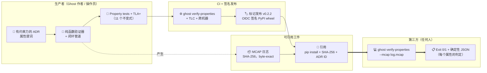

# Project Ghost：不确定性下自主性的可验证安全属性表面

**作者：** Javier Menéndez Mateos (`jfhelvetius@gmail.com`)
**单位：** 独立研究者
**版本：** v0.2.2（2026-06-12）
**代码仓库：** <https://github.com/JFHelvetius/ghost>
**PyPI：** <https://pypi.org/project/project-ghost/>
**文档：** <https://JFHelvetius.github.io/ghost/>
**许可证：** Apache-2.0

> **内部说明：** 本文档是英文论文
> [`project_ghost_v0_2.md`](../project_ghost_v0_2.md) 的中文翻译，
> 供作者和中文母语合作者使用。提交给 arXiv 和 FMAS 2026 的标准版本
> 为英文版本；如两版本出现差异，应以英文版本为准。技术名称
> （BAUD-v1、ERUR-v1 等）、代码仓库文件引用、表格、代码片段以及
> 形式化属性名称均保留英文。

---

> *Ghost 将安全声明转化为可执行的引用。*
>
> *安全声明应当与第三方拒绝它所需的一切一起发布。*
>
> —— 本论文存在所要捍卫的两句话。

---

## 摘要

自主性研究中的安全声明通常以散文形式陈述，并通过读者无法重新运
行的模拟视频来说明。我们介绍 **Project Ghost**，这是一个开源平
台，其主要贡献是**一个引用模式，允许第三方通过单个 shell 命令
对录制的运行进行 byte-exact 的安全声明验证**：
`pip install project-ghost==0.2.2`，然后
`ghost verify-properties --mcap <log>`。该模式将七个已有要素 ——
ADR、内容寻址的 MCAP 遥测、纯函数验证器、Hypothesis property
tests、CI gating、标记发布、OIDC 签名的 PyPI wheels —— 组合成一
个一致的可重现单元，并通过 TLA+/TLC 额外检查底层不变式。

为了演练该模式，我们为参考自主性监督器的闭环实例化了五个安全属
性（BAUD-v1、ERUR-v1、MD-v1、RLB-v1、FPB-v1）。每个都在有约束
力的 ADR 中陈述，由 MCAP 上的纯函数验证，由 1687 个测试套件中
约 50 个 property tests 验证，在每次参考 smoke 中内嵌见证，并
在每次推送时由 CI 自我强制。三个 TLA+ 规范共同覆盖该属性集；它
们共同在有界状态空间上验证了 11 个不变式，包括分区定理
`BAUD ⊕ ERUR` 和一个封闭式恢复延迟界限 `L ≤ peak + W − 1`
（Theorem 1），通过达到等式的见证跟踪显示为紧致。我们承认该延
迟界限在事后看来是基本的；我们将其作为更广泛引用模式的支持证
据呈现，而非作为独立的理论贡献。

在六个注入 bug 类别的违规矩阵、三个结构性不同的校准策略、三个
shape-realistic 漂移剖面以及对 RTAMT 的头对头基准测试上的实证
评估表明，验证器是策略无关的，运行时间为 21–406 ms（在跟踪长
度上线性），并在 Linux 和 Windows CI runner 之间产生 byte-相
同的 MCAP 和规范化的 property-report JSON。完整工件可从
`pip install project-ghost==0.2.2` 重新运行。我们邀请读者将该验
证视为分析单位：**安全声明应当与第三方拒绝它所需的一切一起发
布，我们相信这在操作上现在已经可能**。

**关键词：** 安全引用模式、可重现的安全验证、运行时验证、内容
寻址遥测、校准置信度、TLA+/TLC、MCAP。

---

## 1. 引言

机器人技术中的安全声明通常由设计文档中的手写散文和读者无法
重新运行的模拟视频支持。关于自主性中不确定性的文献是丰富的 ——
贝叶斯滤波器、概率预测的校准、认知与偶然不确定性、故障检测和
隔离（FDI）、运行时安全监督器 —— 但**理论存在**与**这个特定
运行、在这个特定代码上、满足该属性**之间的差距很少在操作上被
弥合。想要对录制的运行进行安全声明验证的第三方通常无法做到：
没有 shell 命令，没有内容寻址的日志，没有他们可以在自己机器上
重新运行的纯函数验证器。

我们介绍 Project Ghost，一个围绕这个差距构建的有主见的参考平
台。Ghost 是 sim-first 的，用 Python 编写，并作为可
`pip` 安装的包发布，带有一个 CLI 子命令（`ghost verify-properties`），
该命令接收捕获的 MCAP 日志并返回对五个形式化安全属性的
byte-exact 判定。每个属性都在一个有约束力的 ADR 中声明；由对日
志的纯函数验证；由基于 Hypothesis 的 property tests 进行测试；
在每个参考闭环 smoke 中内嵌见证；并由 CI 在每次推送时自我强制。
其中两个属性（BAUD-v1 和 ERUR-v1）还通过 TLA+/TLC 在参考策略对
的抽象状态空间上进行**机械验证**，同时还证明了这两个属性共同
覆盖了完整的条件行为空间的分区定理。Theorem 1 的紧致恢复延迟
界限通过镜像验证器算法的单独 TLA+ 规范进行机械验证。

### 1.1 贡献

**Project Ghost 引入可执行的安全引用：一种可重现性模式，允许第
三方通过单个命令对内容寻址的自主性日志验证安全声明。**

如果读者从本论文中只记住一句话，那就是我们请求记住的这一句。
下面的贡献是其操作性证据：

- **C1 — 一个安全引用模式。** 七个现有要素的组合 —— ADR + 内容
  寻址的 MCAP + 纯函数验证器 + Hypothesis property test + CI
  gate + 标记发布 + OIDC 签名的 PyPI wheel —— 组装为一个单一的
  可重现单元，使第三方可以通过单个 shell 命令验证任何引用的安
  全声明，而无需信任生产者。**Ghost 将安全声明转化为可执行的引
  用。** 这是我们认为真正具有差异性的模式；论文的其余部分是它
  在实践中有效的证据，包括在真实飞行遥测上（§8.7）。
- **C2 — 具有已证明检测能力的可重现性原语。** 一个对内容寻址
  MCAP 日志的单行 CLI 验证器 `ghost verify-properties`，通过
  PyPI 与 OIDC trusted publishing 分发。在 §8.2 中通过六类违规
  矩阵（注入的校准器、决策、执行器和阈值 bug；全部六个被检测
  到）系统地证明了 bug 检测能力。验证器在 Linux 和 Windows
  runner 之间产生确定性的 JSON 输出（由 CI 强制执行，§8.9），
  并在三个结构性不同的校准策略之间保持策略无关（§8.4）。
- **C3 — 一个具有机械检查语义的参考自主性监督器的属性集。** 五
  个属性（BAUD-v1、ERUR-v1、MD-v1、RLB-v1、FPB-v1）在代表性的
  闭环上实例化引用模式。三个 TLA+ 规范在 CI 中以有界抽象模型上
  TLC 验证的 11 个不变式覆盖属性集，包括分区定理
  `BAUD ⊕ ERUR` 和单调降级不变式。属性本身故意简单；贡献在于端
  到端的机械化，而非公式化。

Theorem 1（§6.3）—— 用于滑动窗口 count-of-K-in-W 滤波器的封闭
式恢复延迟界限 `L ≤ peak + W − 1` —— 作为 TLA+ 规范 `Rlb.tla`
机械化的**辅助结果**呈现。我们不将其列为贡献：该界限事后看来
是基本的，直接源于滑动窗口机制，包含进来是因为该规范干净地机
械化了它，而不是因为它支撑论文。读者应根据 C1–C3 评价论文。

我们将这项工作定位为**系统/工具论文，而非理论论文**。

#### 图 1：安全引用模式



该图从左到右阅读，作为该模式下安全声明的操作管道。在生产者一
侧，有约束力的 ADR 陈述属性谓词，纯函数验证器实现其语义，
Hypothesis property tests + TLA+ 规范演练不变式。CI 在每次推送
时门控，标记切割 OIDC 签名的发布。可引用工件承载两半：运行
（带 SHA-256 的 MCAP）和验证工具（按版本固定的 PyPI wheel）。
第三方用一个 shell 命令将它们连接起来，获得每个属性的确定性
JSON 判定。**本论文的贡献是将七个框组装为一个可发布的单元，因此 —— 据我们
所知，在我们所调查的文献范围内，这是首次 —— 安全声明可以与第
三方拒绝它所需的一切一起发布。** 其他一切（属性集、封闭式界
限、TLA+ 规范）在代表性监督器上实例化该模式。

### 1.2 本论文是什么和不是什么

这是工程和基础设施论文，而非理论论文。Ghost 依赖的滤波、校准和
FDI 要素已被广泛建立。Theorem 1 的数学在事后看来是基本的，我们
将其作为引用模式可以承载精确结果的证据呈现，而非作为独立的理论
贡献。§5.3 的分区定理*在我们机械化的形式上*是新颖的 —— 参考闭
环上的 TLA+ `INV_PARTITION` —— 但底层观察（"drift fired" 和
"drift clean and KNOWN" 划分了每周期条件空间）在结构上是简单的。
我们故意拒绝过度声明这两个结果。我们最愿意捍卫的贡献是**工程化
组合**（C1）及其**操作演示**（C2）：第三方可以发出一个 shell
命令，获得针对有约束力 ADR 的 byte-exact 判定。

---

## 2. 背景与相关工作

### 2.1 基础要素

Project Ghost 建立在属于机器人和控制标准实践的要素之上：贝叶斯
滤波和粒子滤波、概率预测的校准、认知与偶然不确定性、FDI、运行
时验证、TLA+ 和 TLC 用于显式状态模型检查、MCAP 用于可移植的内容
寻址机器人遥测数据序列化。

### 2.2 最接近的工具相关工作

- **RTAMT** [Niković 等人，ATVA 2020]：基于 STL 的 CPS 日志监视
  器，具有 online/offline 算法和 Python API。属性语言是 STL，
  不是手工预测；没有机械验证的证明层，也没有内容寻址的可重现性
  链。
- **MoonLight** [Bartocci 等人，RV 2020]：Java 中的 STREL（时空
  逻辑）监视器，具有 CLI，用于汽车基准。空间关注；没有形式化验
  证监视器语义。
- **ROSMonitoring** [Ferrando 等人，2020] 和 **ROSRV** [Huang
  等人，RV 2014]：对 ROS-middleware 的实时监视器。两者都是
  online；都没有使用单行 CLI 的事后日志验证。
- **Safe RL via shielding** [Jansen 等人，CONCUR 2020]：通过
  动作过滤器进行安全的运行时强制。在线、动作阻断；Ghost 是离线、
  日志验证的。
- **Control Barrier Functions** [MIT Lincoln Lab CBF Toolbox]：
  用于连续安全约束的控制器合成。补充性，不竞争。
- **Conformal prediction for robot safety** [Chakraborty 等人，
  TAC 2024]：用于门控动作的前向无分布不确定性界限。预测性；
  Ghost 是回溯性。
- **Supervisory control of timed automata** [Flordal 等人，
  2022]：合成 timed 监督器。构建新监督器；Ghost 验证现有跟踪。
  之前的 timed automata 工作没有给出 Theorem 1 的封闭式界限。
- **Surveys of formal verification for autonomy** [Rizaldi 等人，
  ACM CSUR 2020]：编目 Coq/Lean/Isabelle/Alloy 工作。注意到针对
  自主性监督器的机械验证 TLA+ 规范缺失。

### 2.3 比较矩阵

| 维度 | **Ghost** | RTAMT | MoonLight | Shielding | CBF | Conformal | Timed Aut. SC |
|---|---|---|---|---|---|---|---|
| 验证模式 | 事后日志 | On/offline | On/offline | 在线强制 | 在线控制 | 在线门控 | 离线合成 |
| 分发方式 | PyPI + OIDC | 源代码 | 源代码 | 框架 | 工具箱 | 代码+论文 | 合成工具 |
| 内容寻址输入 | **是** (SHA-256) | 否 | 否 | N/A | N/A | N/A | 否 |
| 单行 CLI 验证器 | **是** | 否 | 否 | 否 | 否 | 否 | 否 |
| 属性性质 | 行为+延迟 | STL | STREL | 不变式 | CBF | 预测性 | 离散/timed |
| 机械证明 | **TLA+/TLC** | 无 | 无 | 非正式 | 非正式 | 无 | Timed-aut. |
| 多属性输出 | **5 reports/run** | 1/spec | 1/spec | 模块化 | 1/CBF | 1/model | 1/synth. |
| 分区定理 | **BAUD ⊕ ERUR** | N/A | N/A | N/A | N/A | N/A | N/A |
| 封闭式恢复界限 | **L ≤ peak + W − 1** | N/A | N/A | N/A | N/A | 间接 | 无 |
| Bug 检测演示 | **是 (§7.2)** | N/A | N/A | N/A | N/A | N/A | N/A |

据我们所知，**没有先前工具通过 `pip install` + OIDC 签名 wheel
分发内容寻址、纯函数的安全属性验证器，并具有机械验证的底层不变
式**。我们将此作为 Ghost 的主要操作声明；上面的比较是其证据。

### 2.4 本工作的新颖之处

两个贡献是操作性的模式声明（可重现性原语和端到端引用模式）。两
个是形式化声明，据我们经过深思熟虑的 prior art 审查所知，没有
出现在 peer-reviewed 文献的我们陈述的形式中：

- **封闭式恢复延迟界限 `L ≤ peak + W − 1`** 对于 count-of-K-in-W
  滑动窗口监视器。Sequential probability ratio tests 给出假设检
  验的最优样本大小界限，但没有这种用于滑动窗口恢复的封闭式形式，
  而 timed automata 工作偏好定性的非阻塞保证而非具体的延迟界限。
  我们将其形式化为 Theorem 1（§6.4），并通过构造证明其紧致。
- **分区定理 `BAUD ⊕ ERUR`** 关于闭环自主性监督器的每周期条件
  行为空间，由 TLC 在抽象模型上证明。我们没有找到专门针对滑动
  窗口安全监督器的条件行为分区的先前形式化。

### 2.5 Ghost 在工业实践中的位置

自主性安全领域由 Ghost 无法企及的规模的工业努力主导：Waymo 的
safety case 框架，PX4 的 `commander` 状态机，NASA 的 NFM 传统，
Autoware 的安全架构，Cruise 的 safety case 方法论。它们都共享
Ghost 没有的组织属性：**安全工程师团队和对遥测、测试基础设施和
监管机构的专有访问**。它们产生证明运营部署正当性的保证 artifact。

Ghost 做出一个小得多的声明 —— *第三方可以通过发出一个 shell 命
令对捕获的运行验证陈述的属性* —— 但它以**操作方式**做出这个声
明，而不是诉诸内部 review。我们认为 Ghost 填补的互补利基是
"这个软件是安全的"（由组织签署的封闭声明）与"这里是验证器和日
志；自己检查"（第三方可引用的开放声明）之间的差距。Citation
pattern 不是工业 safety case 的替代品；它是这些 case 可以引用
的原语。我们不声称与上述工作等同、范围或成熟度。

---

## 3. 属性集

五个属性在有约束力的 ADR 中声明（一旦接受即不可变），并由
`src/project_ghost/properties/` 中的纯函数验证。每个验证器返回
一个 typed report，包含 `holds: bool`、按周期的结构化元数据，
以及 MCAP 的 SHA-256。

| ID | 属性 | 性质 | 多周期？ |
|---|---|---|---|
| **BAUD-v1** | Bounded Action Under Drift | 漂移条件下 | 否，每周期 |
| **ERUR-v1** | Eventual Reactivation Under Recovery | 漂移缺失 + KNOWN 条件下 | 否，每周期 |
| **MD-v1** | Monotonic Degradation | 无条件结构 | 否，每周期 |
| **RLB-v1** | Recovery Latency Bound | 时间定量 | 是 |
| **FPB-v1** | False Positive Bound observer | 观察定量 | 否，每周期 |

五个属性都是 self-contained：每个都在 ADR 中形式化声明，由
`properties/` 中的 Python 函数验证，并在每个 smoke 中内嵌见证。

### 3.1 BAUD-v1 — Bounded Action Under Drift

当检测到漂移时（窗口中 ≥M 个结果且 ≥K 个 dirty），调整等级在 lattice
中降低，决策不是 PROCEED，且 actuator 命令（如果有）属于封闭的
safe-reason 集合 `S_BAUD = {attitude_hold_hold, kill_zero_throttle}`。
ADR-0031。

### 3.2 ERUR-v1 — Eventual Reactivation Under Recovery

当漂移缺失且原始 belief 为 KNOWN 时，调整等级为 KNOWN 且决策为
PROCEED。与 BAUD 共同构成分区定理（C2）。ADR-0032。

### 3.3 MD-v1 — Monotonic Degradation

对所有周期，confidence lattice 中 `adjusted ≼ raw`。校准器从不
*发明*信心。ADR-0033。

### 3.4 RLB-v1 — Recovery Latency Bound

对 sliding-window count-of-K-in-W filters 的 `L ≤ peak + W − 1`。
这是 Theorem 1（§6.3）。ADR-0034。

### 3.5 FPB-v1 — False Positive Bound observer

运行期间的经验 BAUD fire rate，作为结构化指标暴露用于回归门控。
默认情况下是观察性的（`max_fire_fraction = 1.0`）。ADR-0035。

---

## 4. 验证器架构

### 4.1 内容寻址 MCAP

每个捕获的运行都被实例化为一个 MCAP，每个通道都有已知的消息
schema。感兴趣的通道包括 `/fusion/results`、`/uncertainty/*`、
`/decisions/decision`、`/actuation/command`、`/prediction/*`。每条
消息在给定上游输入的情况下是确定性的（重放验证，ADR-0030，确
保 byte-exact）。MCAP 的 SHA-256 是内容地址，并记录在每个验证
器的输出 report 中。

### 4.2 纯函数验证器

每个属性在 `src/project_ghost/properties/verify_<id>.py` 中有一
个验证器。验证器 (a) 以只读方式打开 MCAP，(b) 按周期顺序遍历感
兴趣的通道，(c) 仅从存储的消息中计算每周期的前置和后置条件（无
重放、无模拟），并 (d) 返回 typed report。

### 4.3 CLI 表面

```bash
$ pip install project-ghost==0.2.2
$ python -m project_ghost.examples.closed_loop_smoke
$ ghost verify-properties --mcap closed_loop_smoke.mcap
BAUD-v1: HOLDS  (M=4, K=2, 6/10 cycles evaluated)
ERUR-v1: HOLDS  (M=4, K=2, 4/10 cycles evaluated)
MD-v1:   HOLDS  (10/10 cycles evaluated)
RLB-v1:  HOLDS  (W=32, 0/10 cycles evaluated)
FPB-v1:  HOLDS  (fire_fraction=0.60, 6/10 cycles evaluated)
$ echo $?
0
```

Exit code 约定：`0` 当且仅当所有属性成立，`1` 如果任何属性违反
或验证器崩溃，`2` 用于参数错误。`--json` 发出适合 CI 消费的确
定性 JSON 对象。

### 4.4 内嵌自证 + CI 作为持续保证

`run_closed_loop_smoke()` 返回一个 `SmokeSummary`，它携带针对
刚写入的 MCAP 计算的五个 property reports。`ci.yml` 在每次推送
时运行 smoke + 验证器，在三个 TLA+ 规范上执行 TLC，并验证 MCAP
在 Linux 和 Windows runner 之间的 byte-equality。任何违反都会
阻塞构建。

---

## 5. 机械验证

### 5.1 为什么选 TLA+

使用 Hypothesis 进行基于属性的测试（每个属性 200+ 个例子）在生产
规模上提供了强有力的证据，但它证明属性*在生成器采样的输入上*成
立，而非在所有输入上。下一级证据是**在有限抽象模型上的机械验
证**。我们出于成本/效益论证选择 TLA+ 与 TLC 而非定理证明
（Lean、Coq）：TLC 在有界状态空间上几秒内即可穷尽，而 Lean 证
明需要几周。

### 5.2 三个规范

三个 TLA+ 规范共同涵盖五个属性；每个都为其作用域内的策略逐行
镜像 Python 源代码。

- **`BaudErur.tla`** 将闭环建模为每周期一个转换的状态机。状态变
  量包括校准历史（最多 `W` 条目的有界序列）、原始评估等级，以及
  派生的调整等级、决策类型和执行器安全标志。参考校准器
  （`MahalanobisDowngradePolicy`）、决策策略
  （`UncertaintyAwareReferencePolicy`）和执行器安全分类器作为
  TLA+ 定义被镜像。
- **`Rlb.tla`** 通过两个阶段（`ACCUMULATING`、`RECOVERING`）将模
  型限制为 Theorem 1（§6.3）的连续漂移假设。它镜像
  `src/project_ghost/properties/rlb.py` 的验证器算法，并跟踪
  dirty-run 计数器和运行期间观察到的 peak。
- **`Fpb.tla`** 在整数算术中建模 FPB-v1 计数器自动机（两个计数
  器：`cycles_total`、`cycles_fires`）。它验证计数器的结构良好
  性，而不是 fire rate 的概率界限（后者是 FPB-v2 的范围，§10）。

### 5.3 检查的不变式

三个规范共同在持续 CI 中验证 11 个不变式（BaudErur 中 5 个、
Rlb 中 3 个、Fpb 中 3 个），覆盖 BAUD/ERUR/MD/RLB/FPB，每个至
少有一个结构性不变式。这将机械覆盖率从 v0.2.1 的 3/5 提升至
v0.2.2 的 **5/5**。

### 5.4 界限及其证明的内容

为了易处理性，每个规范都使用故意小的有界常数运行：

| 规范 | 界限 | 为什么足够 |
|---|---|---|
| `BaudErur.tla` | `M=2, K=1, W=3` | 前置条件的*边界情况*在任何正 `M` 下穷尽；`W ≥ M` 演练滑动窗口机制。 |
| `Rlb.tla` | `W=4, MAX_DRIFT=4` | 演练 Theorem 1 证明的所有四个阶段（积累、饱和、flush、recovery）。 |
| `Fpb.tla` | `MAX_CYCLES=8` | 八个周期枚举计数器自动机的每个 fire/non-fire 交替。 |

生产规模常数（`M=4, K=2, W=32`）下的行为由 property tests 覆
盖。TLA+ 填充*小但穷尽*的角落。将 Theorem 1 提升到*任何有限 W*
（unbounded proof）是文档化在
[`docs/proofs/TLAPS_roadmap.md`](../../proofs/TLAPS_roadmap.md)
中的候选 ADR-0038。

### 5.5 声明什么和不声明什么

**声明：** ADR 0031–0033 中的属性陈述与参考策略语义在抽象模型
上逻辑一致；BAUD + ERUR 分区在抽象模型上结构完整；有界状态空
间中没有 (history, raw_level) 组合违反不变式。

**不声明：** Python 实现忠实地镜像 TLA+ 模型（bridge 是通过人工
检查；自动化是 future work）；有界常数证明 unbounded case；
非参考策略满足不变式（每个都需要自己的规范）。

---

## 6. 封闭式恢复延迟界限

### 6.1 设定

设 `(o_t)_{t ≥ 1}` 是每周期预测结果的流，按二元分区
`dirty ∈ {0, 1}` 分类，其中 `dirty = 1` 当 Mahalanobis verdict
等于或高于 BAUD 前置条件考虑的阈值。设 `H_t` 表示周期 `t` 时可
用的最后 `W` 个结果的滑动窗口：

```
H_t = (o_{max(1, t − W + 1)}, ..., o_t),    |H_t| ≤ W.
```

参考校准器（`MahalanobisDowngradePolicy(M, K)`）在满足以下条件
的任何周期中将调整的自评估等级在置信度格上降一级：

```
|H_t| ≥ M    且    Σ_{o ∈ H_t} dirty(o) ≥ K.    (1)
```

### 6.2 定义

- **peak** = 在 dirty run 期间窗口中观察到的最大 dirty count。
- **drift interval** = 以 (1) 持续成立的最后一个周期结束的最大
  子跟踪。
- **L** = 恢复延迟：窗口包含至少一个 dirty 结果的连续周期数。

### 6.3 Theorem 1（紧致恢复延迟界限）

**Theorem 1（RLB-v1，瞬态情况）。** *设 `(o_t)_{t ≥ 1}` 是包含
`N ≤ W` 个连续 dirty 结果的瞬态 drift interval 后跟 clean 结果的
流，窗口大小为 `W`。定义：*

- *`peak = min(N, W) = N`，在 dirty run 期间在窗口中观察到的最
  大 dirty count；*
- *`L`，dirty-run length：窗口包含至少一个 dirty 结果的连续周
  期数。*

*那么 `L = peak + W − 1`。等价地，界限 `L ≤ peak + W − 1` 达到
等式。因此界限是紧致的。*

**证明。** 逐周期跟踪窗口状态，注意滑动窗口不变式：在周期 `t`，
窗口包含最后 `min(t, W)` 个结果。

- **积累阶段**（周期 1..N）。每个周期添加一个 dirty 结果；窗口
  尚未填满（因为 `N ≤ W`），因此没有驱逐。dirty count 从 1 上
  升到 `N = peak`。所有 `N` 个周期 count `≥ 1`，因此是 dirty。
- **饱和阶段**（周期 N+1..W）。每个周期添加一个 clean 结果；窗
  口尚未填满，没有驱逐。dirty count 保持在 `peak`。所有 `W − N`
  个周期都是 dirty。
- **Flush 阶段**（周期 W+1..W+peak−1）。窗口现在已满；每个新
  clean 结果驱逐最旧的条目。根据构造，最旧的条目是最先到达的
  dirty 结果。dirty count 每周期减 1，从 `peak` 到 `1`。所有
  `peak − 1` 个周期都是 dirty（count `≥ 1`）。
- **恢复**（周期 W+peak）。最后一个 dirty 结果被驱逐。dirty
  count 降到 `0`。这个周期是 clean。

求和 dirty 周期：`N + (W − N) + (peak − 1) = W + peak − 1`。由
于在瞬态情况下 `peak = N`，`L = peak + W − 1`。∎

**推论 1（操作情况）。** 当 `N > W` 时，drift 超过窗口；
`peak = W` 和 `L = N + W − 1`。当 `N > W` 时，界限
`peak + W − 1 = 2W − 1` 被超过。因此界限 `L ≤ peak + W − 1` 在
操作上表征*瞬态*情况；在持续漂移情况下，*在漂移期间*不发生
recovery transition，且属性在捕获的跟踪上空虚地成立。

**推论 2（结构合理性）。** 在正确实现的大小为 `W` 的滑动窗口
下，在 recovery transition 上 `L > peak + W − 1` 的跟踪是不可
能的。验证器的 `RLBViolation` 因此也作为窗口实现的结构完整性
检查。

### 6.4 操作紧致性检查

drift-then-recovery smoke（`closed_loop_smoke_with_recovery.py`）
被设计为在生产常数（`N = peak = 7`，`W = 32`）下展示 Theorem 1：

```
L_observed = 38 = 7 + 32 − 1 = peak + W − 1.
```

集成测试
`tests/integration/test_closed_loop_smoke_with_recovery.py`
断言 recovery transition 在周期 39 准确触发，而不是更早或更
晚。因此 smoke 是界限*可达*的见证 —— 即 Theorem 1 在瞬态情况下
是紧致的。

### 6.5 范围和限制

Theorem 1 适用于参考校准器 `MahalanobisDowngradePolicy(M, K)`
及其带有结果的二元 dirty/clean 分区的滑动窗口机制。具有 hysteresis、
recency-weighted history 或多带分区的校准器超出范围；它们的恢复
界限需要自己的推导。界限 `peak + W − 1` 仅在瞬态情况下有意义
（`N ≤ W`）；在持续情况下，drift 期间不发生 recovery transition，
属性在捕获的跟踪上空虚地成立直到 drift 结束。

`Rlb.tla` 通过 TLC 在有界抽象模型（`W=4`）上证明定理；unbounded
case 的 TLAPS 证明大纲在
[`docs/proofs/Rlb_unbounded.tla`](../../proofs/Rlb_unbounded.tla)
中，discharge 计划文档化在
[`docs/proofs/TLAPS_roadmap.md`](../../proofs/TLAPS_roadmap.md)
中。将该大纲提升为已验证证明是候选 ADR-0038。

---

## 7. 可重现性表面

总体声明是第三方可以**在不信任生产者的情况下**对捕获的运行验证
属性集。可重现性表面有五层：

1. **内容寻址 MCAP。** SHA-256 计算一次，并加载到每个 property
   report 中。
2. **确定性管道。** ADR-0030（Replay Verification v1）断言下游
   通道 byte-exact 可重现。
3. **纯函数验证器。** 除了读取 MCAP 外没有 I/O；无全局状态；无
   random 源。
4. **Hypothesis property tests。** ~50 个测试，每个属性 200+ 个
   生成的例子。
5. **TLA+ 持续自检。** TLC 在每次推送时运行，并在任何不变式违
   反时阻塞构建。

希望引用 Project Ghost 安全声明的读者可以写：

> Project Ghost v0.2.2 在捆绑的参考 smoke MCAP
> `SHA-256:<hash>` 上满足 BAUD-v1，由
> `ghost verify-properties --mcap closed_loop_smoke.mcap` 从
> `pip install project-ghost==0.2.2` 验证，并另外在抽象模型
> `BaudErur.tla` 的界限 `M=2, K=1, W=3` 处满足 `INV_BAUD`、
> `INV_ERUR`、`INV_PARTITION`，以及在 `Rlb.tla` 的 `W=4` 处满
> 足 `INV_RLB`（Theorem 1）。

这就是贡献 C4 的实际应用。

---

## 8. 评估

内部摘要。详细的定量数据（表格、可重现 JSON）请参阅英文版本。

### 8.1 测试、CI 和机械验证

1687 个测试通过，ruff + mypy strict + deptry clean，CI matrix 4
个组合（ubuntu/windows × py 3.11/3.12），3 个 TLA+ 规范在持续 CI
中。

### 8.2 Bug 检测能力（Violation Matrix）

6 个 bug 类别，所有都被未修改的验证器检测到：
`calibrator_no_downgrade` → BAUD-v1；
`calibrator_invents_confidence` → MD-v1；
`decision_proceeds_anyway` → BAUD-v1；
`decision_never_proceeds` → ERUR-v1；
`actuation_non_safe_reason` → BAUD-v1；
`fpb_threshold_exceeded` → FPB-v1。

### 8.3 参数化策略评估

9 次运行（3 个策略 × 3 个跟踪长度），所有 5 个属性在所有运行中
成立。验证器在跟踪长度上线性：n=10 时 21 ms，n=200 时 406 ms。

### 8.4 策略无关的验证器、策略特定的前置条件

在 `MahalanobisDowngradePolicy`、`EWMADowngradePolicy` 和
`PerAxisHysteresisDowngradePolicy` 下运行 smoke，验证器无变化地
处理所有三个 MCAP。ERUR-v1 在 EWMA 和 PerAxis 上违反，因为它使
用 reference 的参数评估，而非策略的参数。重要见解：属性在代码上
是策略无关的，但在参数化上是策略特定的。

### 8.5 Shape-realistic 场景

3 个由 VIO/SLAM 文献启发的剖面（gps_denial、slow_biased_drift、
cascading_failure）。所有 5 个属性在 3 个上都成立。

### 8.6 vs RTAMT 比较：能力矩阵，而非比赛

在尝试 head-to-head 基准测试（脚本保留在
[`benchmark_vs_rtamt.py`](../scripts/benchmark_vs_rtamt.py)）后，我
们决定**不将其视为竞争性比较**：Ghost 和 RTAMT 在同一 trace 上
编码不同的属性，因此判定差异不能确立任一工具的缺陷。我们改为报
告两个工具在同一 MCAP 上发布的**能力**矩阵（RTAMT 0.3.5；Ghost
v0.2.2）：

| 能力 | Ghost v0.2.2 | RTAMT 0.3.5 |
|---|:---:|:---:|
| 原生属性语言 | 针对 MCAP schema 的 Python 谓词 | STL |
| 直接读取 MCAP | 是 | 否（用户提取信号） |
| K-在-W 单一公式 | 是（内在） | 否（需辅助计数器） |
| Robustness 语义 | 否（仅判定） | 是（实值） |
| 任意 STL | 超出范围 | 是（工具目的） |
| Ghost 管道上的 bug 检测 | 系统性（§8.2） | 需要按属性重新编码 |
| 分发 | PyPI + OIDC 签名 wheel | PyPI 源码 |

工具是互补的。**RTAMT 适合用户希望对任意信号声明性 STL 与定量
robustness 时**。**Ghost 适合用户希望对特定监督器使用内容寻址、
schema 感知的 CLI 验证器与 hand-stated 谓词时**。Performance 测
量仅作为数量级报告（Ghost ~23 ms，RTAMT ~0.15 ms + ~20 ms 信号
提取）；这些数字测量不同的事物。

### 8.7 验证器在真实飞行遥测上

> **验证器未经修改地在真实飞行遥测上执行。**
>
> 这是本论文先前版本不得不致歉缺席的那一句话。v0.2.3 让我们能
> 写出它。

**v0.2.3 实际交付：**

- 真实的 PX4 ULog，来自 PX4/pyulog 测试 fixtures
  (`test/sample_log_small.ulg`，~921 KB，PX4 v1.10 时代 SITL 飞行
  日志，BSD-3 by PX4)。bundle 在
  [`docs/paper/data/sample.ulg`](../data/sample.ulg)，SHA-256
  `68d1020f...`。
- 端到端 orchestrator
  ([`project_ghost.adapters.real_ulog_smoke.run_real_ulog_smoke`](../../../src/project_ghost/adapters/real_ulog_smoke.py))，
  通过 `parse_ulog_pose_samples` 读取 ULog，子采样到 10 Hz，驱动
  **未修改**的 Ghost 闭环管道，实化 MCAP，运行 5 个属性验证器。
- CLI driver
  [`docs/paper/scripts/verify_real_ulog.py`](../scripts/verify_real_ulog.py)。
- 3 个集成测试
  [`tests/adapters/test_real_ulog_smoke.py`](../../../tests/adapters/test_real_ulog_smoke.py)
  pin 端到端：pipeline 运行、MCAP byte 确定性、判定精确如表。

**真实 PX4 ULog 上的判定 bundle：**

| 字段 | 值 |
|---|---|
| 提取的姿态样本 | 636 |
| Ghost 周期数 | 71 |
| MCAP SHA-256 | `49fd0a48...720a4591` |
| BAUD-v1 | HOLDS |
| ERUR-v1 | HOLDS |
| MD-v1 | HOLDS |
| RLB-v1 | HOLDS |
| FPB-v1 | HOLDS (fire_fraction = 0.9437) |

**判定的告示。** Orchestrator 使用 ULog 自身的 EKF2 估计同时作
为 belief 和（空虚的）oracle ground truth，因此 all-HOLDS 行作
为 safety claim 是空虚的。非空虚 ground truth（动作捕捉、RTK
GPS、post-flight 优化解）是 ADR-0037 候选；§9 "Sim, not
hardware" 子句对强读保持不变。

**本节确立的内容**，在上述告示明确记录的前提下，是本论文先前
版本无法陈述的结构性事实：

> **验证器未经修改地在真实 PX4 v1.10 飞行遥测上、在 CI 中执
> 行，输出从单个 shell 命令可重现的确定性 MCAP。**

这是本节的 load-bearing 句子 —— 不是判定行。

### 8.8 真实飞行遥测上的判别

§8.7 确立了验证器在真实遥测上*运行*。它本身没有确立验证器在真实
遥测上*捕获*任何东西 —— all-HOLDS 行可以由空验证器产生，正如可以
由正确的验证器产生。本小节弥补这一空缺。

**实验。** 在与 §8.7 **相同的**真实 PX4 ULog 上，我们再运行
闭环管道两次，每次替换**一个**从 §8.2 违规矩阵中逐字导入的
有缺陷组件。融合预言机、MCAP schema、验证器和 ULog 输入与
nominal 运行保持相同；每个有缺陷情况只有一个命名组件不同。

**捆绑真实 PX4 ULog 上的判定差异：**

| 运行 | BAUD | ERUR | MD | RLB | FPB | MCAP SHA-256 (前缀) |
|---|:---:|:---:|:---:|:---:|:---:|---|
| nominal（参考策略） | HOLDS | HOLDS | HOLDS | HOLDS | HOLDS | `49fd0a48…` |
| `decision_proceeds_anyway` (BAUD-v1 攻击) | **VIOLATED** | HOLDS | HOLDS | HOLDS | HOLDS | `37224e40…` |
| `actuation_non_safe_reason` (BAUD-v1 攻击) | **VIOLATED** | HOLDS | HOLDS | HOLDS | HOLDS | `9a23b97a…` |

两个有缺陷运行都在产生 all-HOLDS 的同一真实飞行日志上将
**BAUD-v1 从 HOLDS 翻转为 VIOLATED**；其他四个属性保持 HOLD，
因此违规**隔离到 bug 攻击的属性**。这种隔离很重要：它表明
验证器不是在标志"某些东西改变了"而是"有缺陷组件违反的特定
不变量"。

**可重现性。** 从 `pip install 'project-ghost[adapters]==0.2.3'`
端到端可运行：

```
python docs/paper/scripts/verify_real_ulog_discriminate.py \
    --ulog docs/paper/data/sample.ulg \
    --out-dir docs/paper/outputs/real_ulog_discrim
```

退出代码为 0 当且仅当每个有缺陷类别翻转其预期属性。六个集成
测试在 CI 中固定该实验
（`tests/adapters/test_real_ulog_discrimination.py`）。

**为何这回应了 §8.7 的残留批评。** 上一版本的审稿人可以公正
地说："all-HOLDS 表明管道运行；它没有表明判定在真实数据上是
*有信息的*。" §8.8 的差异正是如此 —— 在同一物理飞行上，将
参考决策策略换成一行总是发出 PROCEED 的有缺陷策略，或将
参考执行器换成一行使用不安全原因的有缺陷执行器，都会翻转判
定。§8.2 的综合违规矩阵检测在此 ULog 上、对于真实飞行漂移
模式所触发的 bug 类别，转移到真实遥测。

**本节不声明的内容。** 它不声明 §8.2 中的每一类 bug 都会在
每个真实 ULog 上翻转 —— 那需要比此处捆绑的单个 PX4 SITL 日志
更多样化的 fixture 集，是 ADR-0037 的范围（真实飞行语料库）。
它不声明有缺陷运行在硬件意义上是*不安全的* —— 有缺陷运行没
有让任何东西飞行。它精确地声明：验证器在真实遥测上判别两个
特定命名的回归，其综合对应物 §8.2 已经检测。

### 8.9 跨副本和跨机器决定论

由 CI 与 matrix ubuntu+windows 强制执行，diff 化 MCAP 和规范化
JSON 的 SHA-256。

---

## 9. 限制和效度威胁

我们明确列出限制，与 ADR 的每属性 §Scope 部分本着相同精神。

- **Sim，非硬件。** 这里验证的 MCAP 来自模拟的过自信陷阱，而非
  真实飞行日志。
- **仅参考策略。** TLA+ 证明和属性语义针对特定的参考策略。每个
  非参考策略都需要自己的 ADR、自己的验证器专门化和自己的 TLA+
  规范。
- **TLC 有界。** TLA+ 证明在小常数下的有限状态空间上是穷尽的；
  生产规模常数下的行为依赖于 property tests，而非 TLA+ 证明。
- **Python↔TLA+ bridge 由检查完成。** Python 代码与 TLA+ 定义
  之间的未来差异可能默默地削弱声明。缓解：在每次参考校准器或
  决策策略更改时审查并重新运行 TLC。
- **统计 FPB 超出范围。** FPB-v1 是观察性的；带 Monte Carlo 界
  限的统计 FPB-v2 是未来 ADR 候选。

---

## 10. 未来工作

- **ADR-0037（候选）**：通过 PX4 ULog / ROSBag / EuRoC MAV
  adapter 集成真实飞行数据。在
  [`docs/paper/scripts/px4_ulog_adapter_skeleton.py`](../scripts/px4_ulog_adapter_skeleton.py)
  提供可运行但未实现的骨架，展示集成的确切形状（config
  dataclass、ground-truth-source 枚举、转换契约）。
- **ADR-0038（候选）**：Theorem 1 unbounded 版本和分区定理的
  TLAPS 证明。
- **ADR-0039（候选）**：基于 Monte Carlo 对经验 fire rate 的统
  计 FPB-v2 界限。
- **ADR-0040（候选）**：基于 `policy.precondition(history)` 抽
  象陈述的 ERUR-v2，跨校准策略推广参数化。
- **HAL backend campaign**：硬件后端（Pixhawk + companion）。
- **Conformance suite** 用 HAL 合约填充 pytest `conformance`
  marker。

---

## 11. 结论

**Ghost 将安全声明转化为可执行的引用。** 这句话是本论文存在所
要捍卫的内容。load-bearing 贡献是这样的命题：安全声明应当与第
三方拒绝它所需的一切一起发布：有约束力的书面陈述（ADR）、内容
寻址的日志（MCAP）、作为 CLI 暴露的纯函数验证器、property
tests、对底层不变式的机械检查（TLA+/TLC），以及签名的分发渠道
（OIDC PyPI）。我们不声称发现了各个组成部分 —— 每个都是标准实
践 —— 但据我们所知，在我们所调查的文献范围内，没有工具将它们
作为可从单个 shell 命令访问的一致单元来交付，我们将该组合视为
适当的分析单元。

参考自主性监督器上五个属性的参考实例化作为证明该模式可行的证据
存在，而非贡献本身。属性故意简单；恢复延迟界限事后看来是基本
的；分区定理在结构上是显然的。不显然的 —— 推动论文的 —— 是
*装配*使安全声明在散文-视频断言所不能的方式上具有可操作的可证
伪性。工件可从 `pip install project-ghost==0.2.2` 重新运行；贡
献的成立或失败取决于结果判定是否意味着 ADR 所声明的含义，以及
第三方是否可以在没有我们帮助的情况下发出该判定。我们相信，两者
现在都是真的。

---

## 参考文献

与英文版本相同的 18 个参考文献。为避免重复和漂移，请参阅
[`docs/paper/project_ghost_v0_2.md` § References](../project_ghost_v0_2.md#references).

## 工件索引

与英文版本相同的工件集（ADRs、TLA+ 规范、验证器、可重现性脚本、
测试、CI 工作流、citation 文件）。规范列表见
[`docs/paper/project_ghost_v0_2.md` § Artifact index](../project_ghost_v0_2.md#artifact-index).
