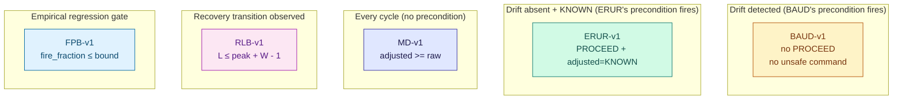

# Safety property set

The five properties ADR-0031..0035 are the citable surface of
Project Ghost. Each one is:

- **Stated formally** in an ADR (binding, immutable once accepted)
- **Verified** by a pure function over an MCAP (no replay, no
  simulation, no trust in the producer)
- **Externally exposed** via `ghost verify-properties --mcap <path>`
- **Inline-witnessed** in every reference smoke run via
  `SmokeSummary.{baud,erur,md,rlb,fpb}_report`
- **Self-enforced** by CI on every push

## The set at a glance

| ID | Property | Nature | Multi-cycle? |
|---|---|---|---|
| [BAUD-v1](baud.md) | Bounded Action Under Drift | Conditional on drift detected | No, per-cycle |
| [ERUR-v1](erur.md) | Eventual Reactivation Under Recovery | Conditional on drift absent + KNOWN | No, per-cycle |
| [MD-v1](md.md) | Monotonic Degradation | Unconditional structural (raw vs adjusted) | No, per-cycle |
| [RLB-v1](rlb.md) | Recovery Latency Bound | Quantitative temporal | **Yes** |
| [FPB-v1](fpb.md) | False Positive Bound observer | Quantitative observational | No, per-cycle |

The set is designed to **cover four distinct natures of safety
claim**: conditional behaviour in both directions of the drift signal
(BAUD, ERUR), an unconditional structural property of the calibrator
(MD), a quantitative temporal bound (RLB), and an empirical observer
for regression gating (FPB).

[BAUD-v1 / ERUR-v1 / MD-v1 are additionally **mechanically verified**
by TLA+ / TLC — see the proofs page :material-arrow-right:](proofs.md){ .md-button }

## How they fit together



**BAUD + ERUR partition** the space of *conditional* per-cycle
behaviour: every cycle either matches BAUD's precondition or ERUR's,
and the two never overlap. In the reference smoke (10 cycles,
sustained drift), BAUD fires on 6 cycles, ERUR on 4 — exactly the
total count, no gaps. This partition is the structural witness that
the pair is bidirectional and complete.

**MD applies to every cycle unconditionally**. It pins down
that the calibration policy never *invents* confidence. Without it,
BAUD + ERUR alone could be vacuously satisfied by a degenerate
"always emit HOLD" policy.

**RLB and FPB are quantitative**, complementing the three qualitative
claims with measurable bounds.

## Honest scope

The five properties **do** establish:

- A deterministic, byte-exact verdict per MCAP
- A complete decomposition of the conditional behaviour space
- An unconditional structural witness on the calibrator
- A quantitative recovery bound when transitions are observed
- An empirical fire rate observer for regression gating

The five properties **do not** establish:

- Real-world safety guarantees (the ground truth is provided by the
  simulation; properties hold against the recorded MCAP, not against
  the physical world)
- Statistical false-positive bounds under arbitrary noise models
  (FPB-v1 is observational; a statistical FPB-v2 would require Monte
  Carlo infrastructure that is currently out of scope)
- Latency-of-detection bounds (BAUD fires when the precondition
  fires; the precondition's responsiveness depends on the window size
  and the policy parameters)
- That custom policies satisfying the contract automatically satisfy
  the properties (each ADR explicitly names the policy pair it
  applies to)

Each property's ADR has a dedicated **§Scope** section that lists
its specific non-claims. Read those before citing.

## Verifying any MCAP

From the shell, no Python required:

```bash
$ pip install project-ghost
$ ghost verify-properties --mcap your-run.mcap
$ echo $?  # 0 if all five hold, 1 if any violates
```

JSON output for CI / programmatic consumption:

```bash
$ ghost verify-properties --mcap your-run.mcap --json
{
  "mcap_path": "your-run.mcap",
  "all_properties_hold": true,
  "properties": {
    "BAUD-v1": { "holds": true, ... },
    "ERUR-v1": { "holds": true, ... },
    ...
  }
}
```

From Python:

```python
from project_ghost.properties import (
    verify_baud, verify_erur, verify_md, verify_rlb, verify_fpb,
)
report = verify_baud("your-run.mcap")
assert report.holds
print(report.mcap_sha256, report.cycles_precondition_held)
```

From a running closed-loop pipeline (inline self-evidence):

```python
from project_ghost.examples.closed_loop_smoke import run_closed_loop_smoke
summary = run_closed_loop_smoke("smoke.mcap", n_cycles=10)
assert summary.baud_report.holds
assert summary.erur_report.holds
assert summary.md_report.holds
assert summary.rlb_report.holds
assert summary.fpb_report.holds
```

## Per-property details

<div class="grid cards" markdown>

-   :material-shield-alert:{ .lg .middle } **[BAUD-v1](baud.md)**

    Bounded Action Under Drift

-   :material-restart:{ .lg .middle } **[ERUR-v1](erur.md)**

    Eventual Reactivation Under Recovery

-   :material-arrow-down-bold:{ .lg .middle } **[MD-v1](md.md)**

    Monotonic Degradation

-   :material-timer-sand:{ .lg .middle } **[RLB-v1](rlb.md)**

    Recovery Latency Bound

-   :material-chart-line:{ .lg .middle } **[FPB-v1](fpb.md)**

    False Positive Bound observer

</div>
